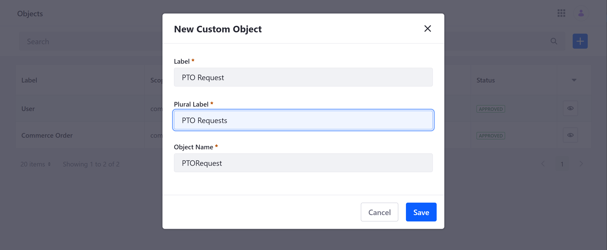
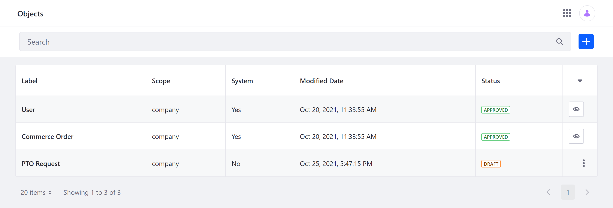
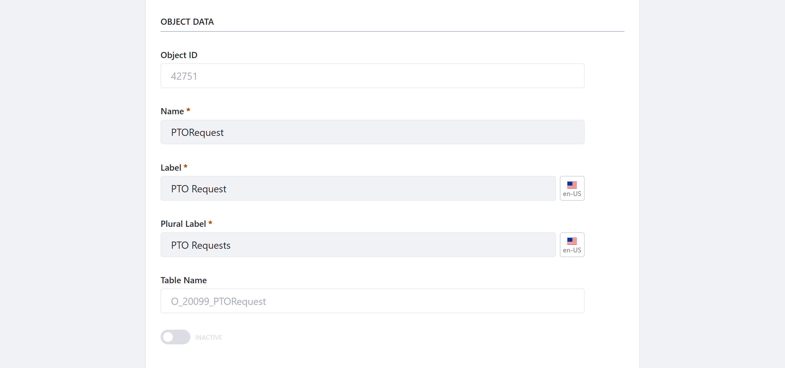
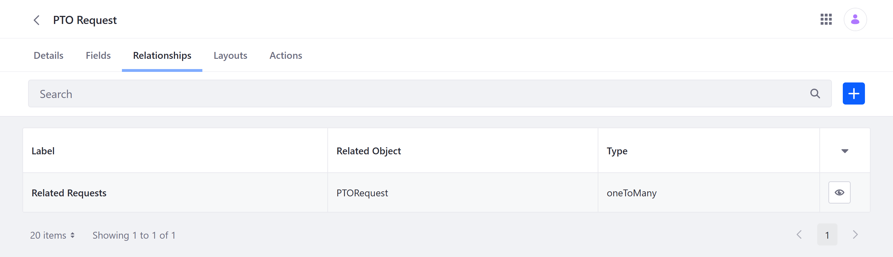
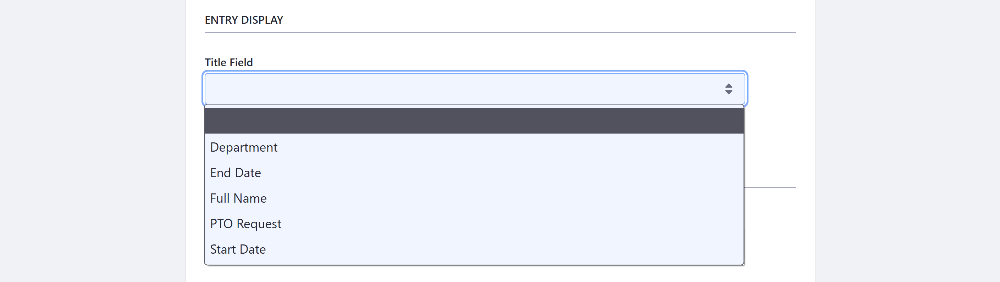

# Creating Objects

{bdg-secondary}`Available Liferay DXP/Portal 7.4+`

Liferay Objects provides development capabilities in the Liferay UI. Using the Objects portlet, you can build fully integrated Liferay applications without writing any code or manually deploying modules. This process includes [creating](#creating-object-drafts) an initial draft of the Object, [editing](#editing-object-drafts) the Object draft, and finally [publishing](#publishing-object-drafts) the draft to create the new application. Publishing an Object draft creates a fully integrated Liferay application that can be [managed and extended](./managing-objects.md) at any time via the Objects portlet.

## Creating Object Drafts

Object drafts are application templates stored in the Objects portlet. The data stored in each template is used to create the Object application when it's published.

Follow these steps to create an Object draft:

1. Open the *Global Menu* (), go to the *Control Panel* tab, and click on *Objects*.

1. Click the *Add* button ().

1. Provide these details for your new Object.

   **Label**: Identifies the Object in the Objects portlet and supported application contexts (e.g., Workflow, Display Page Templates, Forms).

   **Plural Label**: Determines the display name for the Object application in the Portal UI.

   **Object Name**: Determines the Object's `definition.name` and cannot be changed once the Object is published.

   

1. Click *Save*.

Once saved, a new Object draft is created without any fields, relationships, layouts, or a defined scope. To finish the creation process, you must [edit](#editing-object-drafts) the Object and then [publish](#publishing-object-drafts) it to your Liferay instance.



## Editing Object Drafts

Before an Object is published, you can configure its settings and elements. This includes the scope of its data, its name, panel category key, fields, relationships, and layouts. Once published, some of these configuration options are removed. See [Publishing Object Drafts](#publishing-object-drafts) for more information.

Follow these steps to edit the Object draft:

1. From the Objects application, click on the newly created Object draft. This redirects you to the Details tab.

1. If desired, modify the Object's Name, Label, and Plural Label.

   ```{important}
   Once published, the Name field cannot be changed.
   ```

   

1. Determine the Object's *scope*. This determines how the Object's data is stored.

   **Company** (default): When scoped by Company, the Object's data is stored per Liferay instance.

   **Site**: When scoped by Site, the Object's data is stored per Site.

   ```{important}
   Once published, an Object's scope cannot be changed.
   ```

   

1. Select a *Panel Category Key* to determine where the Object appears in the Liferay UI.

   If the Object is scoped by Company, you can place it in the *Global Menu* ().

   If the Object is scoped by Site, you can place it in the *Site Menu* ().

1. Determine whether to show or hide the Object's widget in Sites.

   When enabled, users can deploy the Object to a Page as a widget. See [Deploying Object Widgets in Sites](../deploying-object-widgets-to-sites.md) for more information.

   ```{note}
   This feature is available for Liferay DXP 7.4 U1+ and Liferay Portal 7.4 GA5+.
   ```

   

1. Click *Save* before moving on to the next steps. Any unsaved changes in the *Details* tab are lost when you navigate to the other tabs.

1. (Optional) Go to the *Fields* tab and add fields to the Object. Fields are Object data definitions for storing specific types of values and represent database columns. See [Adding Fields to Objects](./adding-fields-to-objects.md) for more information.

   

1. (Optional) Go to the *Relationships* tab and add relationships to the Object. Relationships are defined connections between Objects that link different Object entries to each other. See [Defining Object Relationships](./defining-object-relationships.md) for more information.

   

1. (Optional) Go to the *Layouts* tab and add a custom layout to the Object. Object layouts define how fields and relationships appear when creating or editing an Object entry. See [Designing Object Layouts](./designing-object-layouts.md) for more information.

   ```{note}
   If you do not design a custom layout and set it as default, the Object uses an automatically generated layout for its entries. This layout has a single tab that displays all Object fields in alphabetical order and does not display relationships. To display relationships, you must create a custom layout with a dedicated relationships tab.
   ```

   

1. (Optional) Once you've added a field to an Object, you can go to the *Details* tab and select an Entry Title. This determines the field used as the title for an Object's entries.

   

Whenever you add a field, relationship, or layout, the Object draft is saved automatically. Once you've finished configuring and editing the draft, you can [publish](#publishing-object-drafts) it in the *Details* tab to create the application.

## Publishing Object Drafts

Publishing an Object creates and activates your new application. When activated, users can access it in the Portal UI according to its scope and panel category key. Before publishing your Object, review the following information to understand the consequences of publishing a draft.

### What Happens During Publishing

The publishing process includes the following operations:

* A database table is created for the Object with the draft's data definitions.

* A new Headless API is automatically created for CRUD operations.

* A Collection Provider is created for displaying the Object's entries.

* A Page widget is created for the Object.

* The Object is integrated with Info framework, so you can select the Object as a content type for a [Display Page Template](../../../site-building/displaying-content/using-display-page-templates/about-display-page-templates-and-display-pages.md)

* The Object is integrated with the [Permissions framework](../understanding-object-integrations/permissions-framework-integration.md), so you can manage permissions for the new application and its resources.

* The Object is integrated with the Workflow framework, so you can configure a custom workflow for the Object.

* The Object is integrated with Forms, so you can select the Object as a data storage option.

### Configuration Restrictions for Published Objects

{bdg-secondary}`For Liferay 7.4 U26+ and GA26+`

To prevent data loss and system conflicts, some configuration options are removed for Objects, fields, and relationships after they are published.

* The name and scope of a published Object cannot be changed.

* Any fields included in an Object at the time of publishing cannot be removed.

* Most configuration options for published fields and relationships cannot be changed.

You can still edit and localize labels for Objects, fields, and relationships after publishing, but most configuration options are removed. For Objects, you can change the Panel Category Key as well as add new fields, relationships, and layouts. For relationships, you can configure its *Deletion Type*.

```{note}
For Liferay 7.4 U25/GA25 and earlier versions, users cannot delete published Object definitions or remove relationships included in an Object at the time of publishing.
```

## Additional Information

* [Objects Overview](../../objects.md)
* [Adding Fields to Objects](./adding-fields-to-objects.md)
* [Defining Object Relationships](./defining-object-relationships.md)
* [Designing Object Layouts](./designing-object-layouts.md)
* [Managing Objects](./managing-objects.md)
