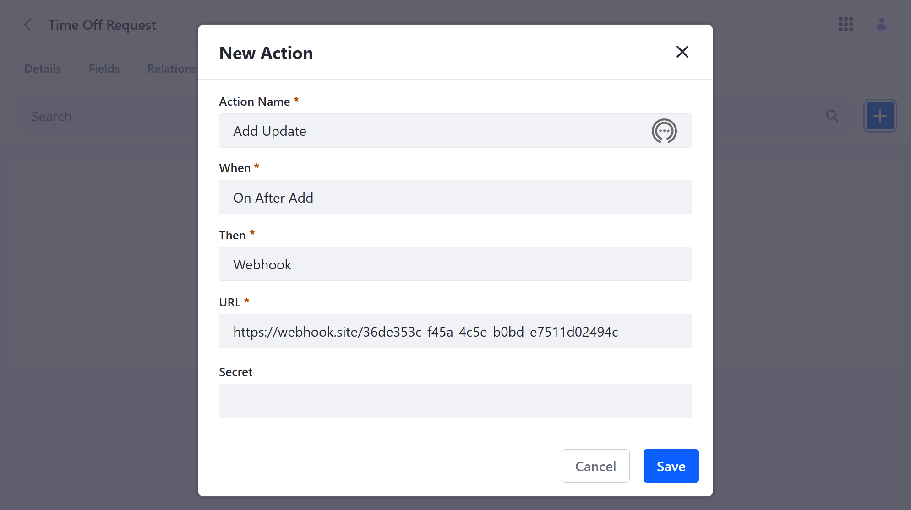
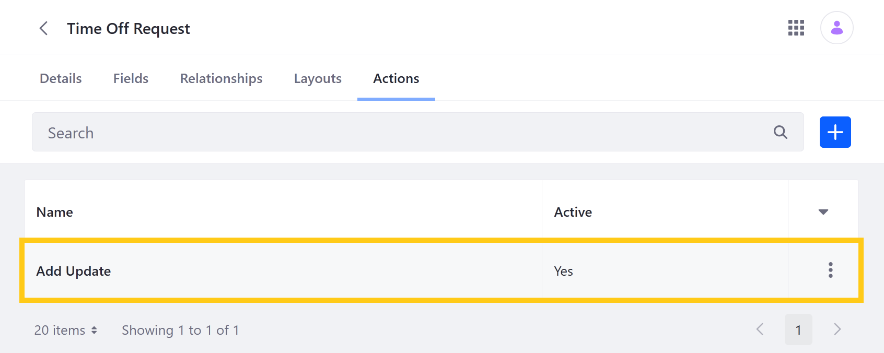
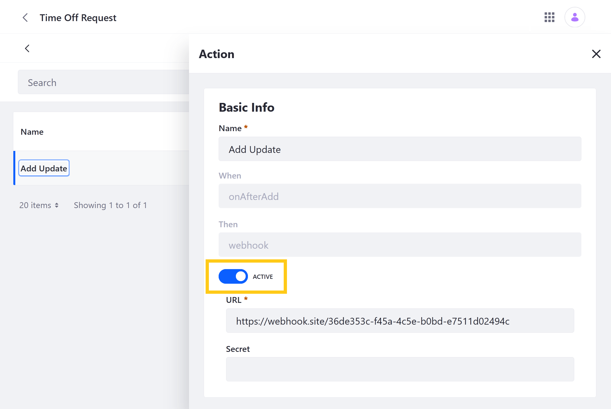

# Defining Object Actions

> Available: Liferay DXP/Portal 7.4+

With Liferay Objects, you can define actions that are triggered under specified conditions. When an action is active, Liferay listens for when an Object's data is added, deleted, or removed and then performs the set action.

```{important}
Currently, Actions only supports triggering *webhooks* that deliver a payload to an exernal source to sync and process data.
```

Follow these steps to define actions for an Object:

1. Open the *Global Menu* (), click on the *Control Panel* tab, and go to *Objects*.

1. Select an existing custom Object or [create a new one](./creating-objects.md).

1. While viewing the Object, select the *Actions* tab and click the *Add* button ().

1. Enter a *name*.

1. For When, determine the action's trigger.

   | Trigger | Description |
   | :--- | :--- |
   | On After Add| When an Object entry is added |
   | On After Delete | When an Object entry is deleted |
   | On After Update | When an Object entry is updated |

1. For Then, select *Webhook*. This determines the type of action performed.

1. Enter a *URL* for the webhook.

1. (Optional) Enter a *secret* for the webhook.

   

1. Click *Save*.

   ```{note}
   After saving an action, you cannot change its trigger (i.e. When field) or action type (i.e. Then field).
   ```

Once created, the action is active and is triggered according to your configuration.



If desired, you can deactivate an action at any time. Select the action, toggle the switch to *Inactive*, and click *Save*.



## Additional Information

* [Creating Objects](./creating-objects.md)
* [Adding Fields to Objects](../creating-and-managing-objects/adding-fields-to-objects.md)
* [Defining Object Relationships](../creating-and-managing-objects/defining-object-relationships.md)
