# Designing Object Views

{bdg-secondary}`Available Liferay 7.4 U27+ and GA27+`

Object views define tables for displaying entries in an Object's application page. By default, Liferay automatically generates a default view for each published Object definition. This view orders all entry fields alphabetically. You can, however, design custom views to determine which Object fields are included in the table, how the table is sorted, and available filters.

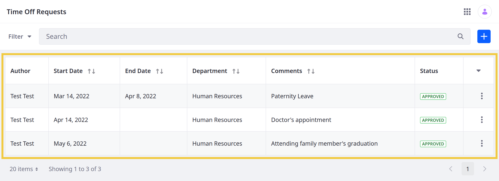

```{note}
Custom views can only be added to custom Objects. They cannot be added to system Objects.
```

Follow these steps to design a view for a custom Object definition:

1. Open the *Global Menu* (), click the *Control Panel* tab, and go to *Objects*.

1. Begin editing a custom *Object definition*, go to the *Views* tab, and click the *Add* button ().

1. Enter a *name* and click *Save*.

   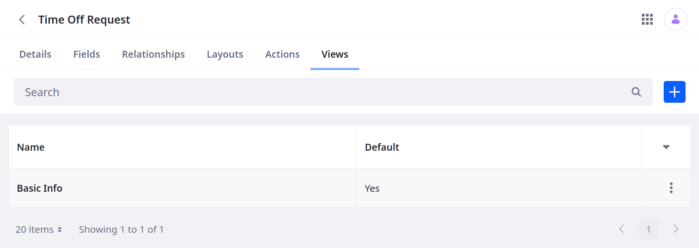

1. Click the new *view* to begin editing it.

1. In the *Basic Info* tab, check *Mark as Default* to set it as the *default* view for the Object definition.

   ```{note}
   This ensures the view is used for the Object's application page. If no custom layout is selected as default, the Object uses its automatically generated layout.
   ```

   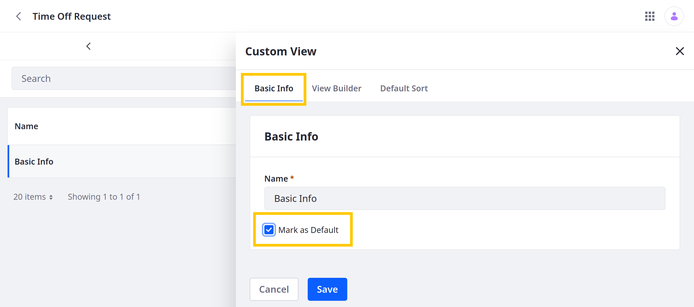

1. In the *View Builder* tab, [add columns](#adding-columns-to-a-view) to the view table.

1. (Optional) [Change or localize](#renaming-columns) the display name for each column.

1. (Optional) In the *Default Sort* tab, set the [default column sorting](#setting-a-default-sorting).

1. (Optional) In the *Filters* tab, select which fields to provide as [view filters](#adding-filters).

1. Click *Save*.

Once saved, the custom view is used to display the Object's entries.

```{tip}
For 7.4 U21+, you can duplicate a view by clicking its *Actions* button () and selecting *Duplicate*. This creates a complete copy of the original view with "(Copy)" appended to it's name. 
```

## Adding Columns to a View

In the View Builder tab, add and order fields for the view. Each field added is used as a column in the view table.

```{note}
Custom views do not support columns containing multiple entries (e.g., *Many to Many* relationship fields).
```

Follow these steps to add columns:

1. Begin editing the desired *view* and go to the *View Builder* tab.

1. Click the *Add* button (),

1. Check all *fields* you want to include in the view table and click *Save*.

   Available options include both [custom fields](./adding-fields-to-objects.md) and default metadata fields (i.e., ID, Author, Creation Date, Modified Date, and Workflow Status).

   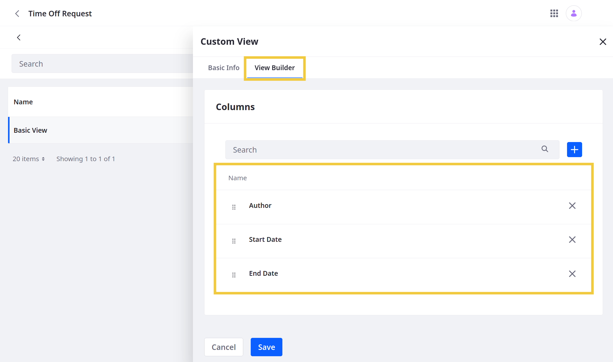

1. Drag and drop fields to determine their order in the view table.

1. Click *Save*.

Once saved, the view table only displays the selected fields.

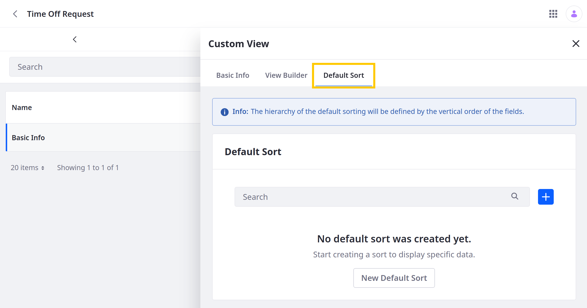

## Renaming Columns

{bdg-secondary}`Available Liferay DXP 7.4 U21+ and Portal 7.4 GA21+`

Follow these steps to change or localize the display name of view columns:

1. Begin editing the desired *view* and go to the *View Builder* tab.

1. Click the *Actions* button () for the desired column and select *Edit*.

   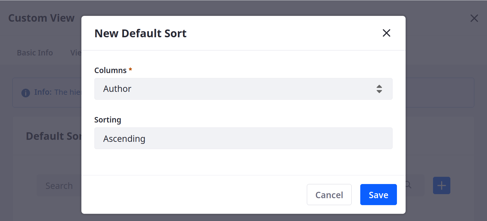

1. Enter a localizable name into the *Column Label* field and click *Edit*.

   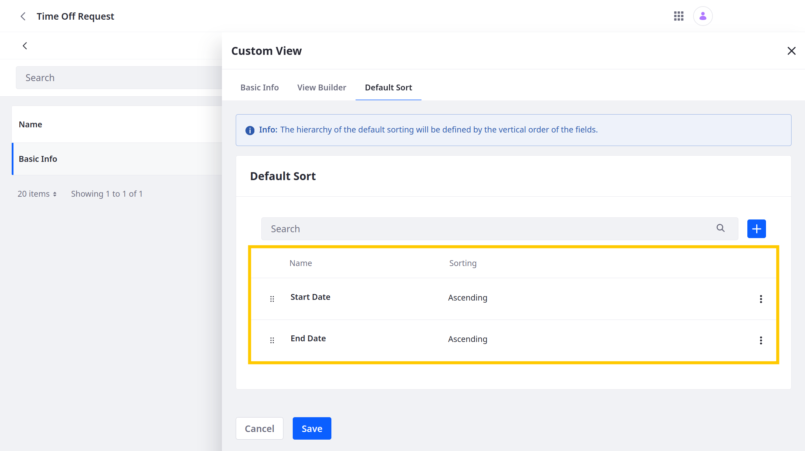

1. Click *Save*.

Once saved, the localized label is used for the view column.

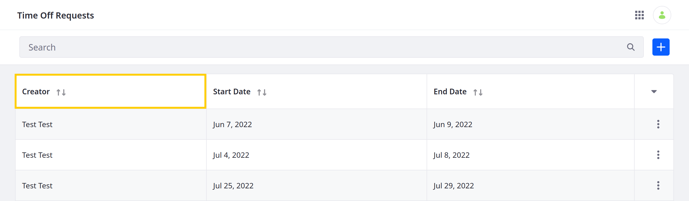

## Setting a Default Sorting

{bdg-secondary}`Available Liferay DXP 7.4 U18+ and Portal 7.4 GA18+`

Follow these steps to set the default ordering/sorting for Object View columns:

1. Begin editing the desired *view* and go to the *Default Sort* tab.

1. Click the *Add* button ().

1. Select a *column* and *sorting* order (i.e., ascending or descending).

   

1. Click *Save*.

1. (Optional) If you add multiple fields, drag and drop them to determine which is the default sorting. The sorting at the top of the list is the default order applied.

   

1. Click *Save*.

Object entries are now sorted according to your default sorting.

## Adding Filters

{bdg-secondary}`Available Liferay 7.4 U27+ and GA27+`

When creating a custom view, you can determine which fields are available to users as filter facets. You can also set default filters that are automatically applied to the view.

Follow these steps to add filters to a custom view:

1. Begin editing the desired *view* and go to the *Filters* tab.

1. Click the *Add* button ().

1. Select a field to *filter by*.

   ```{note}
   Currently, Objects only supports Workflow Status, Creation Date, Modified Date, and Picklist fields as view filters.
   ```

1. (Optional) Select a filter type: *Include* or *Exclude*. This determines whether the default filter includes or excludes entries with the following values.

1. (Optional) Enter field *values* to use as a default filter.

   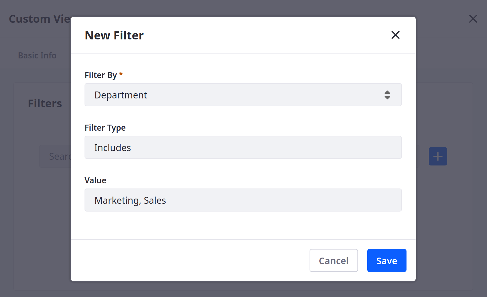

1. Click *Save*.

1. (Optional) Repeat the above process to add additional field filters to the view.

   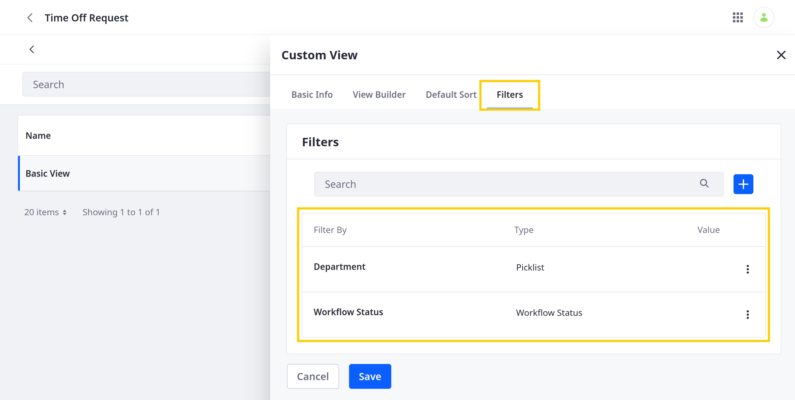

1. Click *Save*.

Once saved, users can filter Object entries using the added fields.

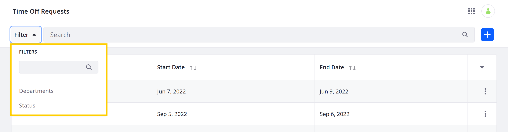

Also, if you've added default filters, they are automatically applied to the view.

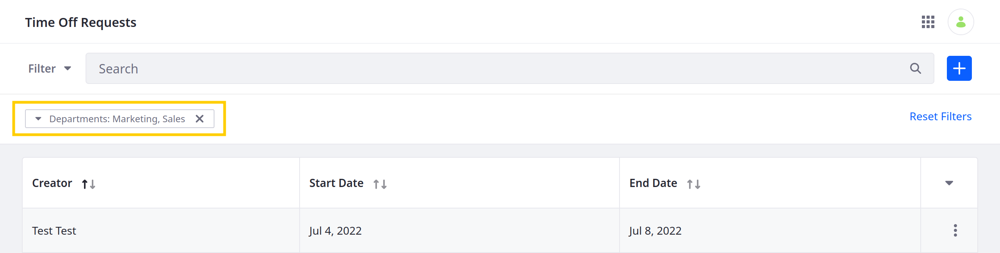

## Additional Information

* [Creating and Managing Objects](../creating-and-managing-objects.md)
* [Adding Fields to Objects](./adding-fields-to-objects.md)
* [Designing Object Layouts](./designing-object-layouts.md)
