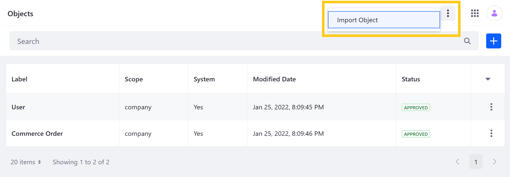
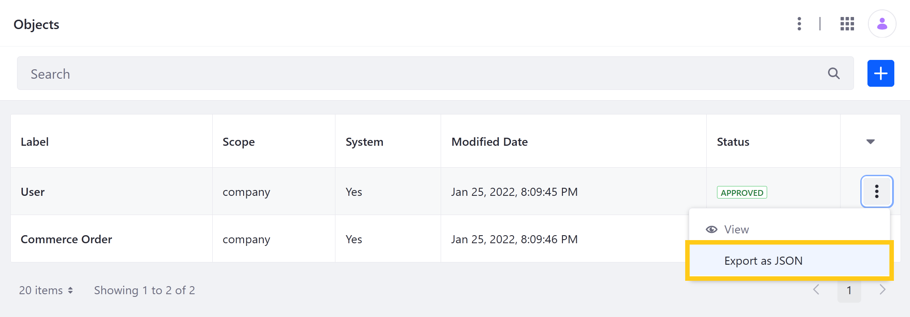

# Importing and Exporting Object Structures

> Available for Liferay DXP 7.4 U5+ and Portal 7.4 GA9+

With Liferay Objects, you can import and export Object structures as `.json` files. This provides greater flexibility during application development, enabling users to easily migrate Object definitions between Liferay environments.

## Importing Structures

Follow these steps to import an Object structure:

1. Open the *Global Menu* (), click on the *Control Panel* tab, and go to *Objects*.

1. Click the *Actions* button () in the Application Bar and select *Import Object*.

   

1. Enter a *name* for the new Object and select the *JSON file* you want to import.

   ```{important}
   Object names must be unique and use PascalCase.
   ```

   

1. Click *Import*.

This beings importing the Object structure in the background and can take a few minutes.

## Exporting Structures

Follow these steps to export an Object structure:

1. Open the *Global Menu* (), go to the *Control Panel* tab, and click on *Objects*.

1. Click on the *Actions* button () for the desired Object and select *Export as JSON*.

   

1. Click *Save* in the dialog window.

This immediately begins downloading a JSON file containing the Object's definition. If desired, you can view and edit the definition in a text editor and then import it to compatible Liferay environments.

## Additional Information

* [Creating Objects](./creating-objects.md)
* [Managing Objects](./managing-objects.md)
