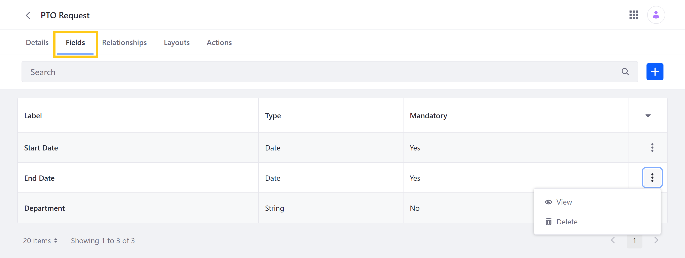
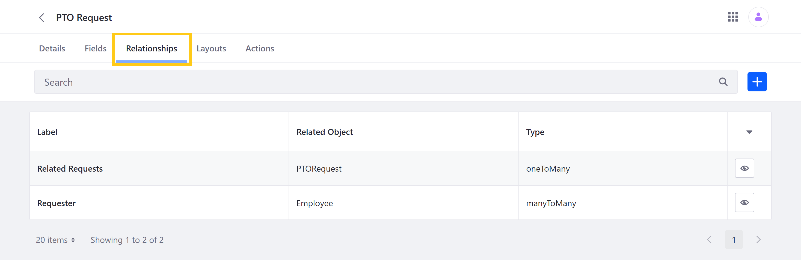
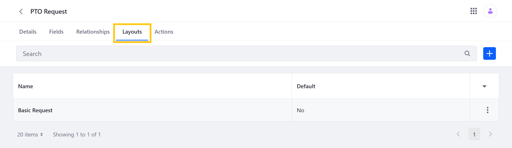
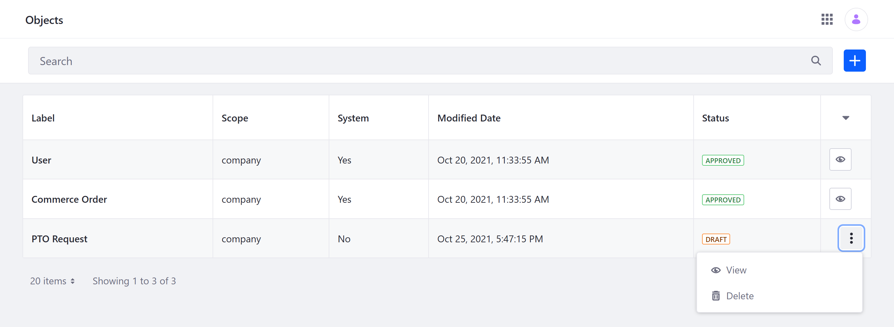
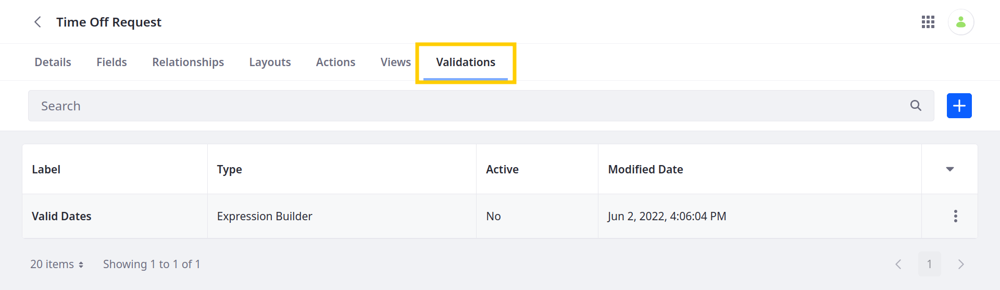
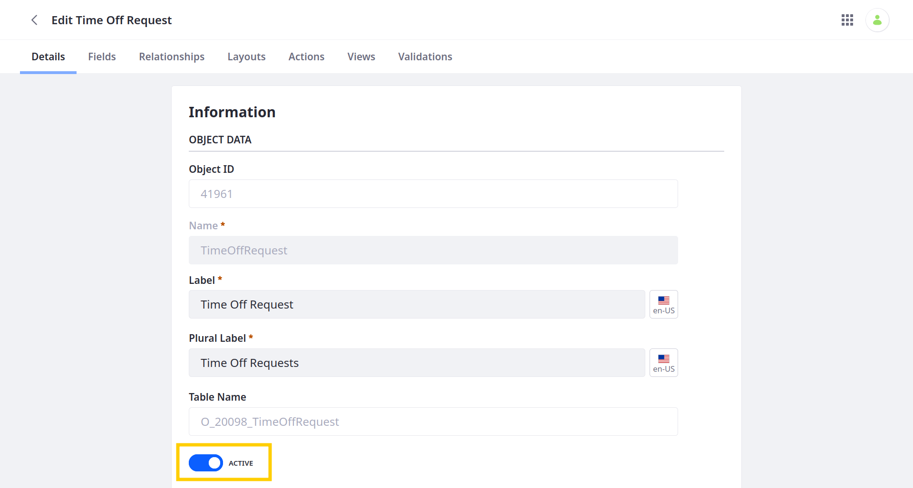
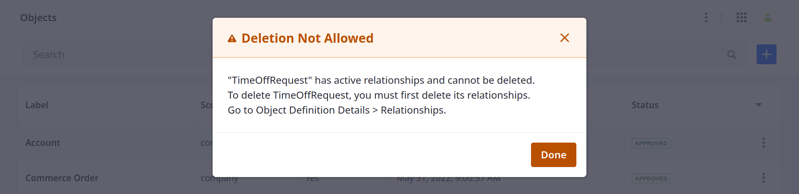
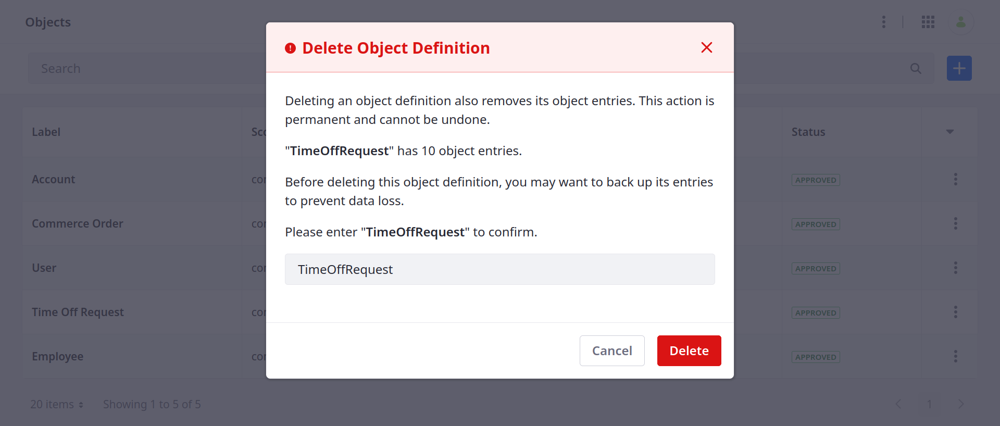

# Managing Objects

{bdg-secondary}`Available Liferay DXP/Portal 7.4+`

The Objects portlet provides tools for managing both system and custom Objects. System Objects include default Liferay applications that have been integrated with the Objects framework, while custom Objects are applications created using the Objects portlet. Though both types of Objects are supported, some management options are only available for custom Objects.


```{note}
See [Objects Application Permissions](../objects-application-permissions.md) to learn more about the permissions necessary for performing these management actions.
```

## Editing and Extending Objects

Users can edit and extend both system and custom Objects using [fields](#fields), [relationships](#relationships), [layouts](#layouts), [actions](#actions), [views](#views), and [validations](#validations).

### Fields



You can add fields to any system or custom Object. Any field added to a system or custom Object after it's published can be edited and removed at any time. However, fields included in a custom Object at the time it is published can only be edited minimally and cannot be removed, and native system Object fields cannot be edited or removed at all. All fields can be viewed in a definition's Fields tab. See [Adding Fields to Objects](./adding-fields-to-objects.md) for more information.

### Relationships



You can add and configure relationships for both system and custom Objects. After creation, users can only edit a relationship's Label and Deletion Type. Depending on the selected type, a relationship is displayed in either the definition's Fields or Relationships tab. See [Defining Object Relationships](./defining-object-relationships.md) for more information.

### Layouts



You can add, edit, and remove layouts for custom Objects at any time. Custom layouts must include all of an Object's required fields in order to be set as the Object's default layout. See [Designing Object Layouts](./designing-object-layouts.md) for more information.
<!--TASK: Replace with following text once system Objects are supported, "You can add, edit, and remove layouts for both system and custom Objects at any time. Custom layouts must include all of an Object's required fields in order to be set as the Object's default layout. See [Designing Object Layouts](./designing-object-layouts.md) for more information."-->

### Actions


You can add, edit, and remove actions that are triggered under specified conditions. When an action is active, Liferay listens for when an Object's data is added, deleted, or updated and then performs the set action. See [Defining Object Actions](./defining-object-actions.md) for more information.

### Views



You can add, edit, and remove views for custom Objects at any time. These views define tables for displaying entries in an Object's application page. See [Designing Object Views](./designing-object-views.md) for more information.

### Validations



You can add, edit, or remove validations for custom Object definitions at any time. These validations set rules used for determining valid field entries and are defined using either Groovy scripts or Liferay's expression builder. See [Adding Custom Validations](./adding-custom-validations.md) for more information.

## Activating and Deactivating Objects

By default, custom Objects are *Activated* when they're first [published](./creating-objects.md#publishing-object-drafts). This makes the application available for use as soon as it's created. While active, the Object and its entries can be accessed via the Liferay UI and Headless API calls. You can, however, deactivate custom Objects at any time.

Deactivating an Object removes it from its Panel Category, integrated frameworks, and related Objects. While inactive, an Object can only be [edited and extended](#editing-and-extending-objects) in the Objects portlet. If an Object's entries are displayed in a Site or related Object at the time it's deactivated, those entries are blank, and their fields no longer appear in any related Object layouts.

You can reactivate any inactive Object to make it and its data available for use.

```{important}
Deactivating an Object does not affect its data; it only prevents users from accessing it until the Object is reactivated.
```

Follow these steps to deactivate or activate a custom Object.

1. From the *Objects* portlet, click on the desired *Object*.

   ```{note}
   System Objects cannot be deactivated.
   ```

1. In the Details tab, set the toggle switch to either *Active* or *Inactive*.

    

1. Click on *Save*.

## Deleting Object Definitions

{bdg-secondary}`Available Liferay 7.4 U26+ and GA26+`

You can delete both draft and published Object definitions at any time. Deleting a definition removes its associated data; this including stored entries for published definitions.

```{important}
For versions before Liferay 7.4 U26/GA26, users cannot delete [published Object definitions](./creating-objects.md#publishing-object-drafts).
```

If your definition has active relationships, you must remove them before you can delete the definition. See [Removing Relationships](./defining-object-relationships.md#removing-relationships) for more information.

   

When ready, follow these steps to delete the definition.

1. Open the *Global Menu* (), go to the *Control Panel* tab, and click on *Objects*.

1. Click the *Actions* button () for the desired definition and select *Delete*.

1. In the dialog window, enter the *name* of the definition and click *Done* to confirm.

   

## Additional Information

* [Objects Overview](../../objects.md)
* [Creating Objects](./creating-objects.md)
<!--TASK: Add once article is finished * [Objects UI Reference](../objects-ui-reference.md) -->
