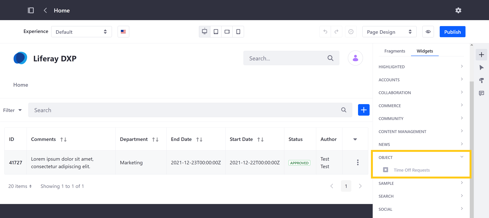
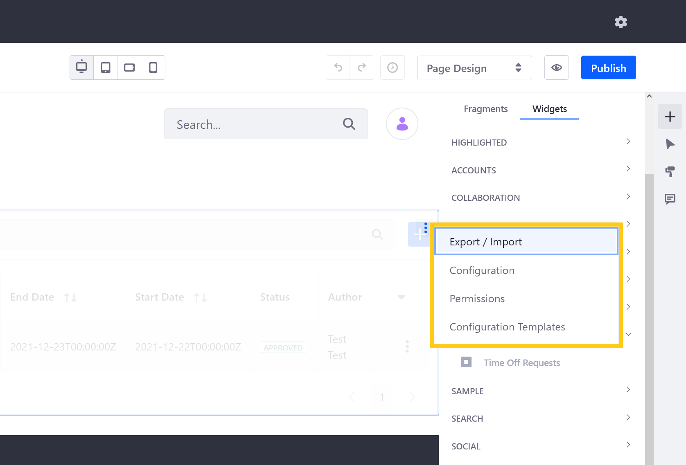

# Deploying Object Widgets to Sites

> Available: Liferay DXP 7.4 U1/Liferay Portal 7.4 GA5

When an Object is published, Liferay automatically generates a dedicated widget you can deploy to Site Pages. This includes both Site-scoped and Company-scoped Objects, so you can grant access to an Object outside of the Site Menu () and Global Menu ().

```{note}
Widget data is saved and displayed according to the Object's scope.
```

## Showing and Hiding Object Widgets

1. Open the *Global Menu* (), go to the *Control Panel* tab, and click on *Objects*.

1. Select the desired *Object*.

1. In the Details tab, toggle the *Show/Hide Widget* switch.

   

1. Click *Save*.

If the switch is toggled to *Show Widget* and the Object is published, you can immediately [add the widget to Site Pages](#adding-the-widget-to-pages).

However, if the switch is toggled to *Hide Widget*, it is hidden in the widget menu and cannot be added to a page.

```{note}
Hiding an Object's widget does not remove it from Site Pages where it is already deployed. Hiding the widget only prevents users from adding it to a new Page.
```

## Adding the Widget to Pages

When *Show Widget* is enabled for a Published Object, its widgets appear under *Objects* in the widget menu.

You can add the widget to Site Pages like any other Page widget.



You can also click the widget's *Options* button () to access additional functions and configuration options.



Available options depend on whether the widget is deployed to a [Content Page](../../site-building/creating-pages/using-content-pages/using-widgets-on-a-content-page.md) or [Widget Page](../../site-building/creating-pages/using_widget_pages.html).

## Additional Information

* [Creating Objects](./creating-and-managing-objects/creating-objects.md)
* [Displaying Object Entries](./displaying-object-entries.md)
