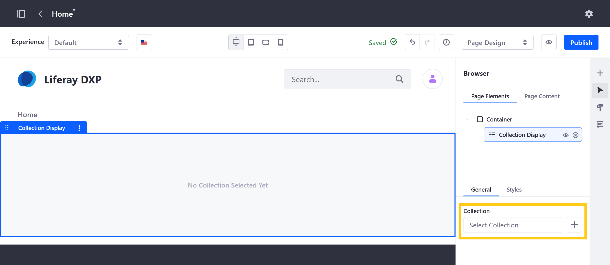
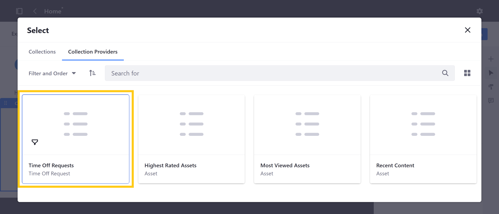
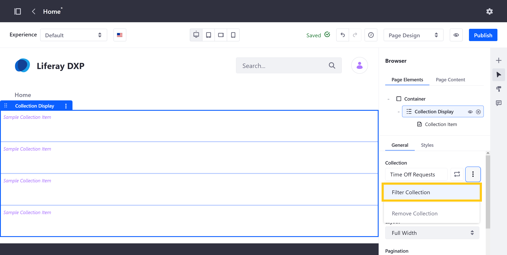
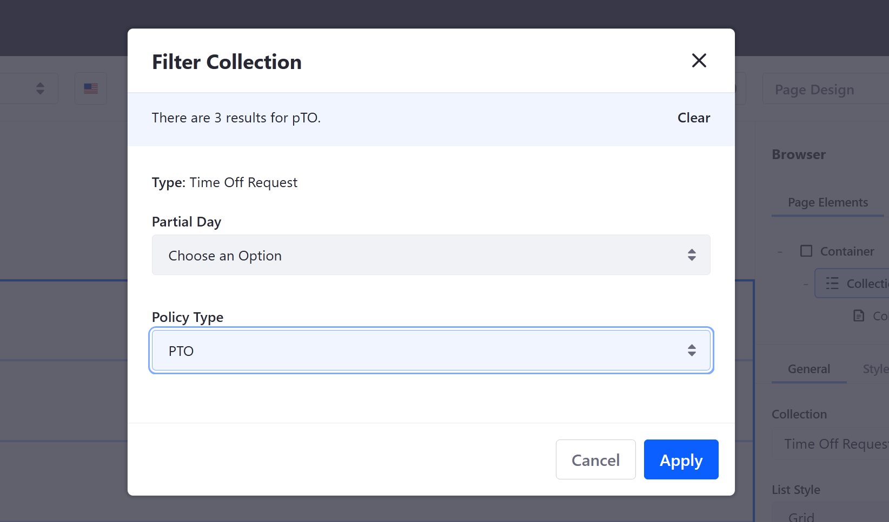
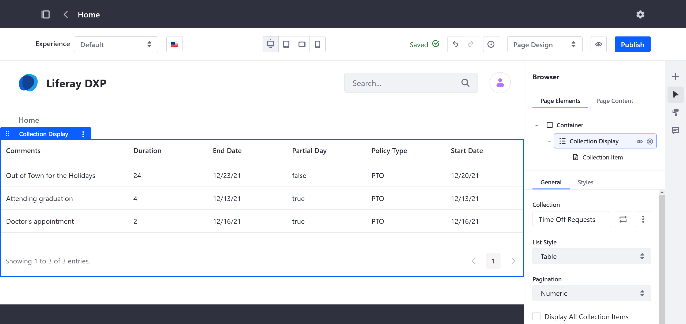
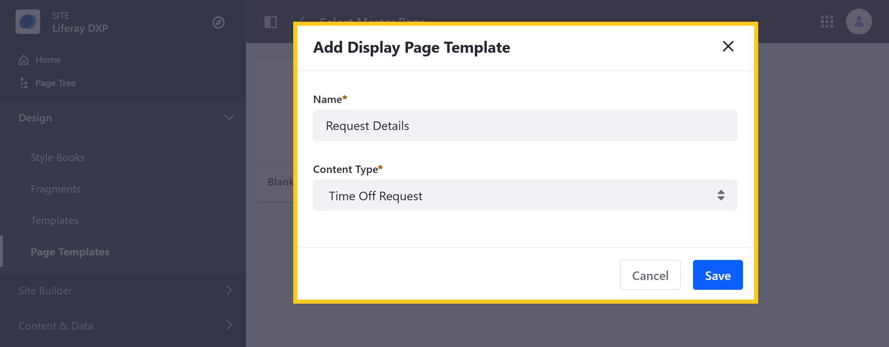

# Displaying Object Entries

> Available: Liferay DXP/Portal 7.4+

With Liferay Objects, you can use existing DXP frameworks to display Object entries dynamically in Sites. This includes collection displays for multiple entries and display pages for individual entries.

When an Object is published, Liferay creates a Collection Provider that you can use with the [Collection Display fragment](../../site-building/displaying-content/additional-content-display-options/displaying-collections.md#adding-a-collection-display-fragment-to-a-page) to display multiple Object entries. You can also configure the fragment to style, filter, and paginate the collection. And since published Objects are integrated with the Info framework, you can select them as the content type for [Display Page Templates](../../site-building/displaying-content/using-display-page-templates/about-display-page-templates-and-display-pages.md). When selected, the Object is set as the template's mapping source, so you can easily map fragment fields to Object fields to create flexible page displays for individual Object entries.

Together, these integrations enable users to leverage Liferay's WYSIWYG page building capabilities while delivering personalized user experiences.

## Using the Collection Provider for Objects

Once you've published an Object, follow these steps to use the Collection Display fragment to display an Object's entries:

1. Create a new [Content Page](../../site-building/creating-pages/using-content-pages.html) or [Display Page Template](../../site-building/displaying-content/using-display-page-templates/creating-and-managing-display-page-templates.md). Alternatively, begin *editing* () an existing one.

   ```{note}
   You can also create a Collection Page using the Collection Provider. See [Collections and Collection Pages](../../content-authoring-and-management/collections-and-collection-pages/about-collections-and-collection-pages.md) for more information.
   ```

1. Drag and drop the *Collection Display* fragment into the Page or Template from the *Fragments and Widgets* () sidebar.

   

1. Select the *Collection Display Fragment* to access its configuration options and click *Select Collection* in the General tab.

   

1. In the modal window, click on the *Collection Providers* tab and select the *Object's provider*.

   

1. (Optional) Filter which Object entries are displayed. You can filter by any Picklist or Boolean fields in the Object.

   To do this, click the *Collection Options* button () and select *Filter Collection*.

   

   Then, select the desired *filters* and click *Apply*.

   

After selecting the desired provider, use additional fragment options to determine how Object entries are displayed, including *List Style* and *Pagination*.



## Creating Display Page Templates for Objects

1. Open the *Site Menu* (). Go to *Design* &rarr; *Page Templates* and click on the *Display Page Templates* tab.

1. Click the *Add* button () and select the *Blank* template.

   This opens a modal window.

1. Enter a *name* and select the desired *Object* for Content Type.

   

1. Click *Save*.

Once saved, the selected Object is set as the template's mapping source, and you're redirected to edit the template. Here, you can design flexible page displays for individual Object entries using fragments that map to Object fields. See [Using Display Page Templates](../../site-building/displaying-content/using-display-page-templates/about-display-page-templates-and-display-pages.md) for information.


## Additional Information

* [Creating Objects](./creating-and-managing-objects/creating-objects.md)
* [About Collections and Collection Pages](../../content-authoring-and-management/collections-and-collection-pages/about-collections-and-collection-pages.md)
* [About Display Page Templates and Display Pages](../../site-building/displaying-content/using-display-page-templates/about-display-page-templates-and-display-pages.md)
