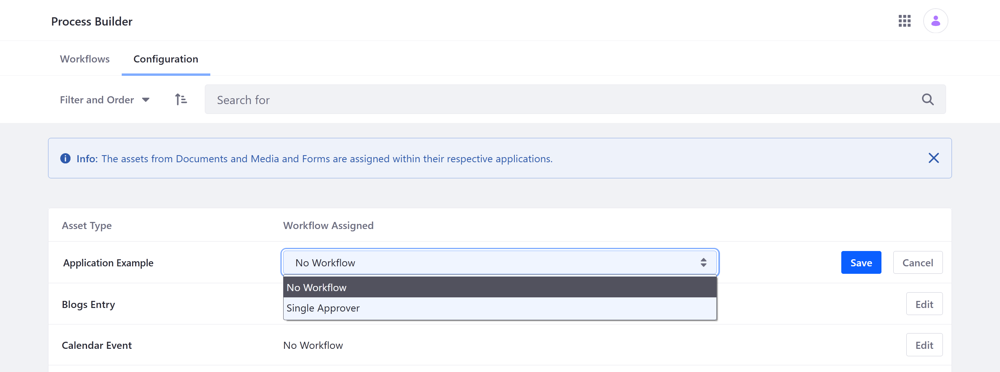
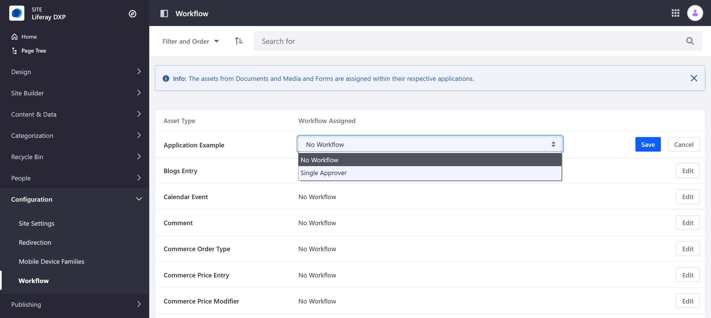

# Enabling Workflow for Objects

Every published Object is integrated automatically with the Workflow framework, so you can direct Object entry creation through a defined review and approval process. How you enable a Workflow for an Object depends on the Object's scope: [Company](#company-scoped-objects) or [Site](#site-scoped-objects).

See [Workflow](../../process-automation/workflow.html) documentation to learn more about general workflow features.

## Company-Scoped Objects

Follow these steps to enable a custom Workflow for a company-scoped Object:

1. Open the *Global Menu* (), click on the *Applications* tab, and go to *Process Builder*.

1. Click the *Configuration* tab.

   

1. Click *Edit* for the desired Object.

1. Select the desired *Workflow*.

1. Click *Save*.

## Site-Scoped Objects

Follow these steps to enable a custom Workflow for a Site-scoped Object:

1. Open the *Site Menu* () &rarr; *Configuration* &rarr; *Workflow*.

   

1. Click *Edit* for the desired Object.

1. Select the desired *Workflow*.

1. Click *Save*.

## Additional Information

* [Objects](../objects.md)
* [Creating Objects](./creating-and-managing-objects/creating-objects.md)
* [Managing Objects](./creating-and-managing-objects/managing-objects.md)
