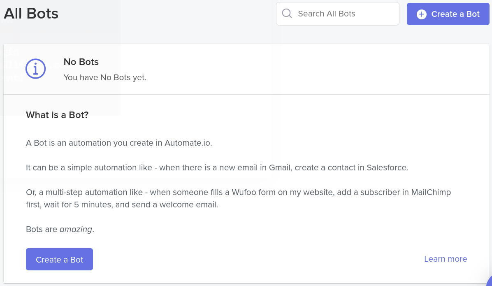
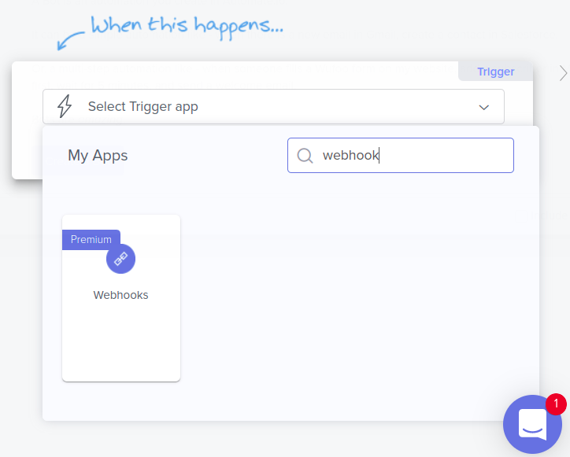
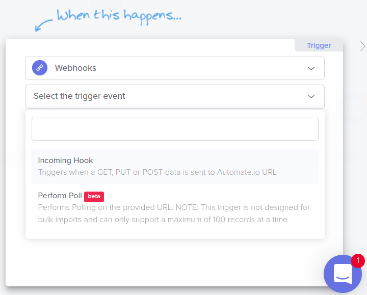
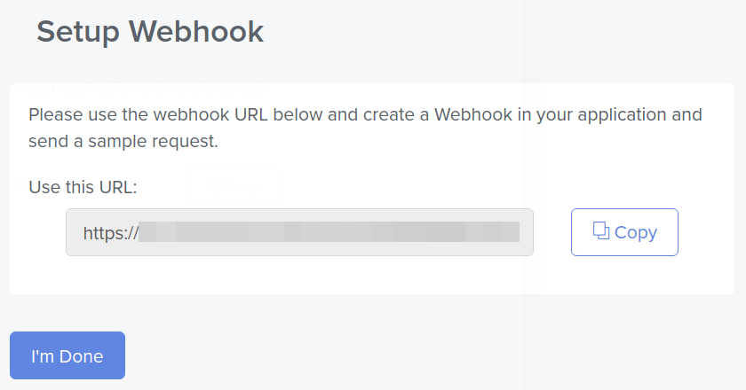
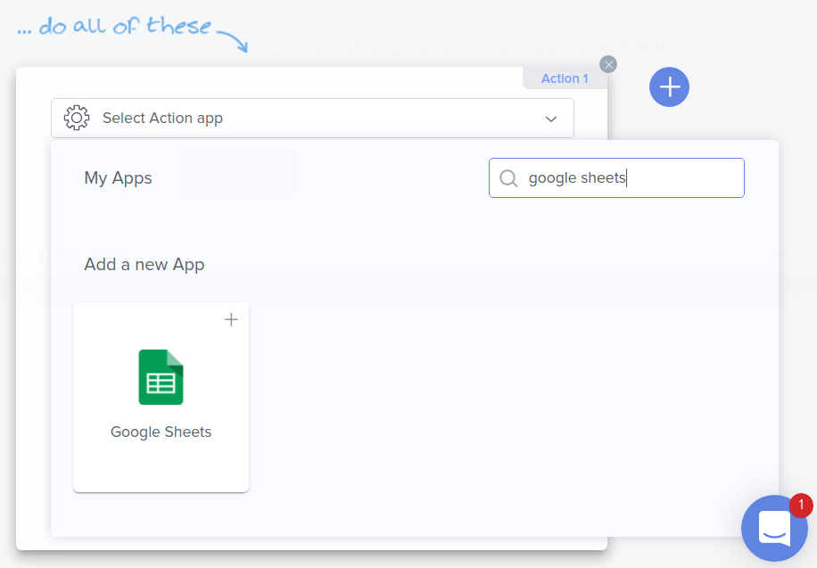
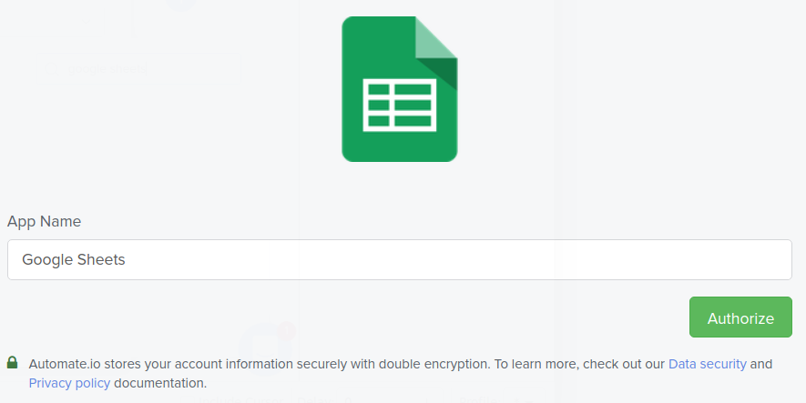
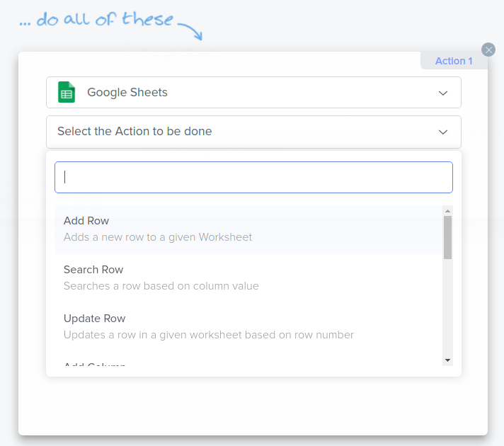
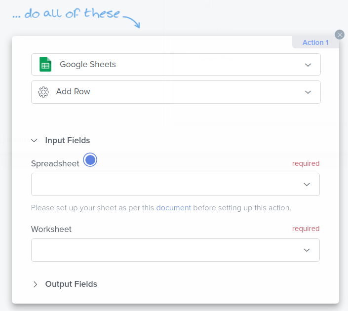
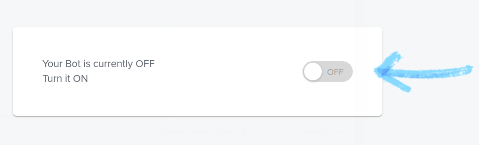
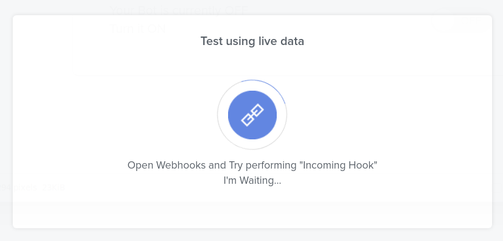

# Using Automate.io to Sync Object Data with Google Sheets

{bdg-secondary}`Available 7.4+`

Here you'll learn how to use webhooks to trigger sync tasks between Liferay Objects and Google Sheets using [Automate.io](https://automate.io/). Syncing your data in this way requires an premium Automate.io account, Google Spreadsheet, and active DXP 7.4 instance. The DXP instance must also have a published Object with the desired fields for sending or receiving data to the Google Spreadsheet.

## Syncing Object Data to a Google Sheet

Follow these steps to sync Object data to a Google Sheet:

1. Sign in to [Automate.io](https://automate.io/) and click *Create a Bot*.

   

1. For the *Trigger* step, select the *Webhooks* app.

   

   ```{note}
   Webhooks is a premium Automate.io feature.
   ```

1. For the *Trigger Event*, select *Incoming Hook*.

   

1. Copy the generated *webhook URL*.

   

1. In your Liferay instance, use the copied URL to [define an Object action](../../creating-and-managing-objects/defining-object-actions.md) that sends a request to the webhook endpoint whenever a new Object entry is added.

   

1. Add a test Object entry to trigger the webhook.

   This allows the Webhooks app in your Automate.io bot to determine the Object's data structure automatically.

1. For the *Action* step, select the *Google Sheets* app.

   

1. Click *Authorize* to connect the app with a Google account.

   

1. For the Action field, select *Add Row*.

   

1. Select the desired *Spreadsheet* and *Worksheet* to sync with the Object and click *Save*.

   

1. *Turn on* your bot.

   

1. Add an Object entry to test your bot.

   

1. Verify the bot successfully received the Object data and triggered the Google Sheets action.

   

## Additional Information

* [Objects Overview](../../../objects.md)
* [Creating and Managing Objects](../../creating-and-managing-objects.md)
* [Understanding Object Integrations](../../understanding-object-integrations.md)