# Using IFTTT to Sync Object Data with Google Sheets

Here you'll learn how to use webhooks to trigger sync tasks between Liferay Objects and Google Sheets using [IFTTT](https://ifttt.com/). Syncing your data in this way requires an IFTTT account, Google Spreadsheet, and active DXP 7.4 instance. The DXP instance must also have a published Object with the desired fields for sending or receiving data to the Google Spreadsheet.

## Syncing Object Data to a Google Sheet

Follow these steps to sync Object data to a Google Sheet:

1. Sign in to [IFTTT](https://ifttt.com/) and click *Create*.

    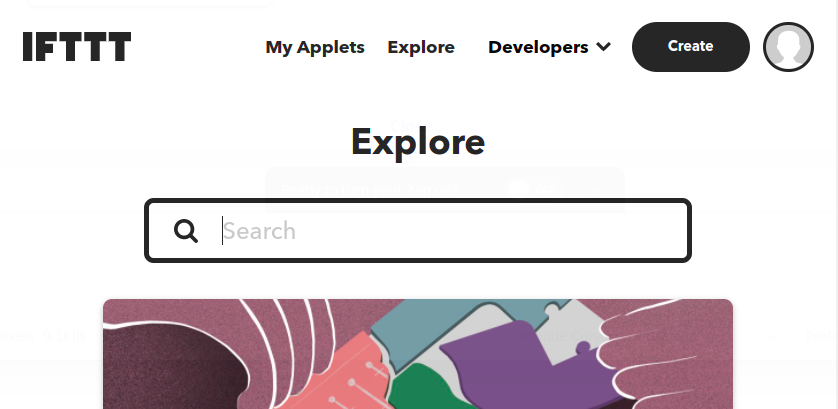

1. Click *Add* for the *If This* step.

    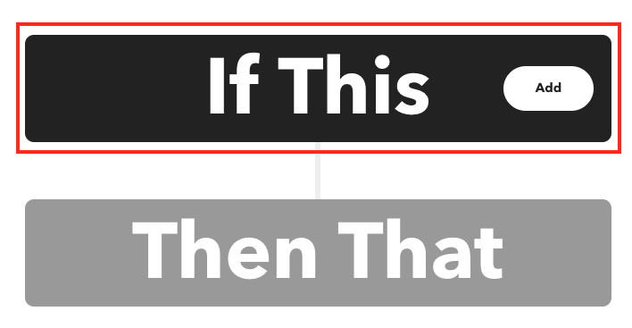

1. Select *Webhooks*.

    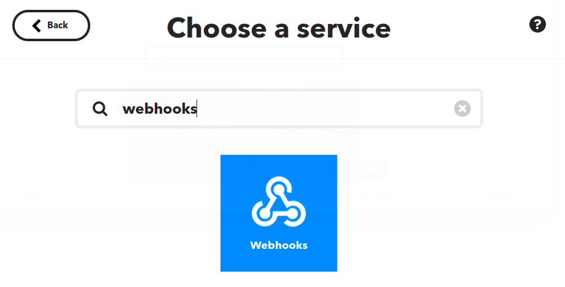

1. For trigger type, click *Receive a web request*.

    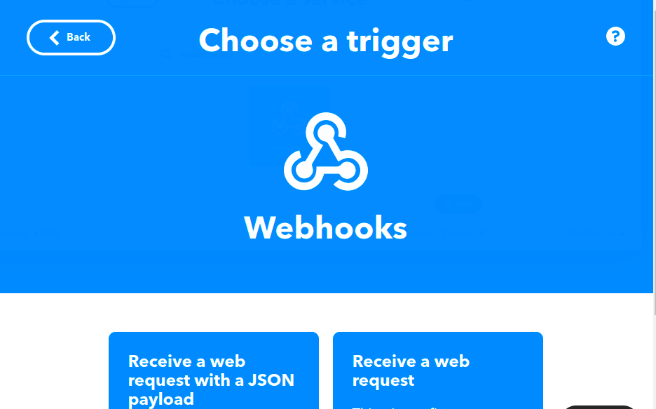

1. Enter an *Event Name* and click *Create Trigger*.

    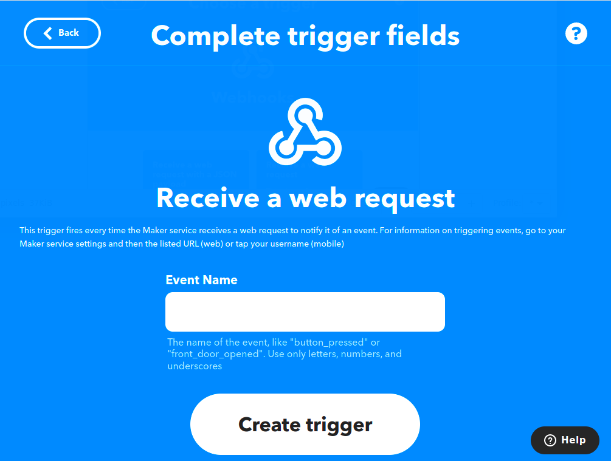

1. Click *add* for the *Then That* step.

    

1. Select *Google Sheets*.

    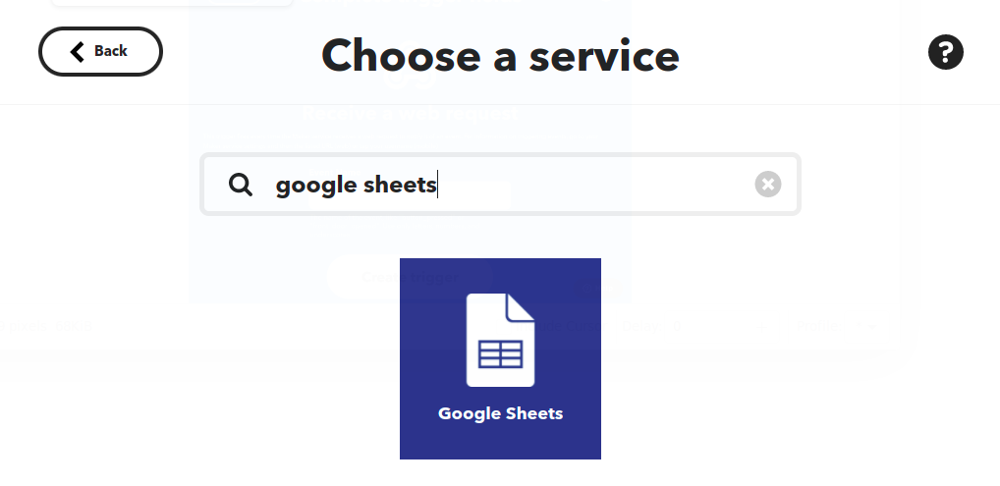

1. For action type, click *Add row to spreadsheet*.

    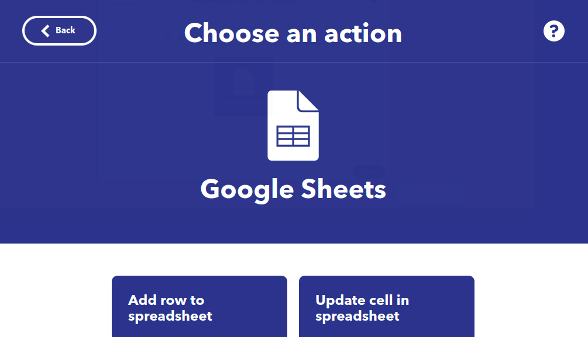

1. Configure the action and click *Create Action*.

    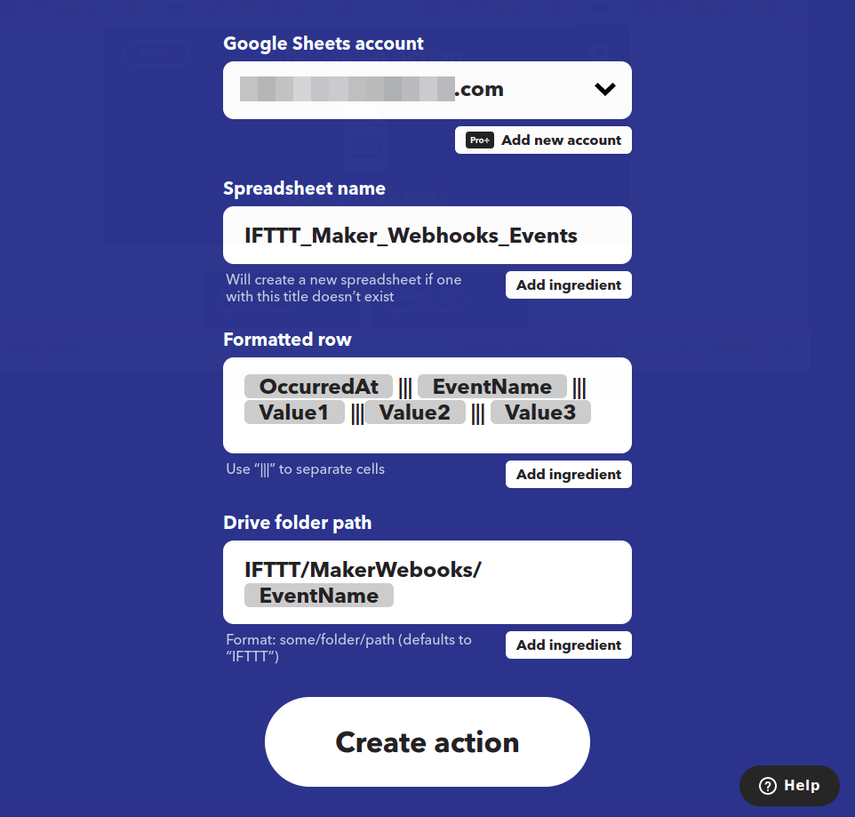

    ```{note}
    When connecting a Google account, this opens a window for selecting the desired Google account and granting IFTTT permission to access the account's files.
    ```

1. Click *Continue*.

    

1. Review and click *Finish*.

    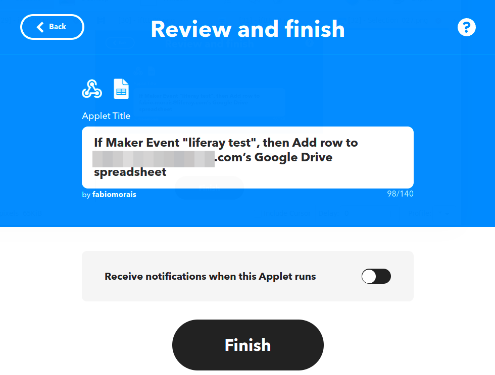

1. When you finish the process, your *Applet* is already *connected*.

    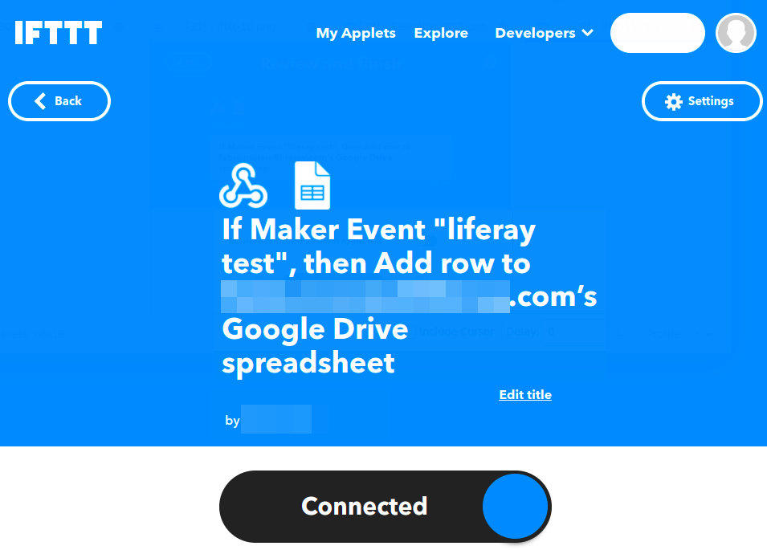

1. Once created, click the *Webhook Icon* &rarr; *Documentation* and copy the generated *webhook URL*.

    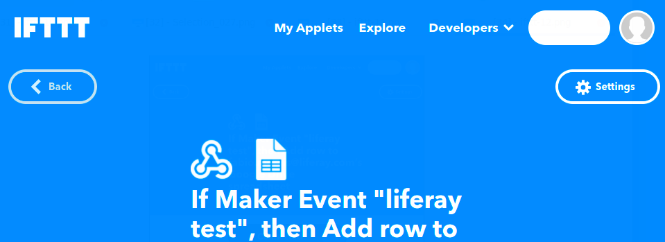

    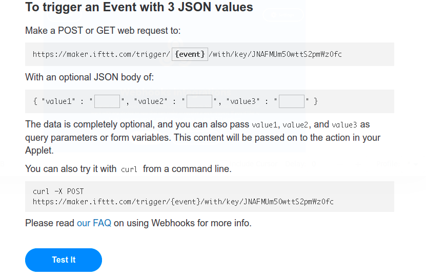

1. In your Liferay instance, use the copied URL to [define an Object action](../../creating-and-managing-objects/defining-object-actions.md) that sends a request to the webhook endpoint whenever a new Object entry is added.

    

## Additional Information

* [Objects Overview](../../../objects.md)
* [Creating and Managing Objects](../../creating-and-managing-objects.md)
* [Understanding Object Integrations](../../understanding-object-integrations.md)