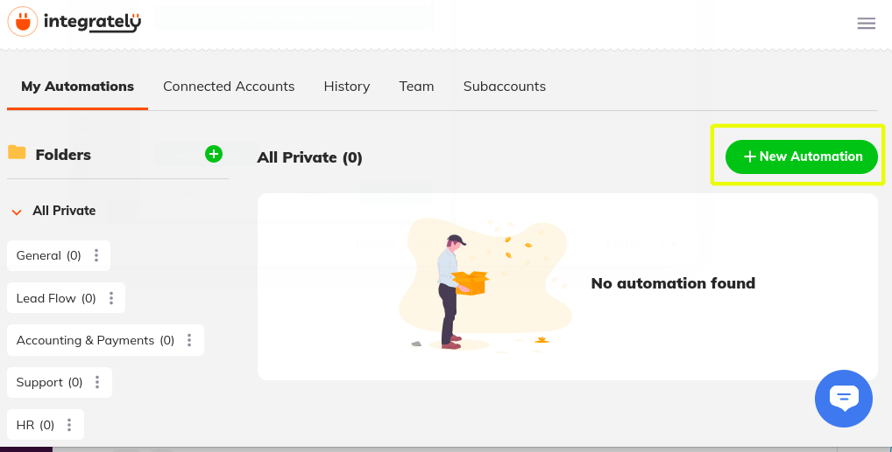
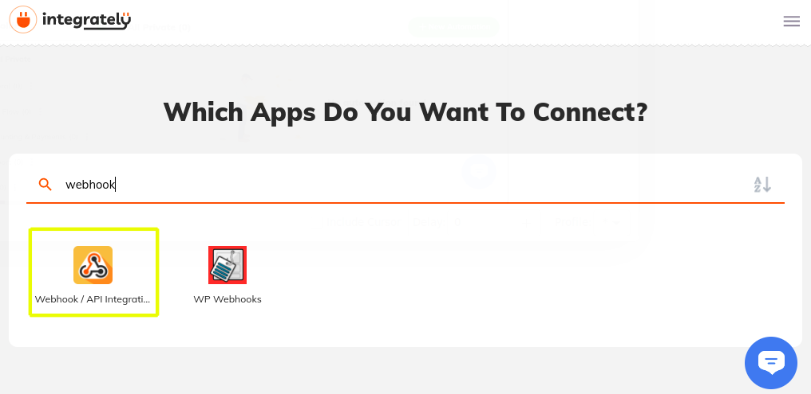
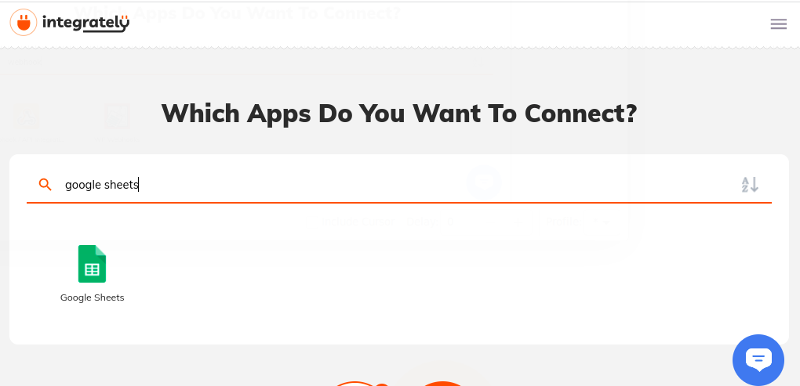
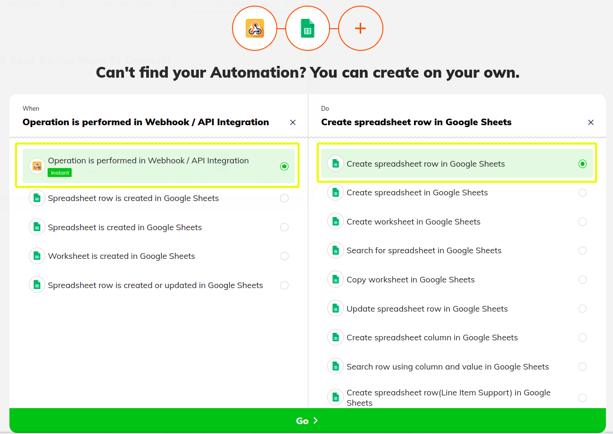
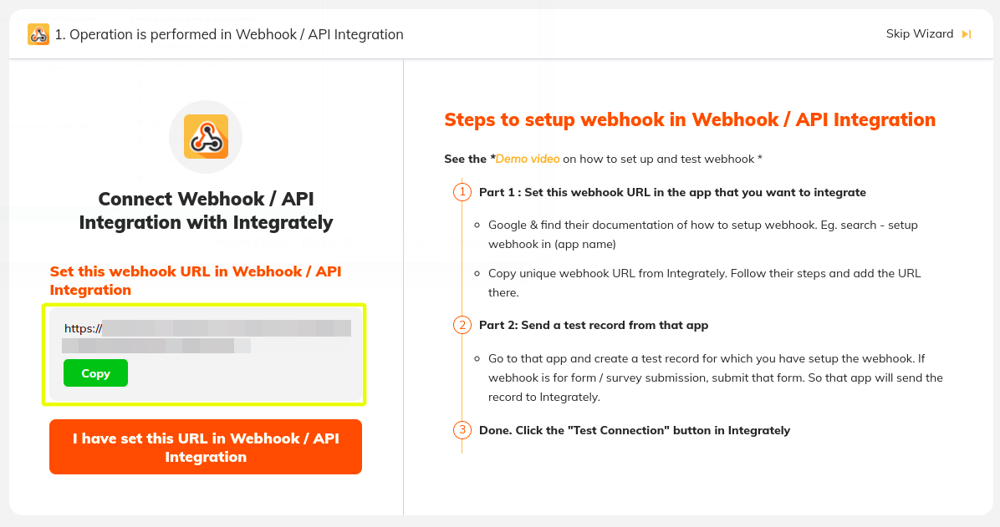
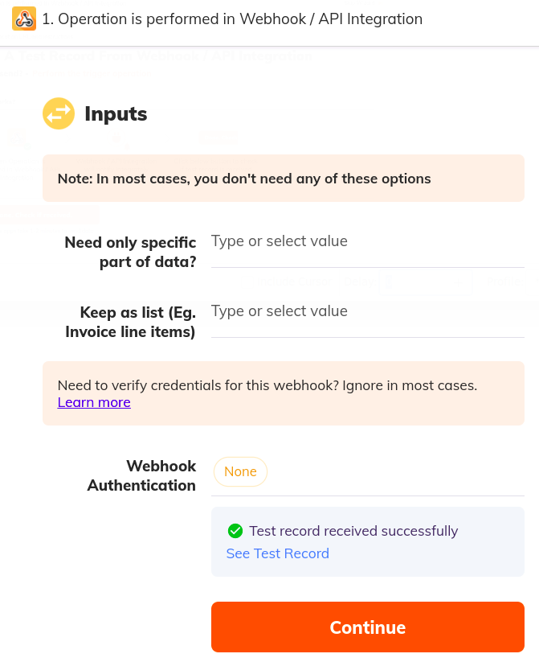
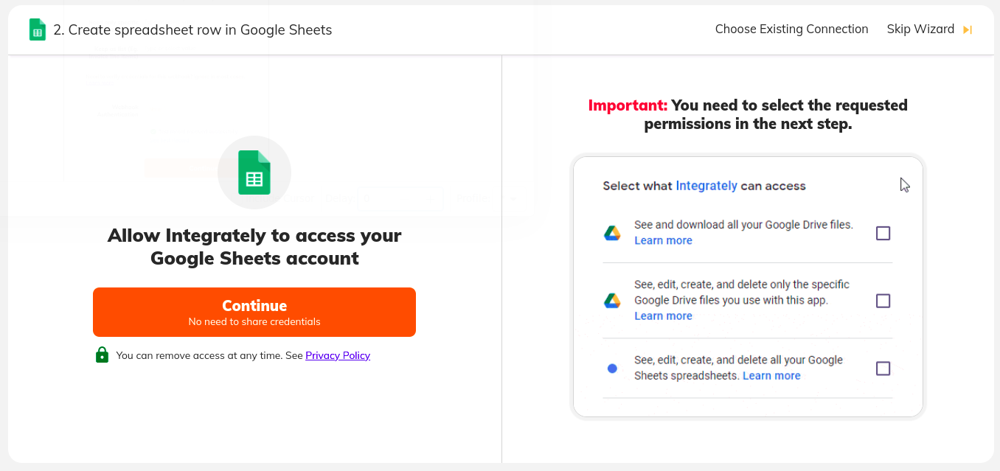
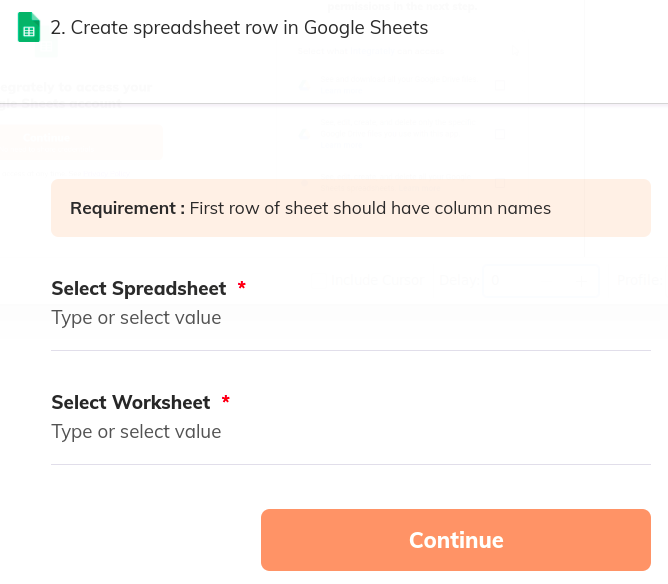
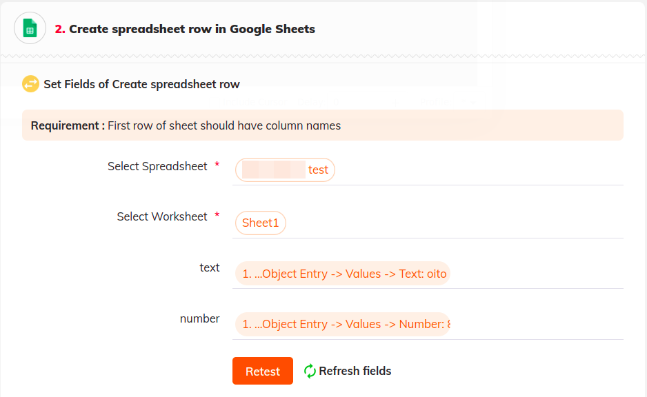
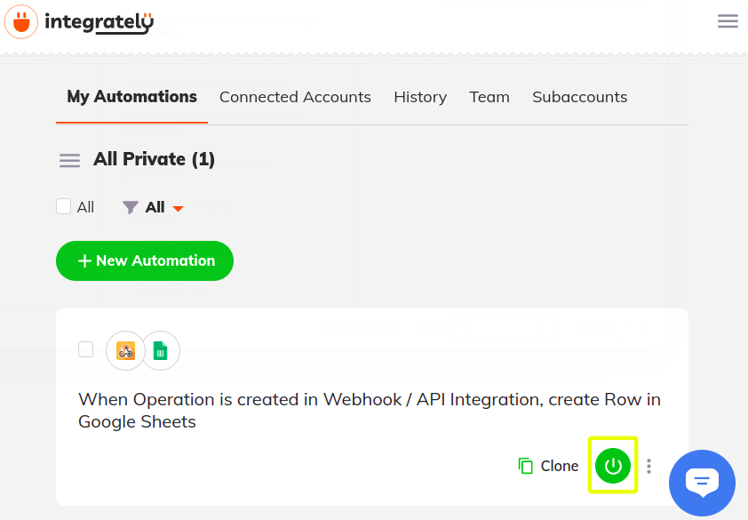

# Using Integrately to Sync Object Data with Google Sheets

{bdg-secondary}`Available 7.4+`

Here you'll learn how to use webhooks to trigger sync tasks between Liferay Objects and Google Sheets using [Integrately](https://integrately.com/). Syncing your data in this way requires an Integrately account, Google Spreadsheet, and active DXP 7.4 instance. The DXP instance must also have a published Object with the desired fields for sending or receiving data to the Google Spreadsheet.

## Syncing Object Data to a Google Sheet

Follow these steps to sync Object data to a Google Sheet:

1. Sign in to [Integrately](https://integrately.com/) and click *New Automation*.

   

1. Add the *Webhook/API Integration* app to the automation.

   

1. Add the *Google Sheets* app to the automation.

   

1. Define the automation's trigger and action and click *Go*.

   

1. Copy the generated *webhook URL*.

   

1. In your Liferay instance, use the copied URL to [define an Object action](../../creating-and-managing-objects/defining-object-actions.md) that sends a request to the webhook endpoint whenever a new Object entry is added.

   

1. Add a test Object entry to trigger the webhook.

   This allows the Webhook app to determine the Object's data structure automatically.

1. In Integrately, click *I have set this URL in Webhook/API Integration*.

1. Click *Done, Check if received*.

   

1. Verify the test was successful and click *Continue*.

   

1. Connect the Google Sheets app to a Google account.

   

1. Select the desired *Spreadsheet* and *Worksheet* to sync with the Object.

   

1. Map the Sheet's columns to data fields in the Object's structure.

   

1. Navigate to the *My Automations* page, and click the *Power* Button to turn on your connection.

   

## Additional Information

* [Objects Overview](../../../objects.md)
* [Creating and Managing Objects](../../creating-and-managing-objects.md)
* [Understanding Object Integrations](../../understanding-object-integrations.md)