# Using Wyzebulb to Sync Object Data with Google Sheets

You can use Liferay Objects with data integration tools to create automated tasks for syncing Object data with external services. These tasks are triggered using webhooks and can connect to Google applications, Microsoft Office, and more.

Here you'll learn how to use webhooks to trigger sync tasks between Liferay Objects and Google Sheets using [Wyzebulb](https://www.wyzebulb.com/). Syncing your data in this way requires an Wyzebulb account, Google Spreadsheet, and active DXP 7.4 instance. The DXP instance must also have a published Object with the desired fields for sending or receiving data to the Google Spreadsheet.

## Syncing Object Data to a Google Sheet

Follow these steps to sync Object data to a Google Sheet:

1. Log in to [Wyzebulb](https://www.wyzebulb.com/) and create a Flow.

1. For the trigger, select the *Webhooks* app.

    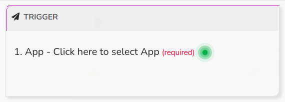

    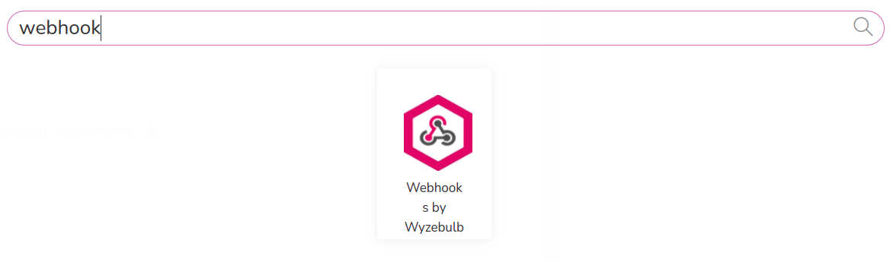

1. Select the *Catch Hook* trigger and click *Save + Continue*

    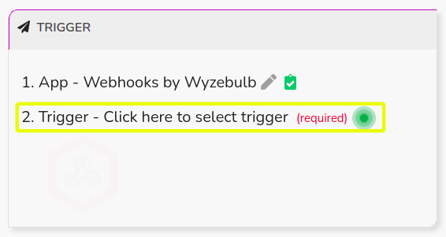

    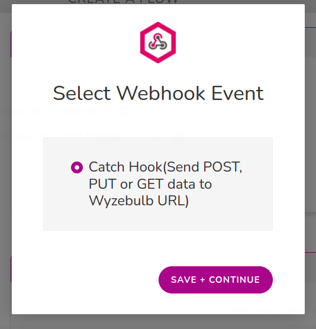

1. Click *Webhooks URL* and copy the generated URL.

    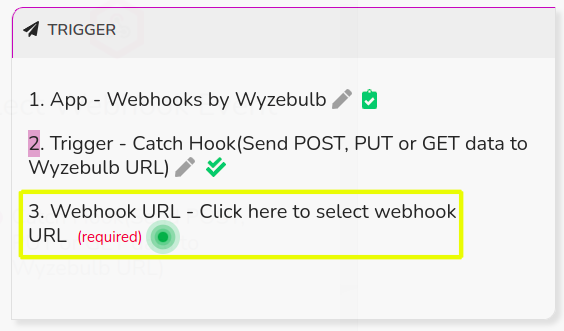

    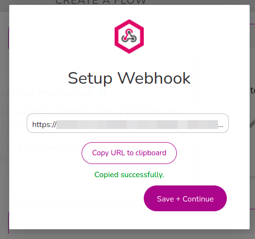

1. In your Liferay instance, use the copied URL to [define an Object action](../../creating-and-managing-objects/defining-object-actions.md) that sends a request to the webhook endpoint whenever a new Object entry is added.

    

1. Add a test Object entry to trigger the webhook.

   This allows the Webhooks module to determine the Object's data structure automatically.

1. Verify the test was successful and click *Save + Continue*.

    

1. For the *Action*, select the *Google Sheets* app.

    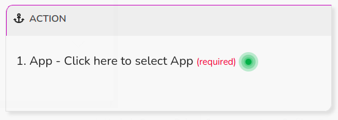

    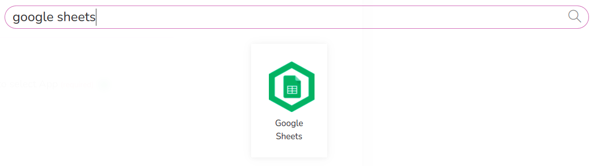

1. Select the *Create a new row in Google Sheets* action and click *Save + Continue*

    

    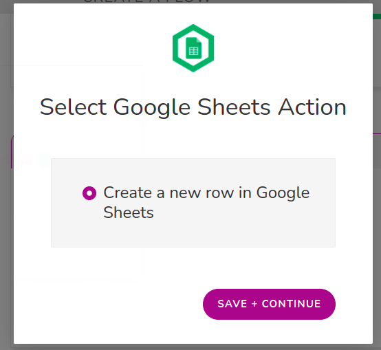

1. Connect the Google Sheets app to a Google account.

    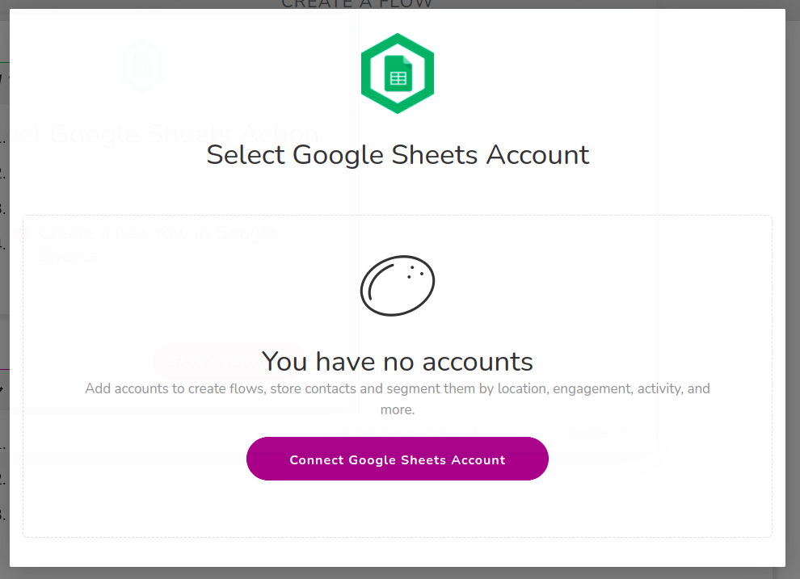

1. Select the desired *Spreadsheet* and *Worksheet*.

    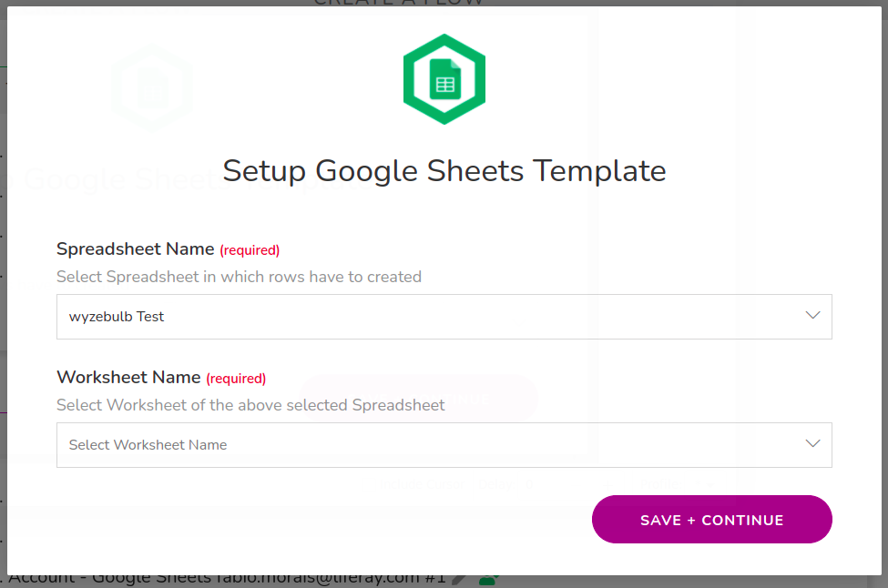

1. Map the Sheet's columns to data fields in the Object's structure.

    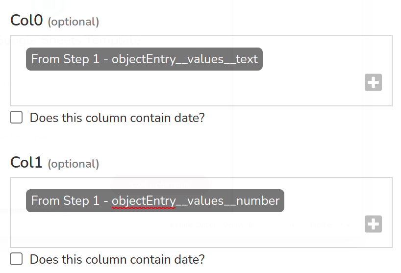

1. Click the *Test Action* button and verify the test was successful.

    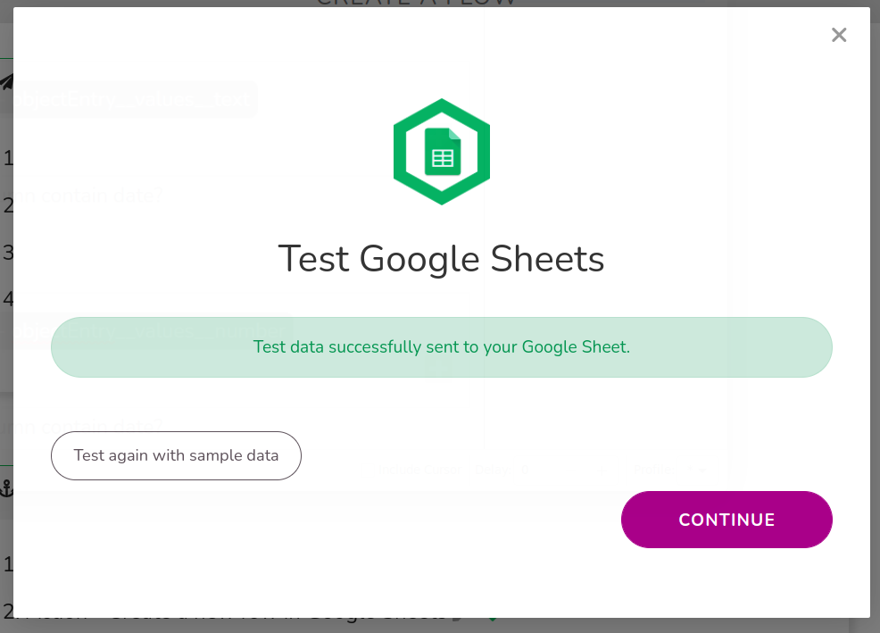

1. Navigate to *My Flows* page and verify your flow is running.

    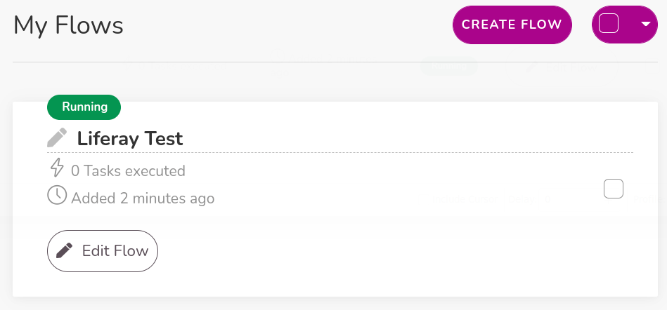

## Additional Information

* [Objects Overview](../../../objects.md)
* [Creating and Managing Objects](../../creating-and-managing-objects.md)
* [Understanding Object Integrations](../../understanding-object-integrations.md)