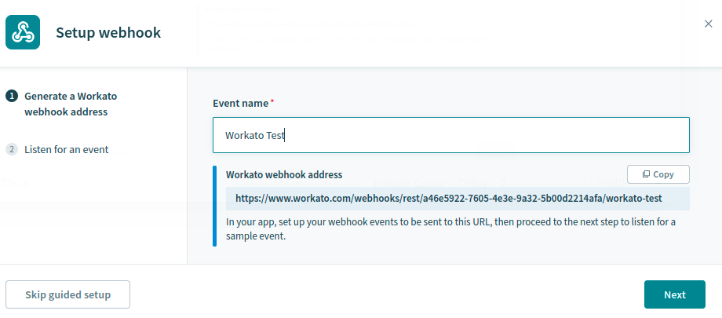
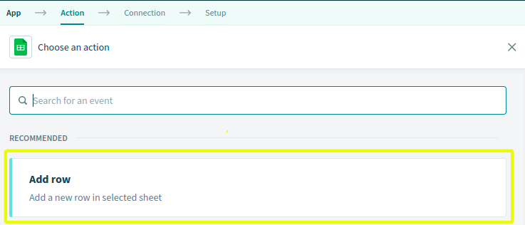

# Using Workato to Sync Object Data with Google Sheets

You can use Liferay Objects with data integration tools to create automated tasks for syncing Object data with external services. These tasks are triggered using webhooks and can connect to Google applications, Microsoft Office, and more.

Here you'll learn how to use webhooks to trigger sync tasks between Liferay Objects and Google Sheets using [Workato](https://www.workato.com/). Syncing your data in this way requires an Workato account, Google Spreadsheet, and active DXP 7.4 instance. The DXP instance must also have a published Object with the desired fields for sending or receiving data to the Google Spreadsheet.

## Syncing Object Data to a Google Sheet

Follow these steps to sync Object data to a Google Sheet:

1. Log in to [Workato](https://www.workato.com/) and navigate to the *Projects* page.

   

1. Navigate to the *Recipes* page and click on *Create Recipe*.

   

1. Enter a recipe *Name*, *Location*, and pick the *Trigger from a webhook*. Then click *Start building*.

   

1. Click *Start Guided Setup*.
   <!--NOTE: Do users need to select the webhook trigger before clicking this? -->
   

1. Enter an *Event Name* and copy the generated *webhook URL*.

   

1. In your Liferay instance, use the copied URL to [define an Object action](../creating-and-managing-objects/defining-object-actions.md) that sends a request to the webhook endpoint whenever a new Object entry is added.

   

1. Click *Next* and add a test Object entry to trigger the webhook.

   This allows the webhook module to determine the Object's data structure automatically.

   

1. Verify if the test successfully determined the Object's data structure and click *Setup Webhook*

   

1. For the *Action*, select *Action in an app*.

   

1. Select the *Google Sheets* app.

   

1. Select the *Add Row* action.

   

1. Connect the app to a Google account.

   

1. Select the desired *Spreadsheet* and *Worksheet* to sync with the Object.

   

1. Map the Sheet's columns to data fields in the Object's structure.

   

1. Click *Save*.

   

1. Navigate to *Assets* page, click the *kebab Button* and select *Start* to activate the recipe.

   

## Additional Information

* [Objects Overview](../../objects.md)
* [Creating and Managing Objects](../creating-and-managing-objects.md)
* [Understanding Object Integrations](../understanding-object-integrations.md)