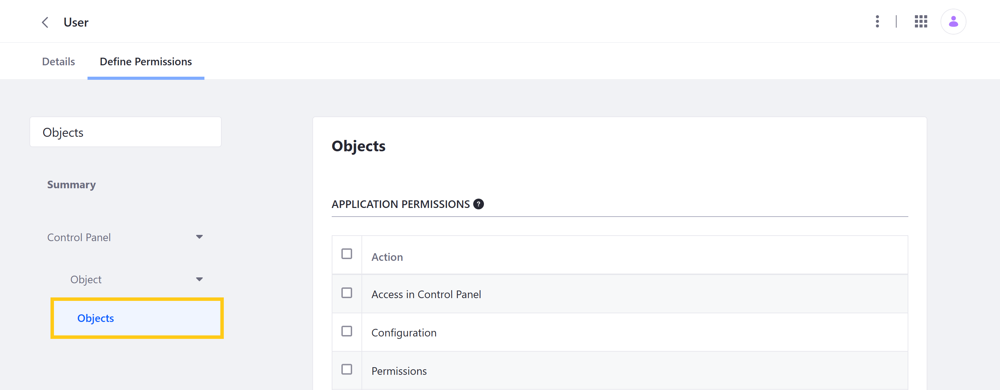
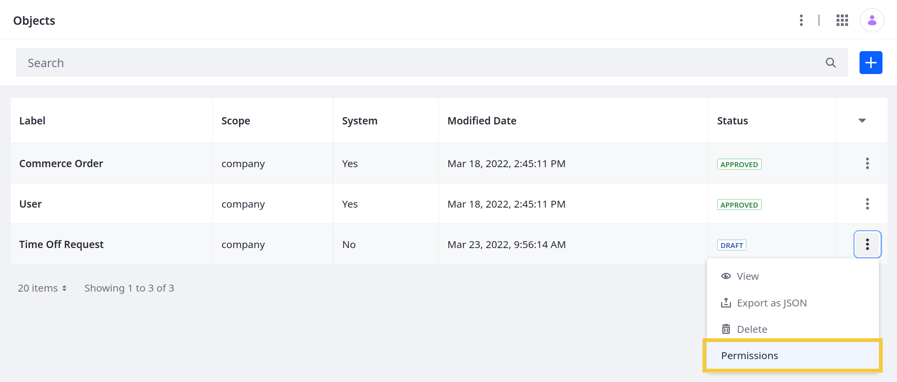
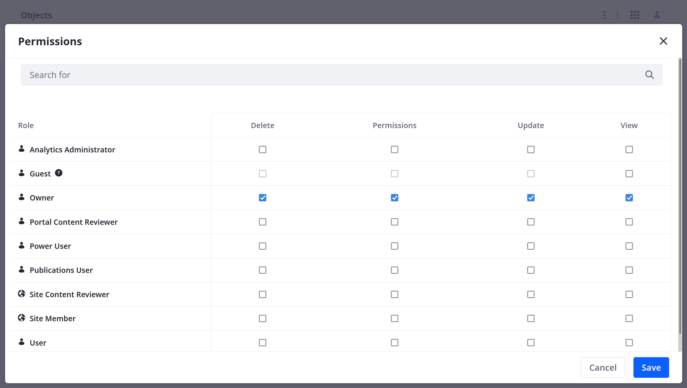

# Objects Application Permissions

{bdg-secondary}`Available Liferay DXP/Portal 7.4+`

Like other Liferay applications, the Objects portlet is integrated with the permissions framework. This means you can assign [application](#application-permissions) and [resource](#resource-permissions) permissions to user roles to determine which users have access to the Objects portlet and its data.



See [Defining Role Permissions](../../users-and-permissions/roles-and-permissions/defining-role-permissions.md) for more information about assigning permissions to user roles.

## Application Permissions

Application permissions grant permission to perform general application-related operations and do not include [resource-related permissions](#resource-permissions).

Objects has the following application permissions:

| Permission | Description |
| :--- | :--- |
| Access in Control Panel | Access Objects in the Global Menu |
| Configuration | View and modify configuration options for the Objects portlet |
| Permissions | View and modify Objects permissions |
| Preferences | View and modify preferences for the Objects portlet |
| View | View the Objects portlet |

## Resource Permissions

Resource permissions grant specific permissions on application resources. Some of these permissions enable performing [operations on database entities](#actions-on-database-entities) (i.e., model resources). Others grant permission to perform [resource-related operations](#resource-related-actions) in an application context (e.g., create a new resource entity).

Objects has the following resource permissions.

### Resource-Related Actions

| Permission | Description |
| :--- | :--- |
| Add Object Definition | Create an Object definition draft |
| Extend System Object Definition | Add fields, relationships, and layouts to system Objects |
| Permissions | View and manage permissions related to Objects |
| Publish Object Definition | Publish an Object definition draft |

### Actions on Database Entities

| Permission | Description |
| :--- | :--- |
| Delete | Delete an Object definition |
| Permissions | View and modify permissions for an Object definition |
| Update | Update an Object definition |
| View | View an Object definition |

## Managing Permissions for Individual Object Definitions

{bdg-secondary}`Available Liferay 7.4 U17+ and 7.4 GA17+`

Follow these steps to manage permissions for individual Object definitions:

1. Open the *Objects* application via the *Global Menu* ().

1. Click the *Actions* button () for the desired Object definition and select *Permissions*.

   

1. Use the checkboxes to grant [Object definition](#actions-on-database-entities) permissions to the desired Roles.

   ```{note}
   Permissions defined at the Roles admin level override permissions defined at the individual level.
   ```

   

1. Click *Save*.

## Additional Information

* [Objects Overview](../objects.md)
* [Creating Objects](./creating-and-managing-objects/creating-objects.md)
* [Managing Objects](./creating-and-managing-objects/managing-objects.md)
