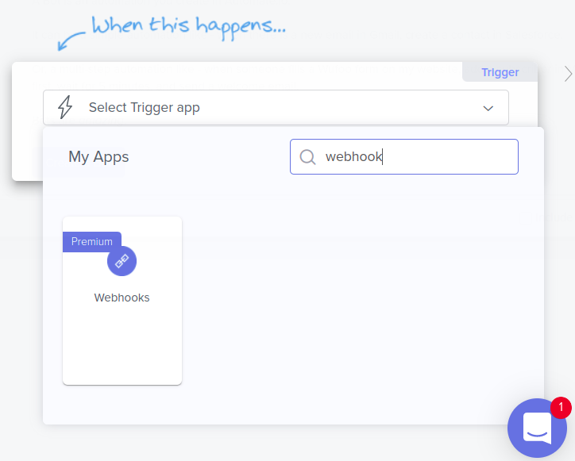
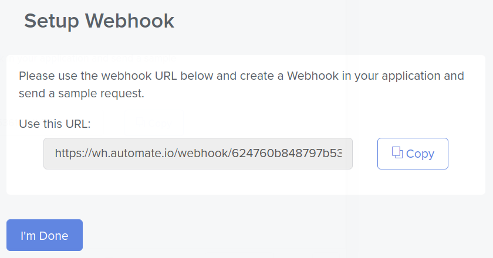
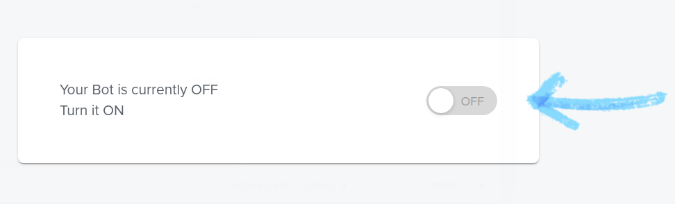

# Using Automate.io to Sync Object Data with Google Sheets

You can use Liferay Objects with data integration tools to create automated tasks for syncing Object data with external services. These tasks are triggered using webhooks and can connect to Google applications, Microsoft Office, and more.

Here you'll learn how to use webhooks to trigger sync tasks between Liferay Objects and Google Sheets using Automate.io. Syncing your data in this way requires an Automate.io account, Google Spreadsheet, and active DXP 7.4 instance. The DXP instance must also have a published Object with the desired fields for sending or receiving data to the Google Spreadsheet.

## Syncing Object Data to a Google Sheet

Follow these steps to sync Object data to a Google Sheet:

1. Open Automate.io and click on *Create a Bot*.

    

1. On the *Trigger* Step, search and select *Webhooks*.

    

1.  Click the *Trigger Event* dropdown menu and select *Incoming Hook*.

    

1. Copy the *Webhooks URL*.

     

1. Use the copied URL to [define an Object action](../creating-and-managing-objects/defining-object-actions.md) that sends a request to the webhook endpoint whenever a new Object entry is added.

    

1. Trigger the webhook by adding a test entry to the Object.

   This allows the Webhooks module to determine the Object's data structure automatically.

1. On the *Action* step , search and select *Google Sheets*.

    

1. Choose a Google Sheet account to connect.

    

1. Select the desired *Spreadsheet*.

    

1. Select the desired *Spreadsheet*, *Worksheet* to sync with the Object and click *Save*.

    

1. *Turn On* your bot.

    

1. Test your bot using live data. 

    

1. Verify if the test successfully determined the Object's data structure. If the data sent to the webhook URL is found, the step will show it was successful.

    

## Additional Information

* [Objects Overview](../../objects.md)
* [Creating and Managing Objects](../creating-and-managing-objects.md)
* [Understanding Object Integrations](../understanding-object-integrations.md)