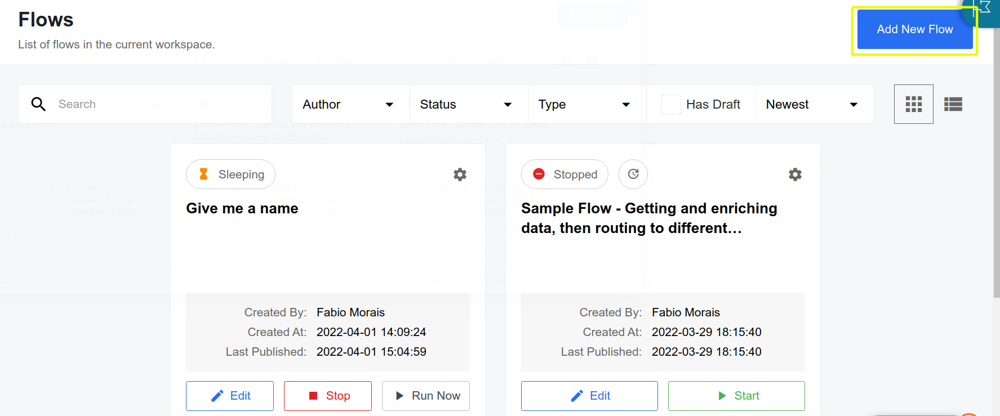
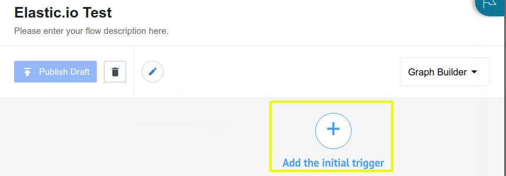
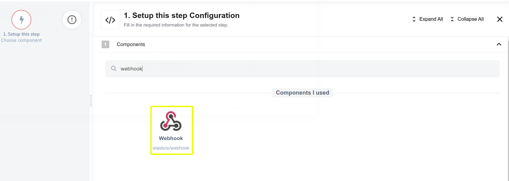
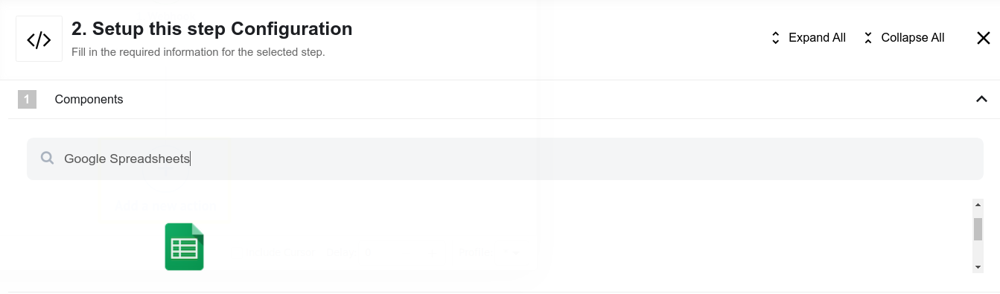
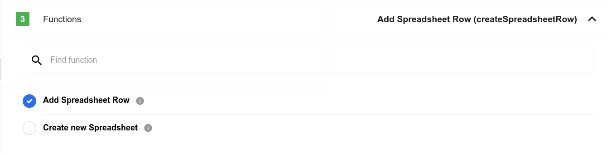
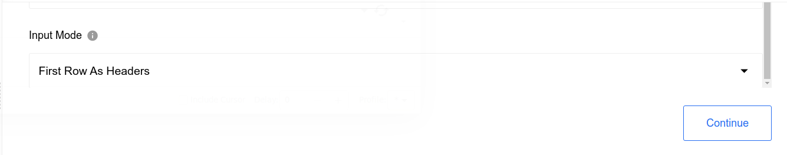
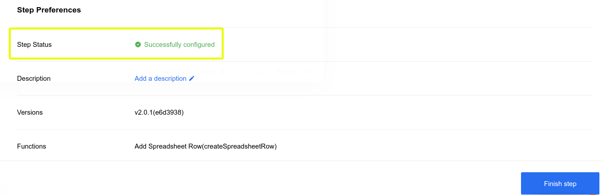
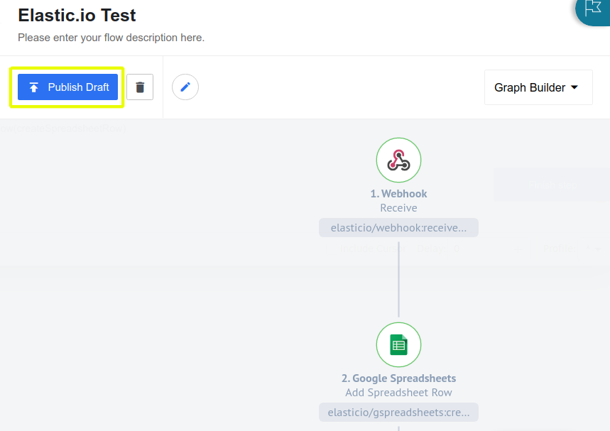

# Using Elastic.io to Sync Object Data with Google Sheets

You can use Liferay Objects with data integration tools to create automated tasks for syncing Object data with external services. These tasks are triggered using webhooks and can connect to Google applications, Microsoft Office, and more.

Here you'll learn how to use webhooks to trigger sync tasks between Liferay Objects and Google Sheets using Elastic.io. Syncing your data in this way requires an Elastic.io account, Google Spreadsheet, and active DXP 7.4 instance. The DXP instance must also have a published Object with the desired fields for sending or receiving data to the Google Spreadsheet.

## Syncing Object Data to a Google Sheet

Follow these steps to sync Object data to a Google Sheet:

1. Open Elastic.io, navigate to the *Integrate* page, and click on *Flow*.

    

1. Click on *Add New Flow*.

    

1. Click on *Add the Initial Trigger*.

    

1. On the *Trigger* step, search for and select *Webhooks*.

    

1. Copy the generated *Webhook URL*

    

1. Use the copied URL to [define an Object action](../creating-and-managing-objects/defining-object-actions.md) that sends a request to the webhook endpoint whenever a new Object entry is added.

    

1. Trigger the webhook by adding a test entry to the Object.

   This allows the Webhooks module to determine the Object's data structure automatically.

1. Click on the *Send Sample Request* button.

    

1. Verify if the test successfully determined the Object's data structure. If the data sent to the webhook URL is found, the step will show it was successful.
   
    

1. Click on *Add New Action*. 

    

1. On the *Action* step, search for and select *Google Sheets*.

    

1. Select *Add Spreadsheet Row*. 

    

1. Select the desired *Spreadsheet* and *Worksheet* to sync with the Object.

    

1. Indicate whether the selected Sheet includes headers.

    

1. Map the Sheet's columns to data fields in the Object's structure.

    

1. Click on the *Retrieve Sample from Google Spreadsheet* button.

    

1. Verify if the test successfully determined the Object's data structure. If the data sent to the webhook URL is found, the step will show it was successful.

   

1. Click on *Publish Draft*.

   

1. Click on *Start Flow* to turn on.

    

## Additional Information

* [Objects Overview](../../objects.md)
* [Creating and Managing Objects](../creating-and-managing-objects.md)
* [Understanding Object Integrations](../understanding-object-integrations.md)