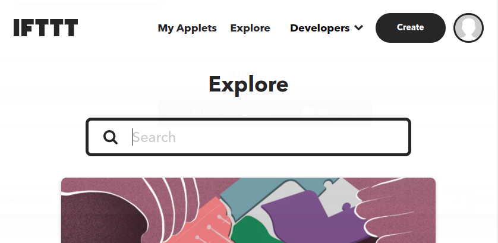
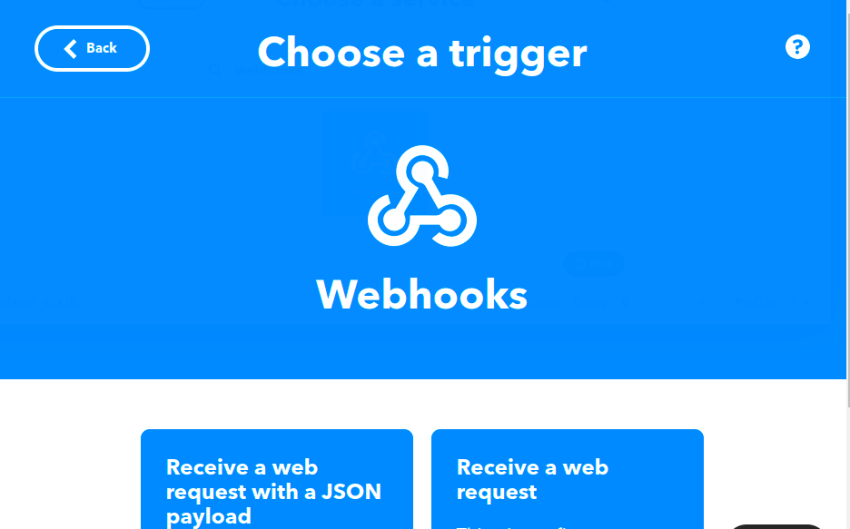
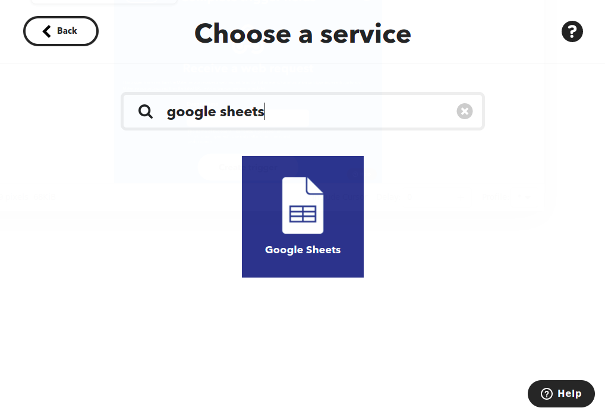
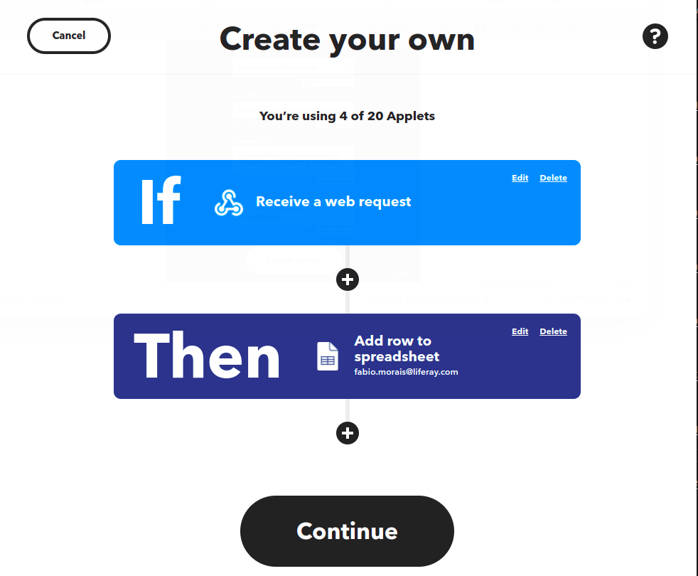
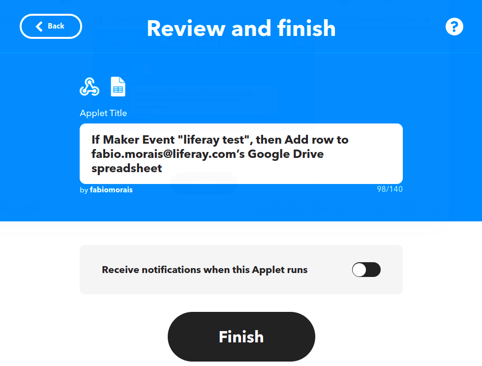
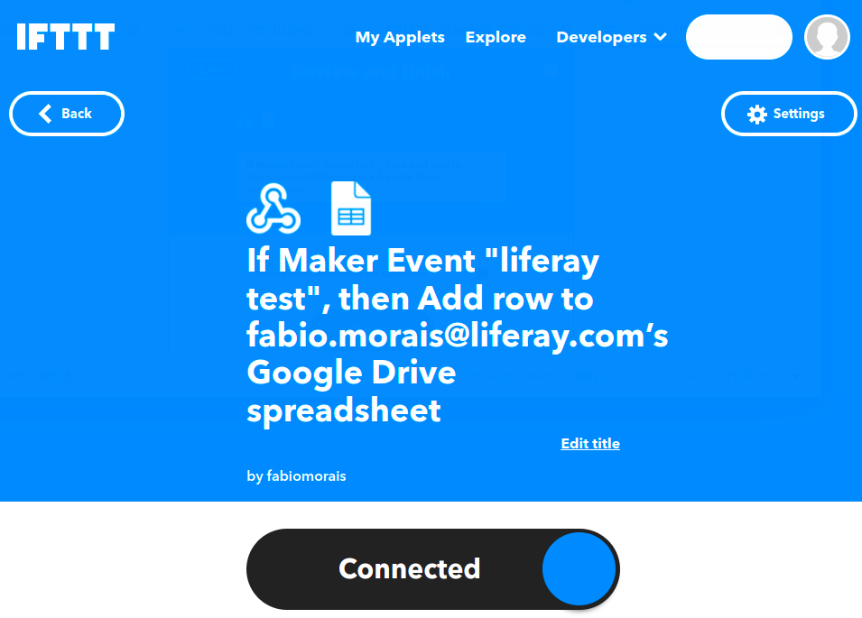

# Using IFTTT to Sync Object Data with Google Sheets

You can use Liferay Objects with data integration tools to create automated tasks for syncing Object data with external services. These tasks are triggered using webhooks and can connect to Google applications, Microsoft Office, and more.

Here you'll learn how to use webhooks to trigger sync tasks between Liferay Objects and Google Sheets using IFTTT. Syncing your data in this way requires an IFTTT account, Google Spreadsheet, and active DXP 7.4 instance. The DXP instance must also have a published Object with the desired fields for sending or receiving data to the Google Spreadsheet.

## Syncing Object Data to a Google Sheet

Follow these steps to sync Object data to a Google Sheet:

1. Open IFTTT and click *Create*.

    

1. Click *add* on the *Trigger* step. 

    
   
1. Search for and select *Webhooks*.

    

1. Choose a *Trigger* type.

    

1. Choose an *Event Name* and click on *Create Trigger*.

    

1. Click *add* on the *Action* step. 
 
    

1. Search for and select *Google Sheets*.

    

1.  Choose an *Action* type.

    

1. Complete the Action's Fields and click on *Create Action*.

    

    ```{note}
    when you choose a google account to connect, this opens a window for selecting the desired Google account and granting IFTTT permission to access the account's files.
    ```

1. Click *Continue*. 

     <!--Maybe the image is not necessary-->

1. Review and click *Finish*.

    

1. When you finish the process your *Applet* is already *connected*.

    

1. Once created, click on the *Webhook Icon* &rarr; Documentation &rarr; Copy the generated *webhook URL*. <!--maybe add a third image? This image would show the documentation step-->

    

    

1.  Use the copied URL to [define an Object action](../creating-and-managing-objects/defining-object-actions.md) that sends a request to the webhook endpoint whenever a new Object entry is added.

    

## Additional Information

* [Objects Overview](../../objects.md)
* [Creating and Managing Objects](../creating-and-managing-objects.md)
* [Understanding Object Integrations](../understanding-object-integrations.md)