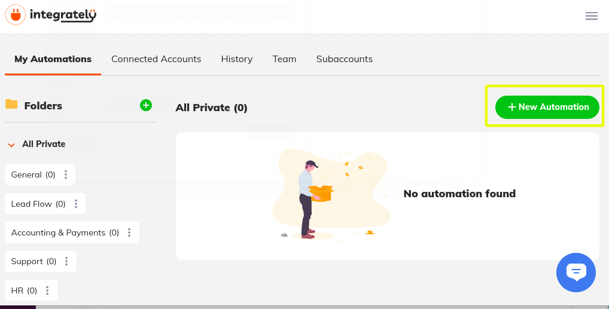
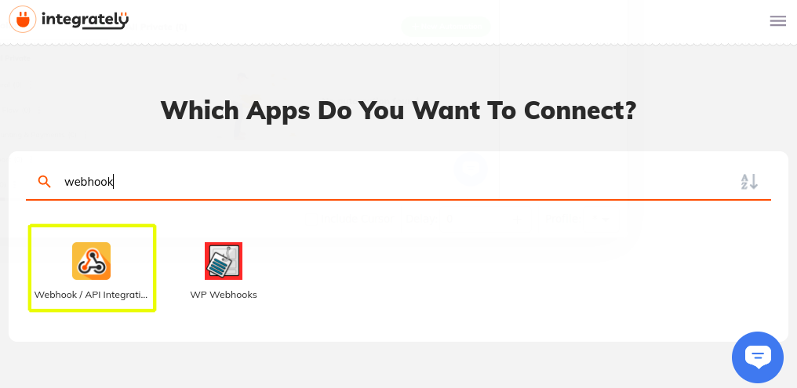
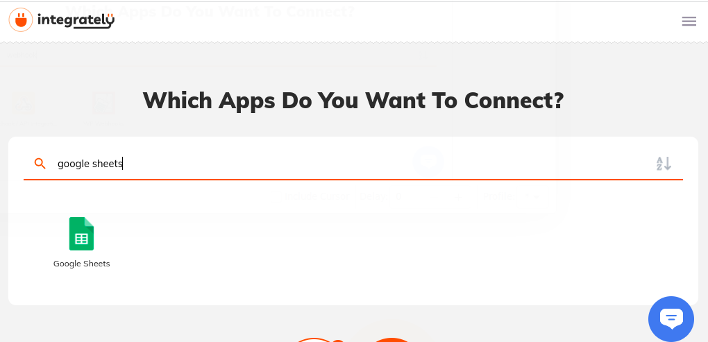
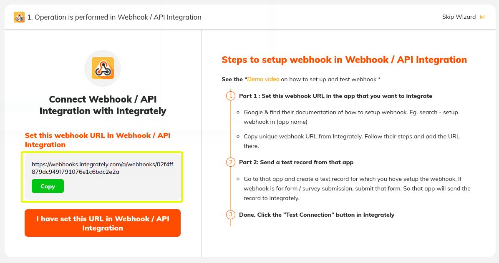
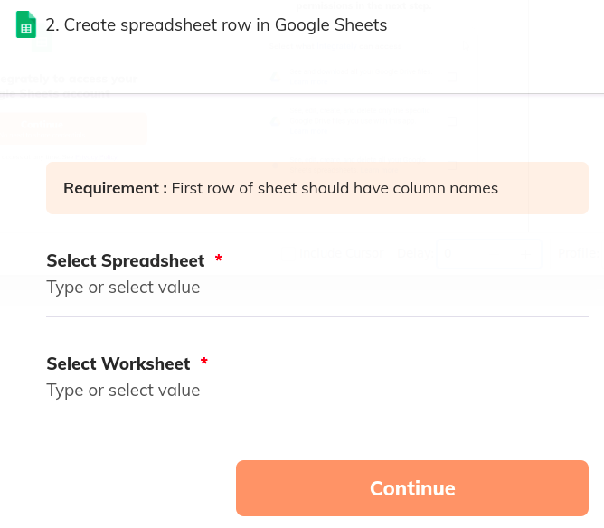
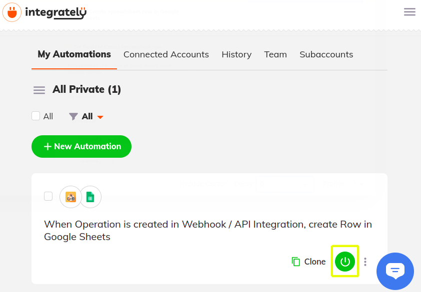

# Using Integrately to Sync Object Data with Google Sheets

You can use Liferay Objects with data integration tools to create automated tasks for syncing Object data with external services. These tasks are triggered using webhooks and can connect to Google applications, Microsoft Office, and more.

Here you'll learn how to use webhooks to trigger sync tasks between Liferay Objects and Google Sheets using Integrately. Syncing your data in this way requires an Integrately account, Google Spreadsheet, and active DXP 7.4 instance. The DXP instance must also have a published Object with the desired fields for sending or receiving data to the Google Spreadsheet.

## Syncing Object Data to a Google Sheet

Follow these steps to sync Object data to a Google Sheet:

1. Open Integrately and click *New Automation*.

    

1. On the *Trigger* step, search for and select *Webhooks*.

    

1. On the *Action* step, search for and select *Google Sheets*

    

1. Define the flow and click *Go*. 

    

1.  Once created, copy the generated *webhook URL*

    

1. Use the copied URL to [define an Object action](../creating-and-managing-objects/defining-object-actions.md) that sends a request to the webhook endpoint whenever a new Object entry is added.

    

1. Trigger the webhook by adding a test entry to the Object.

   This allows the Webhooks module to determine the Object's data structure automatically.

1. Click on the *Done, check if received* button.

    

1. Verify if the test successfully determined the Object's data structure. If the data sent to the webhook URL is found, the step will show it was successful as well as the data received.

    

1. Choose an Google account to connect.

    

1. Select the desired *Spreadsheet* and *Worksheet* to sync with the Object.

    

1. Map the Sheet's columns to data fields in the Object's structure.

    

1. Navigate to the *My Automations* page, and click on the *Power* Button to turn on your connection.

    

## Additional Information

* [Objects Overview](../../objects.md)
* [Creating and Managing Objects](../creating-and-managing-objects.md)
* [Understanding Object Integrations](../understanding-object-integrations.md)