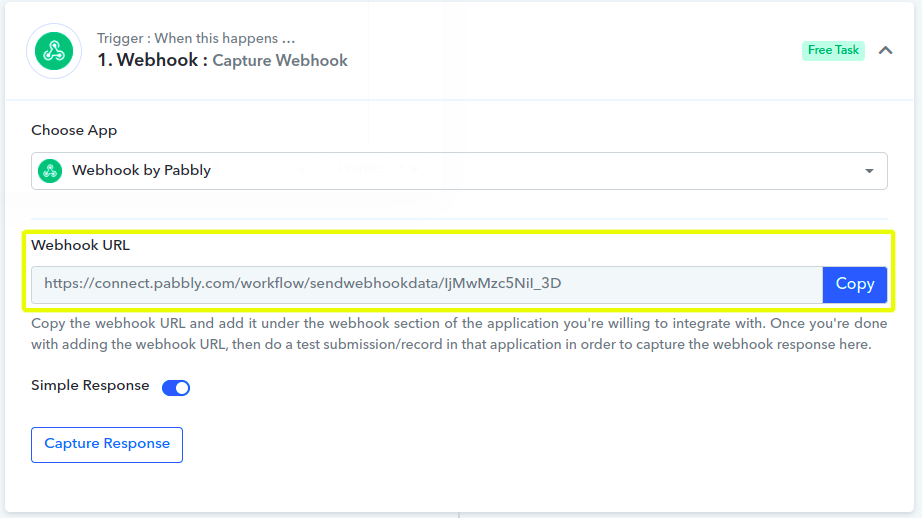
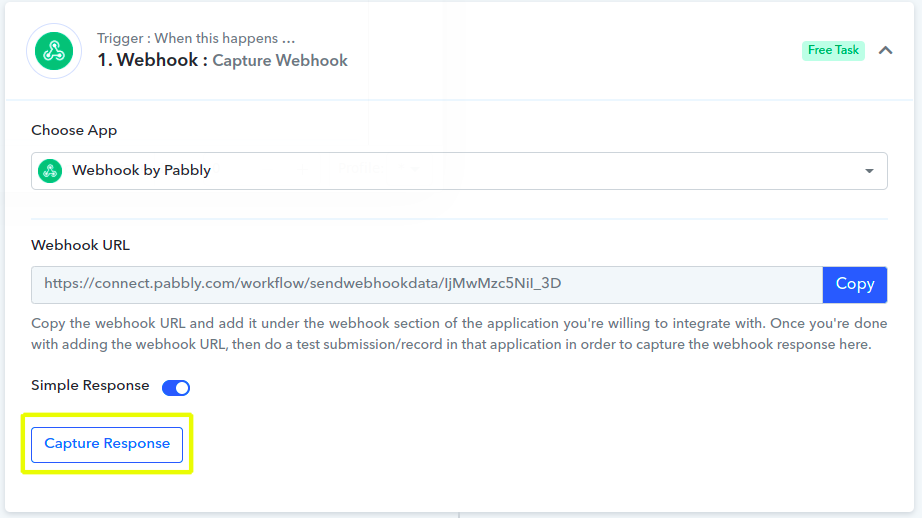
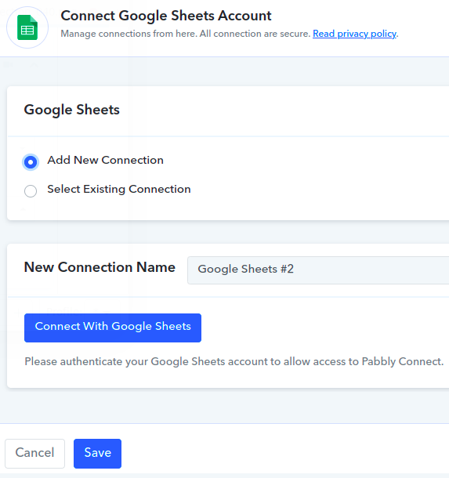
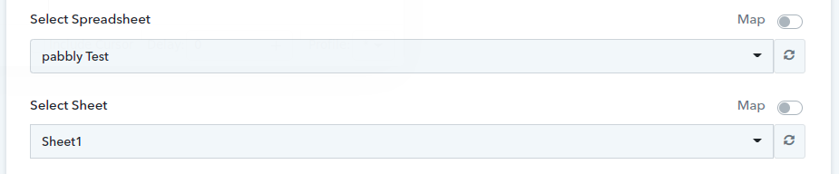
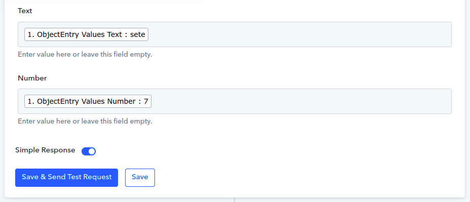

# Using Pabbly to Sync Object Data with Google Sheets

You can use Liferay Objects with data integration tools to create automated tasks for syncing Object data with external services. These tasks are triggered using webhooks and can connect to Google applications, Microsoft Office, and more.

Here you'll learn how to use webhooks to trigger sync tasks between Liferay Objects and Google Sheets using Pabbly. Syncing your data in this way requires an Pabbly account, Google Spreadsheet, and active DXP 7.4 instance. The DXP instance must also have a published Object with the desired fields for sending or receiving data to the Google Spreadsheet.

## Syncing Object Data to a Google Sheet

Follow these steps to sync Object data to a Google Sheet:

1. Open Pabbly, navigate to the *All Apps* page, and click *Pabbly Connect*.

    

1. On the *Dashboard* page, click on *Create Workflow*.

    

1. Choose a name and click *Create*.

    

1. Click the *Trigger* step, search for and select *Webhooks*.

    

1. Copy the generated *webhook URL*.

    

1.  Use the copied URL to [define an Object action](../creating-and-managing-objects/defining-object-actions.md) that sends a request to the webhook endpoint whenever a new Object entry is added.

    

1. Trigger the webhook by clicking on *Capture Response* and add a test entry to the Object.

   This allows the Webhooks module to determine the Object's data structure automatically.

    

1. Click the *Action* step, search for and select *Google Sheets*.

    

1. Click the *Action Event* dropdown menu, select *Create Spreadsheet Row* and click *Connect*

    

1.  Choose an Google account to connect and click *Save*.

    

1. Select the desired *Spreadsheet* and *Sheet* to sync with the Object.

    

1. Map the Sheet's columns to data fields in the Object's structure.

    

1. Click on the *Save and send Test Request* button and verify if the test was successful.

    

    ```{note}
    When you finish the process your *Workflow* is already *On*.
    ```

## Additional Information

* [Objects Overview](../../objects.md)
* [Creating and Managing Objects](../creating-and-managing-objects.md)
* [Understanding Object Integrations](../understanding-object-integrations.md)