# Using Workato to Sync Object Data with Google Sheets

You can use Liferay Objects with data integration tools to create automated tasks for syncing Object data with external services. These tasks are triggered using webhooks and can connect to Google applications, Microsoft Office, and more.

Here you'll learn how to use webhooks to trigger sync tasks between Liferay Objects and Google Sheets using Workato. Syncing your data in this way requires an Workato account, Google Spreadsheet, and active DXP 7.4 instance. The DXP instance must also have a published Object with the desired fields for sending or receiving data to the Google Spreadsheet.

## Syncing Object Data to a Google Sheet

Follow these steps to sync Object data to a Google Sheet:

1. Open Workato and navigate to the *Projects* page.
   
    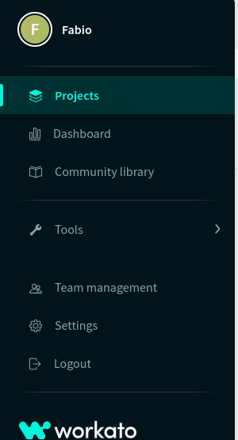

1. Navigate to *Recipes* page and click on *Create Recipe*.

    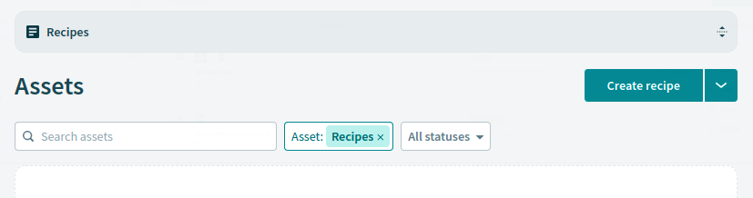

1. Choose a *Name*, *Location* and *Pick a Starting Point*

    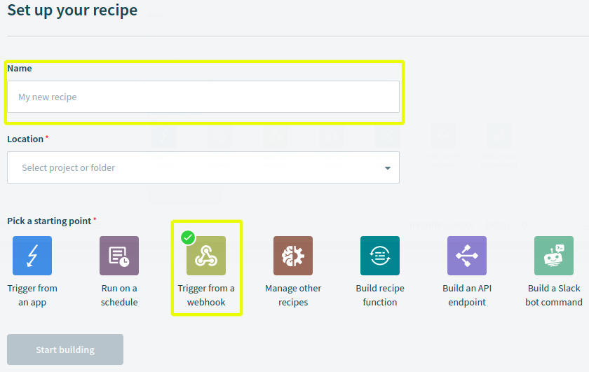

    ```{note}
    The starting point for this example's sake needs to be Trigger from a Webhook.
    ```

1. Click on *Start Guided Setup*.

    

1. Choose an *Event Name* and copy the generated *webhook URL*.

    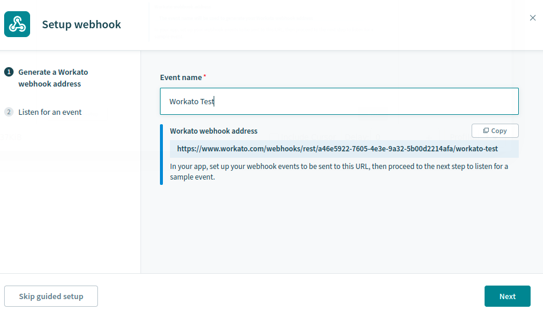

1. Use the copied URL to [define an Object action](../creating-and-managing-objects/defining-object-actions.md) that sends a request to the webhook endpoint whenever a new Object entry is added.

    

1. Click *Next* to trigger the webhook and add a test entry to the Object.

   This allows the Webhooks module to determine the Object's data structure automatically.

    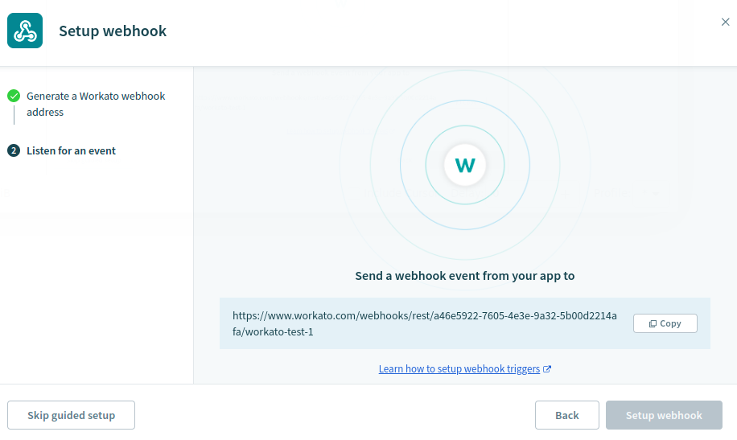

1. Verify if the test successfully determined the Object's data structure and click *Setup Webhook*

    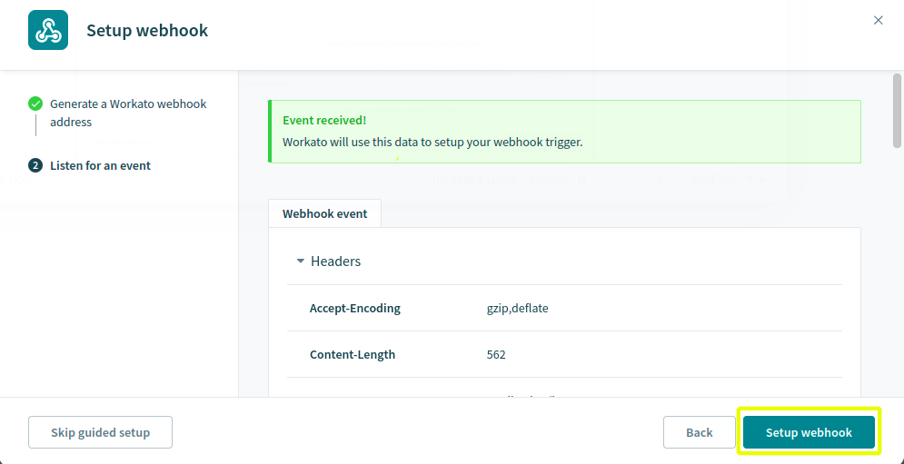

1. Navigate to the *Action* step and select *Action in a App*.

    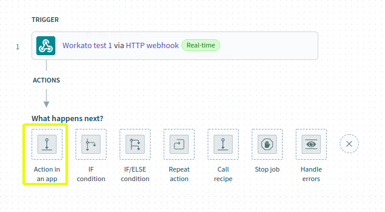

1. Search for and select *Google Sheets*.

    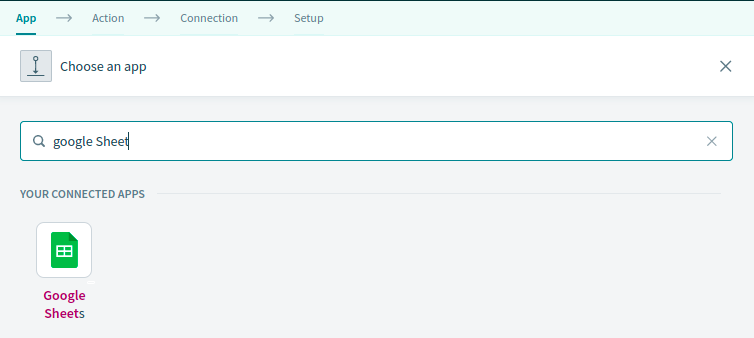

1. Select *Add Row*.

    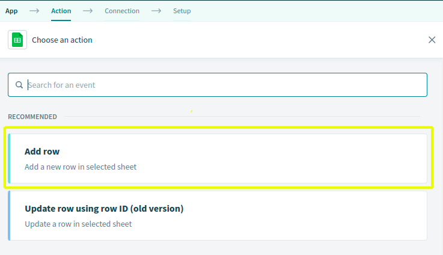

1. Choose an Google account to connect.

    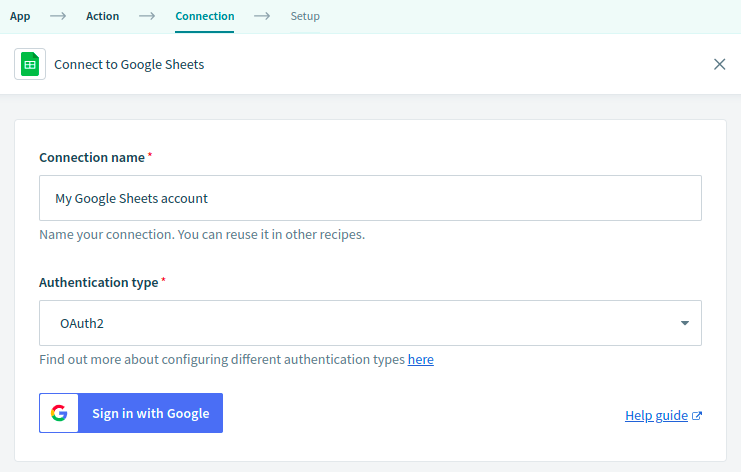

1. Select the desired *Spreadsheet* and *Worksheet* to sync with the Object.

    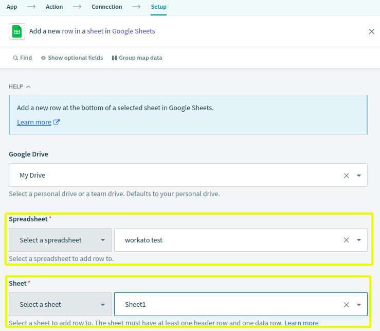

1. Map the Sheet's columns to data fields in the Object's structure.

    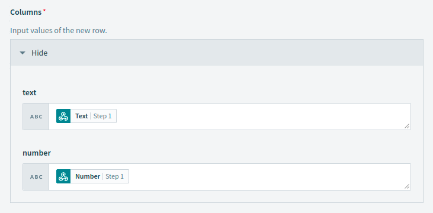

1. Click *Save*.

    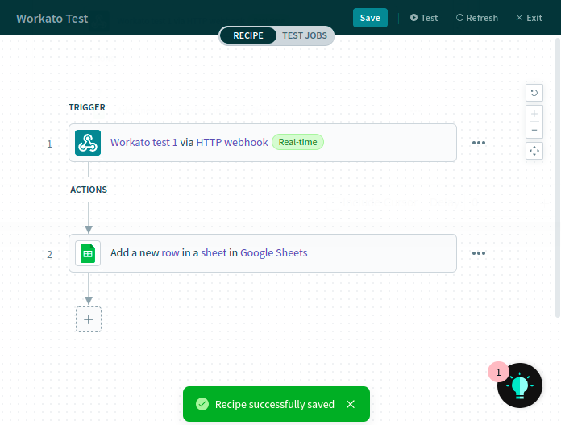

1. Navigate to *Assets* page, click the *kebab Button* and select *Start*. Your connection is active.

    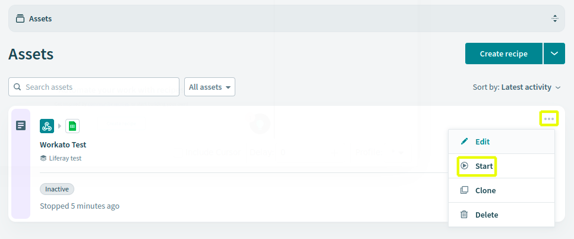

## Additional Information

* [Objects Overview](../../objects.md)
* [Creating and Managing Objects](../creating-and-managing-objects.md)
* [Understanding Object Integrations](../understanding-object-integrations.md)