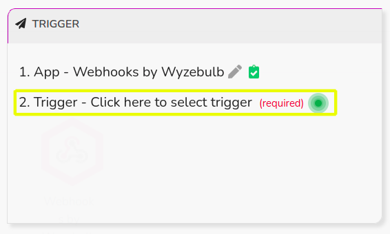
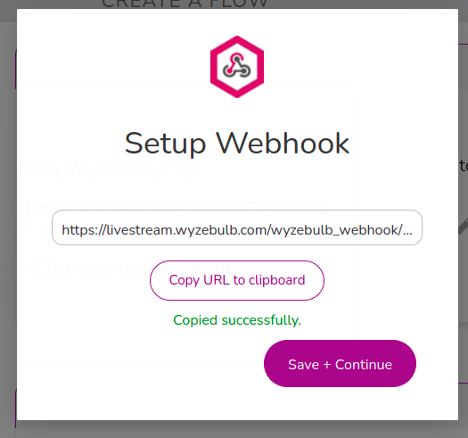
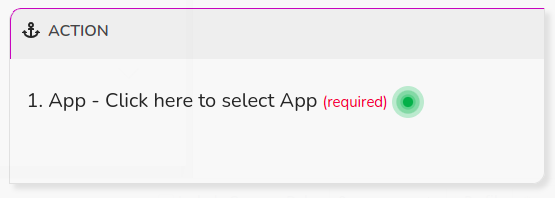
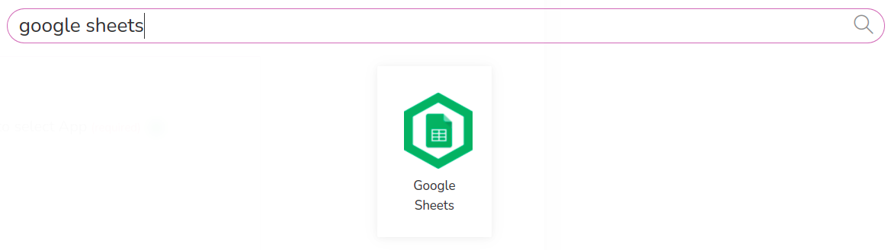
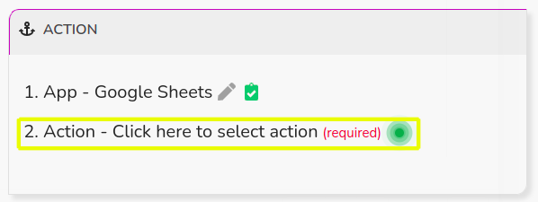
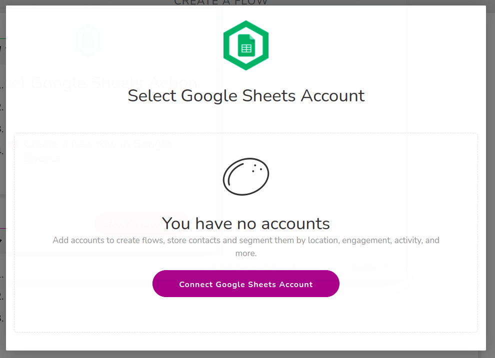
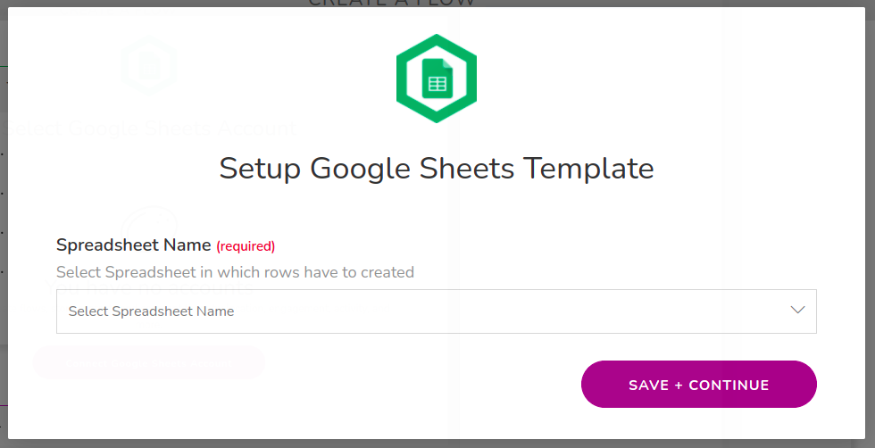
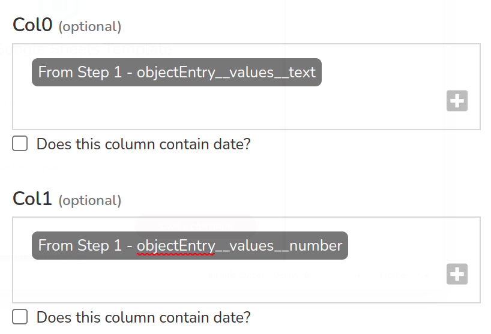
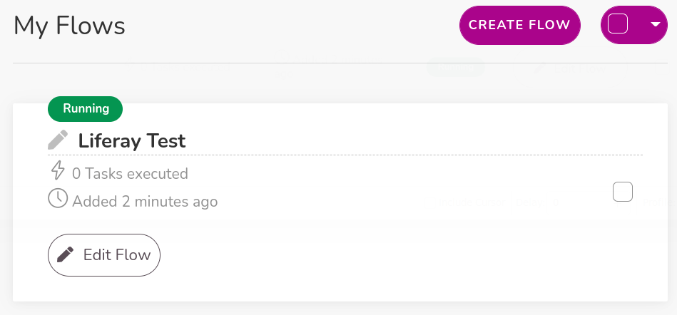

# Using Wyzebulb to Sync Object Data with Google Sheets

You can use Liferay Objects with data integration tools to create automated tasks for syncing Object data with external services. These tasks are triggered using webhooks and can connect to Google applications, Microsoft Office, and more.

Here you'll learn how to use webhooks to trigger sync tasks between Liferay Objects and Google Sheets using Wyzebulb. Syncing your data in this way requires an Wyzebulb account, Google Spreadsheet, and active DXP 7.4 instance. The DXP instance must also have a published Object with the desired fields for sending or receiving data to the Google Spreadsheet.

## Syncing Object Data to a Google Sheet

Follow these steps to sync Object data to a Google Sheet:

1. Open Wyzebulb, on the *Trigger* step click on *App*.

    

1. Search for and select *Webhooks*.

    

1. Select a *Trigger*.

    

1. Click *Save and Continue*. 

    

1. Select the *Webhooks URL*.

    

1. Copy the *Webhook URL*.

    

1. Use the copied URL to [define an Object action](../creating-and-managing-objects/defining-object-actions.md) that sends a request to the webhook endpoint whenever a new Object entry is added.

    

1. Trigger the webhook by adding a test entry to the Object.

   This allows the Webhooks module to determine the Object's data structure automatically.

1. Verify if the test successfully determined the Object's data structure. If the data sent to the webhook URL is found click *Save and Continue*.

    

1. On the *Action* step click on *App*.

    

1. Search for and select *Google Sheets*.

    

1. Select an *Action*.

    

1.  Click *Save and Continue*. 

    

1. Choose a Google Sheet account to connect.

    

1. Select the desired *Spreadsheet*.

    

1. Select the desired *Worksheet* name.

    

1.  Map the Sheet's columns to data fields in the Object's structure.

    

1. Click on the *Test Action* button and verify if the test was successful.

    

1. Navigate to *My Flows* page and verify is your flow is running.

    

    ## Additional Information

* [Objects Overview](../../objects.md)
* [Creating and Managing Objects](../creating-and-managing-objects.md)
* [Understanding Object Integrations](../understanding-object-integrations.md)