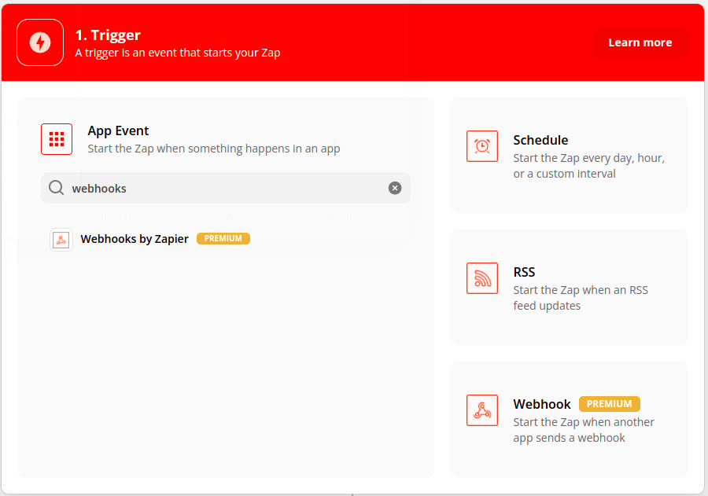
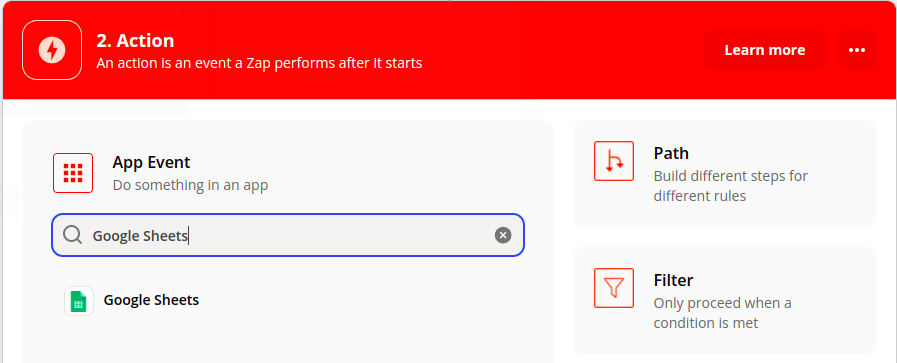
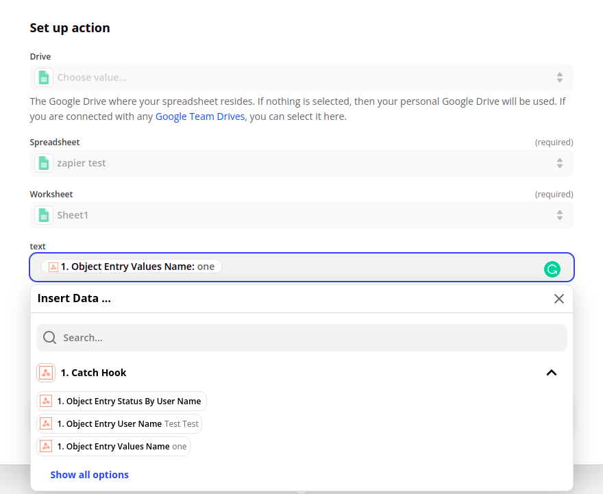
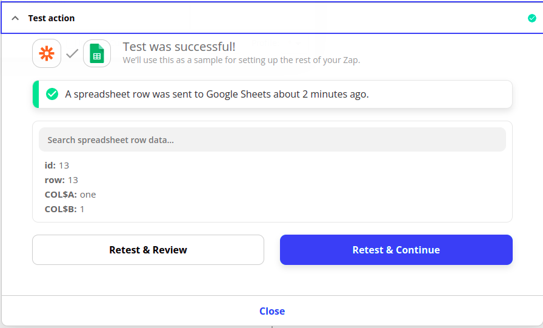

# Using Zapier to Sync Object Data with Google Sheets

You can use Liferay Objects with data integration tools to create automated tasks for syncing Object data with external services. These tasks are triggered using webhooks and can connect to Google applications, Microsoft Office, and more.

Here you'll learn how to use webhooks to trigger sync tasks between Liferay Objects and Google Sheets using Zapier. Syncing your data in this way requires an Zapier account, Google Spreadsheet, and active DXP 7.4 instance. The DXP instance must also have a published Object with the desired fields for sending or receiving data to the Google Spreadsheet.

## Syncing Object Data to a Google Sheet

Follow these steps to sync Object data to a Google Sheet:

1. Open Zapier and click *Create Zap*.

    

1. Click the *Trigger* step, search for and select *Webhooks by Zapier*.

    

1. Click the *Trigger Event* dropdown menu and select your *Webhook Type*

    

    ```{tip}
    For most webhooks, the Catch Hook trigger will be the best option. Catch hooks work by giving you a unique URL that you can make POST requests to. If you want Zapier to make a GET request of an external URL to check for new entries, use a Retrieve Poll webhook trigger.
    ```

1. Click Continue.

1. Once created, copy the generated *webhook URL*

    

1. Use the copied URL to [define an Object action](../creating-and-managing-objects/defining-object-actions.md) that sends a request to the webhook endpoint whenever a new Object entry is added.

    

1. Trigger the webhook by adding a test entry to the Object.

   This allows the Webhooks module to determine the Object's data structure automatically.

1. Click on the *Test Trigger* button.

    

1. Verify if the test successfully determined the Object's data structure. If the data sent to the webhook URL is found, the step will show it was successful as well as the data received.

    

1. Click Continue.

1.  Click the *Action* step, search for and select *Google Sheets*.

    

1. Click the *Action Event* dropdown menu and select *Create Spreadsheet Row*. 

    

1. Choose a Google account to connect. 

    

1. Click Continue.

1. Select the desired *Spreadsheet* and *Worksheet* to sync with the Object.

    

    ```{important}
    You must have text in the first column header, especially if you are using the Create Spreadsheet Row action. Without any text there, the Zap will send your data to the top of the sheet rather than to the bottom.
    ```

1. Map the Sheet's columns to data fields in the Object's structure.

    

1. Click Continue.

1. Click on the *Test Action* button and verify if the test was successful.

    

1. Click close and Turn on your Zap.

    

## Additional Information

* [Objects Overview](../../objects.md)
* [Creating and Managing Objects](../creating-and-managing-objects.md)
* [Understanding Object Integrations](../understanding-object-integrations.md)