# Building a Time Off Requester

> Available: Liferay DXP/Portal 7.4+

Liferay Objects empowers you to build entire applications without writing code or deploying modules. Here, you'll create a Time Off Request application using Liferay [Objects](../../objects.md) and [Picklists](../using-picklists.md).

First, you'll [add a Picklist](#adding-a-department-picklist) for defining department values. Then, you'll create two Objects, one for [Time Off Requests](#adding-a-time-off-request-object) and another for [Employees](#adding-an-employee-object). During this process, you'll relate these Objects to one another and add a webhook to the Time Off Request Object. Finally, you'll [design custom layouts](#designing-custom-object-layouts) to display the relationship fields.

```{note}
Because of limitations with extending system Objects, you must create an Employee Object to relate requests with user profiles. 
```


Before proceeding with the tutorial, run the following command to start up a new Liferay DXP 7.4 container:

```docker
docker run -it -m 8g -p 8080:8080 [$LIFERAY_LEARN_DXP_DOCKER_IMAGE$]
```

## Adding a Department Picklist

Your Picklist represents company departments:

1. Open the *Global Menu* (), click on the *Control Panel* tab, and go to *Picklists*.

1. Click the *Add* button (), enter *Department* for name, and click *Save*.

1. Select the new *Picklist* and use the *Add* button () to add items to it (e.g., Marketing, Human Resources, Sales).

   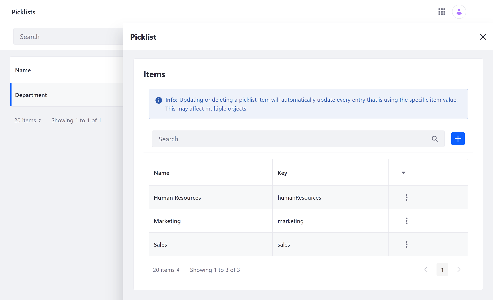

You can now use the Picklist as a field in the Time Off Request Object.

## Adding a Time Off Request Object

1. Open the *Global Menu* (), click on the *Control Panel* tab, and go to *Objects*.

1. Click the *Add* button (  ) and enter these values.

   | Field | Value |
   | :--- | :--- |
   | Label | Time Off Request |
   | Plural Label | Time Off Requests |
   | Object Name | TimeOffRequest |

1. Select the *Object*, click on the *Fields* tab, and add these four *fields*.

   | Label | Field Name | Type | Picklist | Required |
   | :--- | :--- | :--- | :--- | :--- |
   | Start Date | `startDate` | Date | n/a | &#10004; |
   | End Date | `endDate` | Date | n/a |  |
   | Department | `department` | Picklist | Department | &#10004; |
   | Comments | `comments` | Text | n/a |  |

   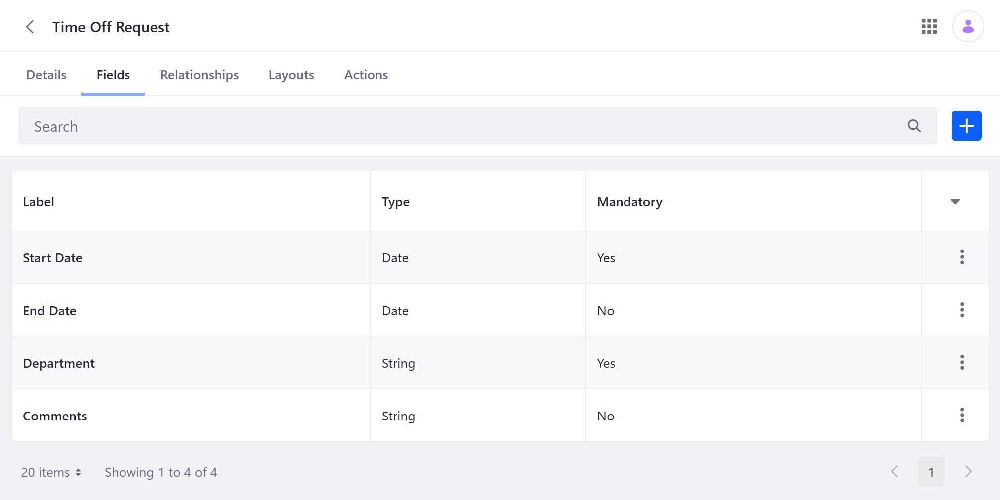

1. Click the *Actions* tab and add this action.

   | Field | Value |
   | :--- | :--- |
   | Action Name | Creation Sync |
   | When | On After Add |
   | Then | Webhook |
   | URL | Enter a test webhook URL from either your app or a site like, https://webhook.site. |

   This action sends data to an external system whenever Time Off Request entries are added. See [Defining Actions](../creating-and-managing-objects/defining-object-actions.md) for more information.

   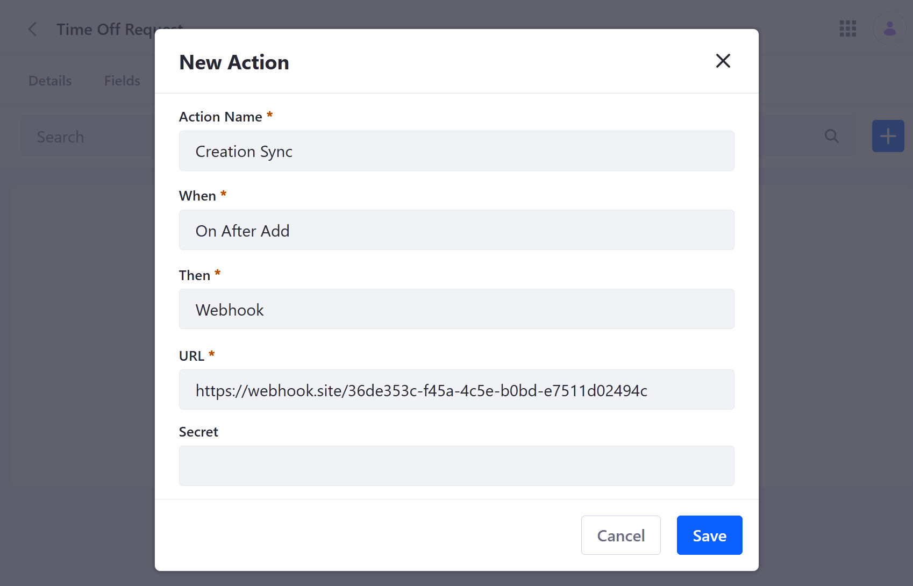

1. Click the *Details* tab and set the following Entry Display and Scope settings.

   | Field | Value |
   | :--- | :--- |
   | Title Field | Start Date |
   | Scope | Company |
   | Panel Category Key | Applications > Communication |

1. Click *Publish*. This activates the Object.

Next, you'll create an Employee Object and relate it to the Time Off Request Object, so you can associate request entries with individual users.

## Adding an Employee Object

1. Open the *Global Menu* (), click on the *Control Panel* tab, and go to *Objects*.

1. Click the *Add* button (  ) and enter these values.

   | Field | Value |
   | :--- | :--- |
   | Label | Employee |
   | Plural Label | Employees |
   | Object Name | Employee |

1. Select the *Object*, click on the *Fields* tab, and add these *fields*.

   | Label | Field Name | Type | Required |
   | :--- | :--- | :--- | :--- |
   | Name | `name` | Text | &#10004; |
   | Email | `email` | Text | &#10004; |

   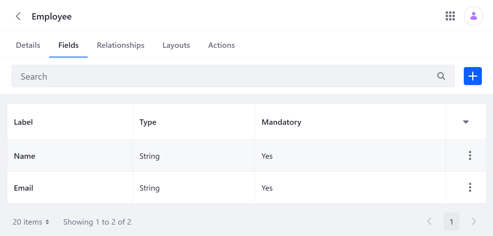

1. Click the *Relationships* tab and add this relationship.

   | Field | Value |
   | :--- | :--- |
   | Label | Requester |
   | Relationship Name | requester |
   | Type | One to Many |
   | Object | TimeOffRequest |

   ```{note}
   When you create this relationship, you add a foreign key field automatically to the Time Off Request Object.
   ```

   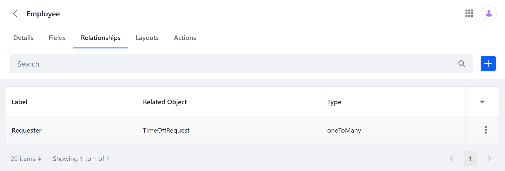

1. Click the *Details* tab and set the following Entry Display and Scope settings.

   | Field | Value |
   | :--- | :--- |
   | Title Field | Name |
   | Scope | Company |
   | Panel Category Key | Control Panel > Users |

1. Click *Publish*.

Once published, you can create entries via the Liferay UI or Headless APIs. However, to relate these entries to request entries, you must first create a [custom layout](#designing-custom-object-layouts).

## Designing Custom Object Layouts

Object layouts determine how fields are organized when creating and editing Object entries. Since relationships are not displayed in default Object layouts, you must design custom layouts for both Objects to display their relationship fields.

### For Time Off Requests

1. Navigate to the *Objects* application and select the *Time Off Request* Object.

1. Click the *Layouts* tab, click the *Add* button (  ), enter *Request* for name, and click *Save*.

1. Select the new Layout and check the *Mark as Default* box.

   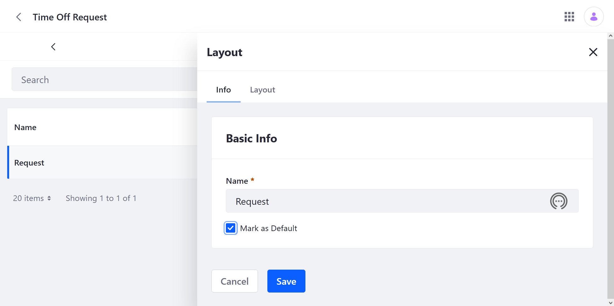

1. Click the *Layout* tab and add a *tab* with two *blocks*.

   | Element | Label | Type |
   | :--- | :--- | :--- |
   | Tab | Request Info | Fields |
   | Block | Dates | n/a |
   | Block | Details | n/a |

1. Add fields to the blocks.

   | Block | Fields |
   | :--- | :--- |
   | Dates | Start Date, End Date |
   | Details | Department, Employee, Comments |

   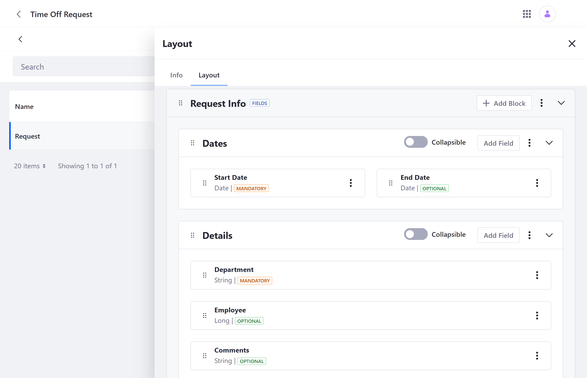

1. Click *Save*.

Once saved, the new layout is used in the Liferay UI for creating and editing Time Off Request entries. If employee entries exist, you can relate them to individual requests.

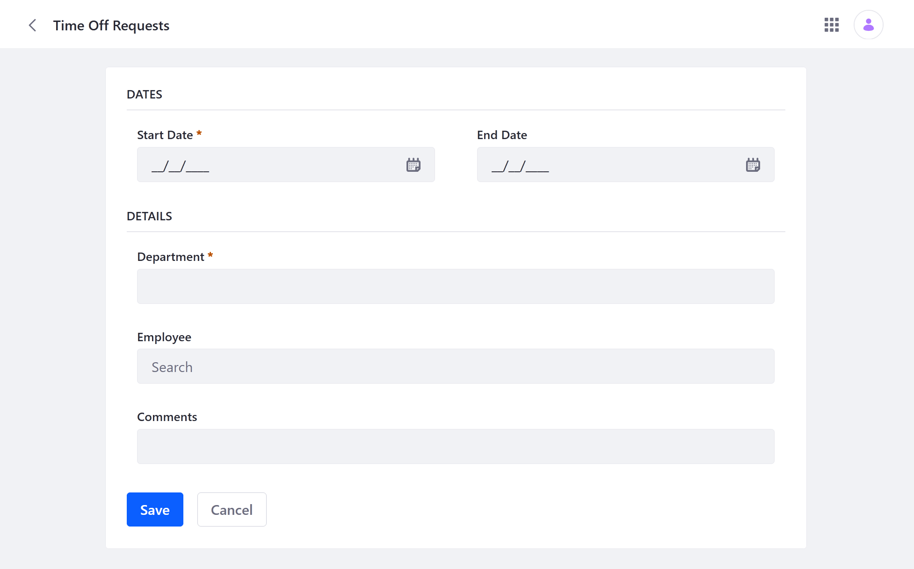

### For Employees

1. Navigate to the *Objects* application and select the *Employee* Object.

1. Click the *Layouts* tab, click the *Add* button (  ), enter *Employee Info* for name, and click *Save*.

1. Select the new Layout and check the *Mark as Default* box.

1. Click the *Layout* tab and add a Fields tab with one block.

   | Element | Label | Type |
   | :--- | :--- | :--- |
   | Tab | Basic Details | Fields |
   | Block | Employee Info | n/a |

1. Add the *Name* and *Email* fields to the block.

1. Add a Relationship tab for the Employee Object's Requester relationship.

   | Element | Label | Type | Relationship |
   | :--- | :--- | :--- | :--- |
   | Tab | Time Off Requests | Relationships | Requester |

   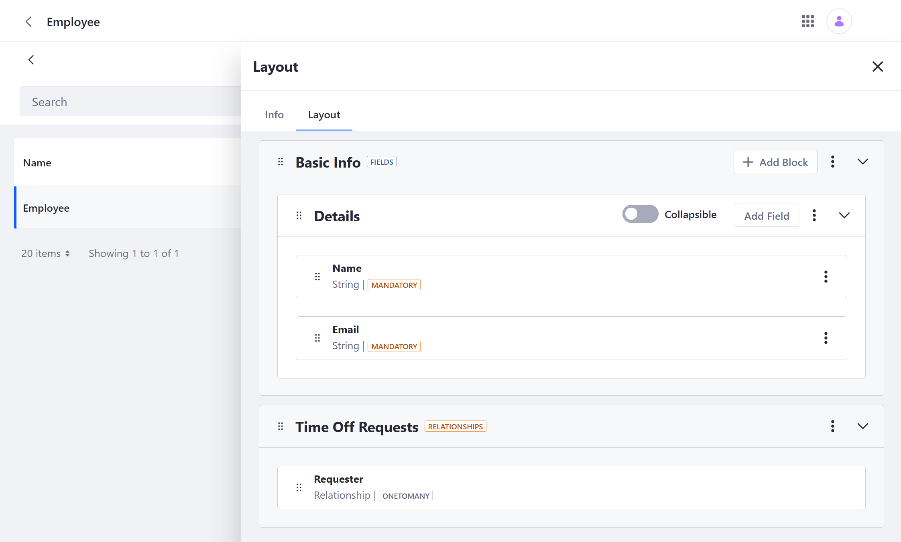

1. Click *Save*.

Once saved, the new layout is used in the Liferay UI for creating and editing employee entries. If request entries exist, you can relate them to employee entries in the *Time Off Requests* tab. Here, you can also view all requests related to the select employee entry.

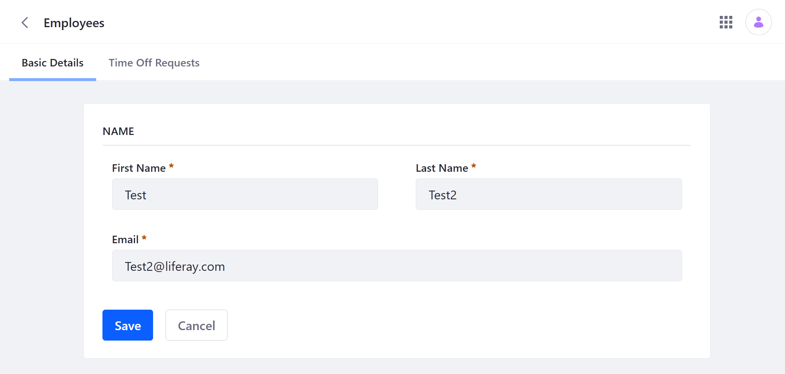

## Adding Object Entries

Now that your app is complete, you can use the Liferay UI and Headless APIs to add data to the Time Off Request and Employee Objects.

### Adding Employees

Follow these steps to add employee entries using Headless APIs:

1. Open Liferay's *API Explorer* (i.e., `localhost:8080/o/api`), click the *REST Applications* drop-down menu, and click *c/employees*.

1. Enter this script into the request body for the batch `POST` API.

   ```json
   [
     {
       "email": "foo@liferay.com",
       "name": "Able"
     },
     {
       "email": "bar@liferay.com",
       "name": "Baker"
     },
     {
       "email": "goo@liferay.com",
       "name": "Charlie"
     }
   ]
   ```

1. Click *Execute*.

This adds three entries to the Employee Object.

### Adding Time Off Requests

Follow these steps to add request entries via the Liferay UI:

1. Open the *Global Menu* (), click on the *Applications* tab, and select *Time Off Requests*.

1. Click the *Add* button () and fill out the form

1. Click *Save*.

After saving an entry, you see the entry's edit screen. To add more entries, return to the Time Off Requests main page. When time requests are added, the Object's webhook is triggered and posts the entry's data to the set URL.

Once requests are added and related to employee entries, you can view them in the Employees application. Open the *Global Menu* (), click on the *Control Panel* tab, and select *Employees*. Select the related *entry* and click the *Time Off Requests* tab.

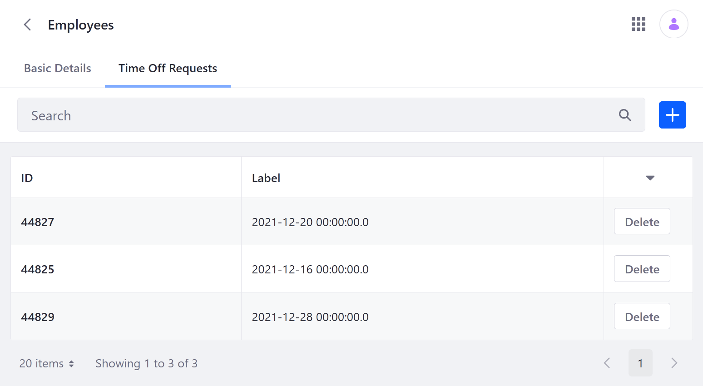

## Additional Information

* [Objects Overview](../../objects.md)
* [Creating Objects](../creating-and-managing-objects/creating-objects.md)
* [Using Picklists](../using-picklists.md)
