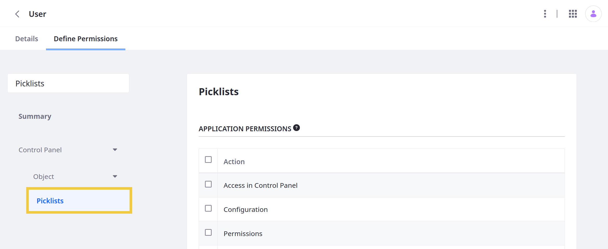
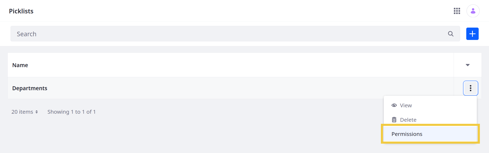
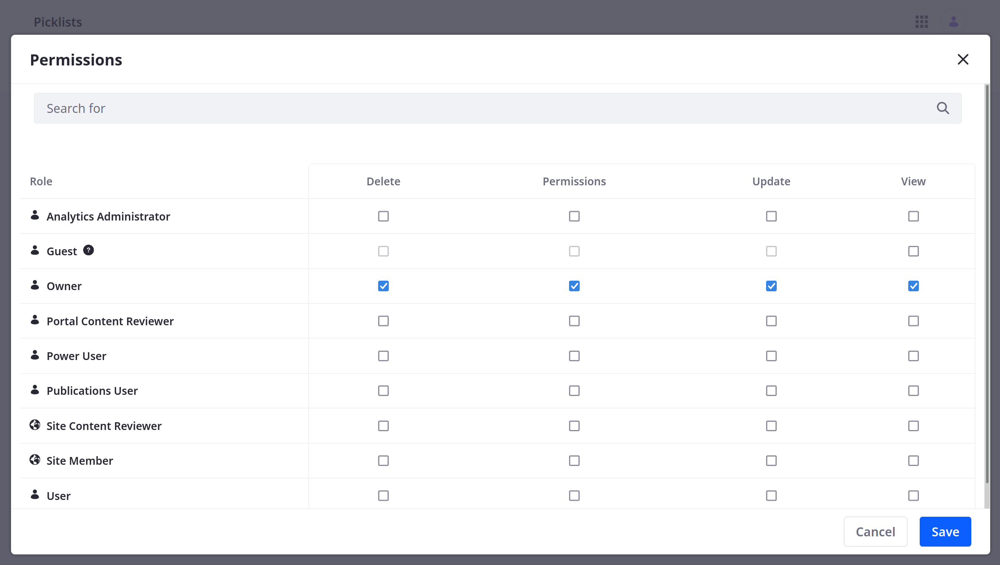

# Managing Picklist Permissions

Picklist is integrated with Liferay's permissions framework. This means you can assign [application](#application-permissions) and [resource](#resource-permissions) permissions to user Roles to determine which users have access to the Picklists application and its data.



See [Defining Role Permissions](../../../users-and-permissions/roles-and-permissions/defining-role-permissions.md) for more information about assigning permissions to user Roles.

## Application Permissions

Application permissions grant permission to perform general application-related operations and do not include [resource-related permissions](#resource-permissions).

Picklists has the following application permissions:

| Permission | Description |
| :--- | :--- |
| Access in Control Panel | Access Picklists in the Global Menu |
| Configuration | View and modify configuration options for the Picklists portlet |
| Permissions | View and modify Picklists permissions |
| Preferences | View and modify preferences for the Picklists portlet |
| View | View the Picklists portlet |

## Resource Permissions

Resource permissions grant permissions on specific application resources. Some of these permissions enable performing [operations on database entities](#resource-related-actions) (i.e., model resources). Others grant permission to perform [resource-related operations](#actions-on-database-entities) in an application context (e.g., create a new resource entity).

The Picklists portlet has the following resource permissions.

### Resource-Related Actions

| Permission | Description |
| :--- | :--- |
| Add List Type Definition | Create a Picklist type definition |
| Permissions | View and manage permissions related to Picklists |

### Actions on Database Entities

| Permission | Description |
| :--- | :--- |
| Delete | Delete a Picklist |
| Permissions | View and modify permissions for a Picklist |
| Update | Update a Picklist |
| View | View a Picklist |

## Managing Permissions for Individual Picklists

> Available Liferay DXP 7.4 U17+ and Liferay Portal 7.4 GA17+

Follow these steps to manage permissions for individual Picklists:

1. Open the *Picklists* application via the *Global Menu* ().

1. Click on the *Actions* button () for the desired Picklist and select *Permissions*.

   

1. Use the checkboxes to grant [database entity](#actions-on-database-entities) permissions to the desired Roles.

   ```{note}
   Permissions defined at the Roles admin level override permissions defined at the individual level.
   ```

   

1. Click *Save*.

## Additional Information

* [Using Picklists](./using-picklists.md)
* [Defining Role Permissions](../../../users-and-permissions/roles-and-permissions/defining-role-permissions.md)
