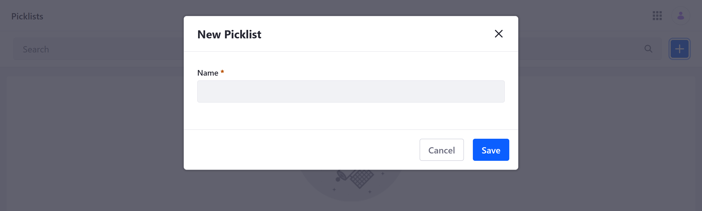
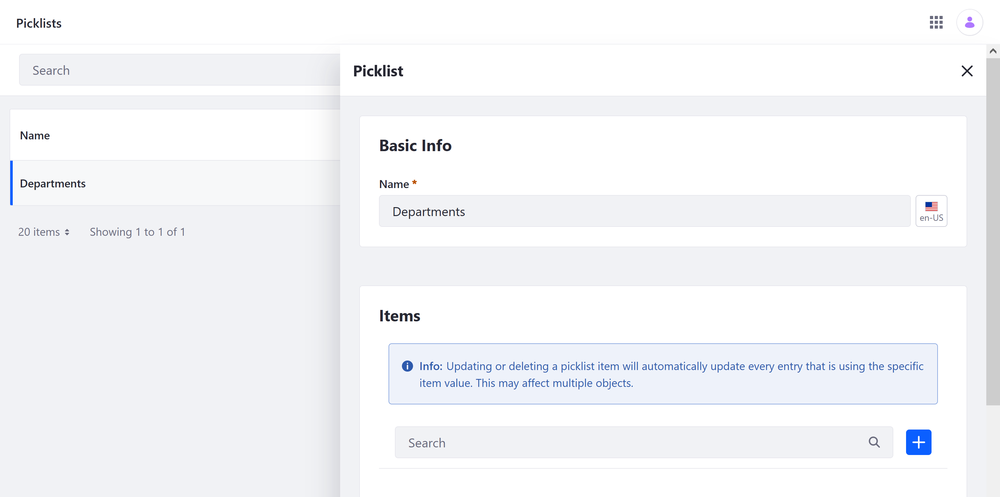
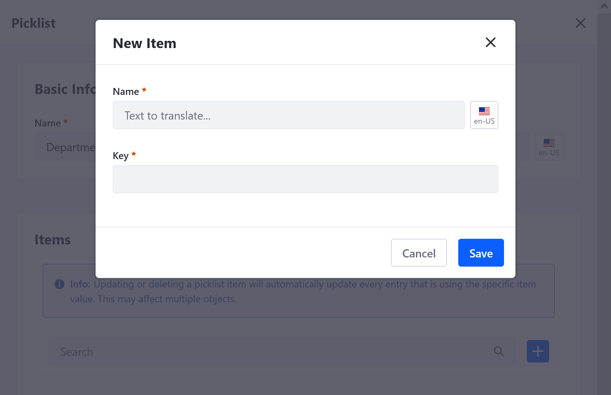
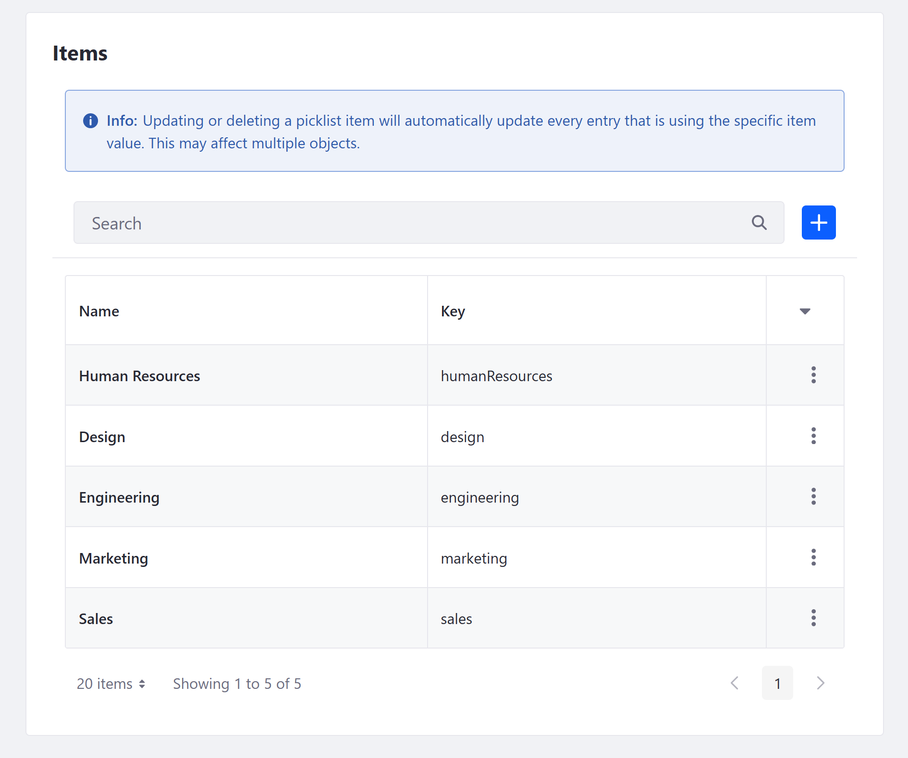
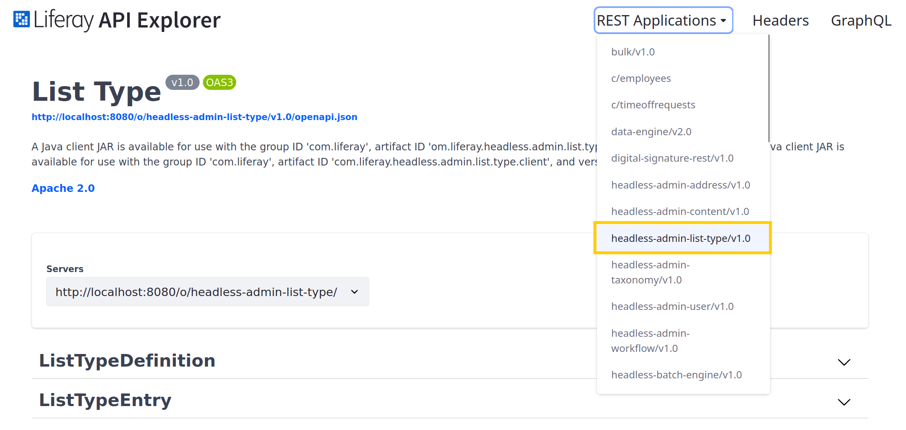

# Using Picklists

{bdg-secondary}`Available Liferay DXP/Portal 7.4+`

Picklists is an application for creating standard lists of values that are understood across the Liferay Portal. The process of creating a Picklist includes creating the initial list and adding items to it. Once these values are defined, they can be used in supported applications.

## Creating a Picklist

Follow these steps to create a Picklist:

1. Open the *Global Menu* (), go to the *Control Panel* tab, and click on *Picklists*.

1. Click on the *Add* button ().

   

1. Enter a *Name* for the Picklist, and click on *Save*. This value identifies the list in the Liferay UI and can be localized after creation.

1. Click on the new Picklist to edit it.

1. Under Items, click the *Add* button ().

   

1. In the modal window, enter a *Name* and *Key* for the item.

   **Name**: Determines the item's display name and can be localized after creation.

   **Key**: Determines the standard value understood by applications in the back-end and uses camel case.

   ```{note}
   Once created, an Item's key cannot be changed, but you can edit its name or delete it at any time.
   ```

   

1. Click *Save*. This immediately updates the Picklist with the new item.

1. Repeat the above steps to add additional items to the list.

   

## Adding Picklist Fields to Objects

Once a list is created, you can select it when creating Object fields. Select the *Picklist* field type and choose the desired list. See [Adding Fields to Objects](../creating-and-managing-objects/adding-fields-to-objects.md) for more information.


When users access this field in an Object's layout, it appears as a drop-down menu that lists the Picklist's items.


```{important}
A list cannot be deleted if it is used by an Object field, though list items can be edited and removed at any time.

Updating or deleting a Picklist item automatically updates all Object entries using the item value.
```

## Picklist APIs

Liferay provides headless APIs for creating and managing Picklists. You can view available Picklist APIs in Liferay's API Explorer at `localhost:8080/o/api` under `headless-admin-list-type`.



With them, you can perform CRUD operations for both Picklist Definitions (`ListTypeDefinition`) and Picklist Entries (`ListTypeEntry`).

## Picklist Fields in Object API Calls

When making POST, PATCH, and PUT API calls for Objects that include a Picklist field, you must use the following formats.

### For Liferay DXP 7.4 U1+/Portal 7.4 GA5+

```json
"samplePicklist": {"key": "string"}
```

### For Liferay DXP 7.4 GA1/Portal 7.4 GA4

```json
"samplePicklist": "string"
```

## Additional Information

* [Adding Fields to Objects](../creating-and-managing-objects/adding-fields-to-objects.md)
* [Managing Picklist Permissions](./managing-picklist-permissions.md)
