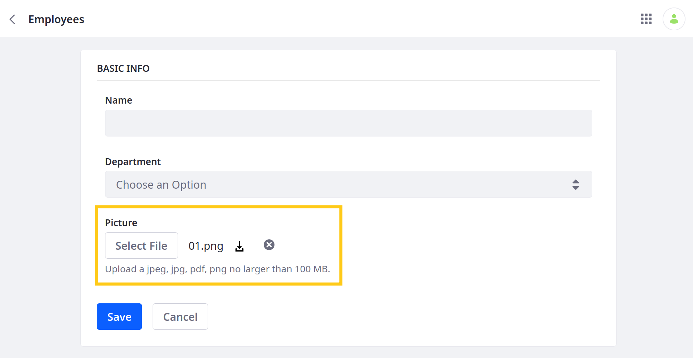
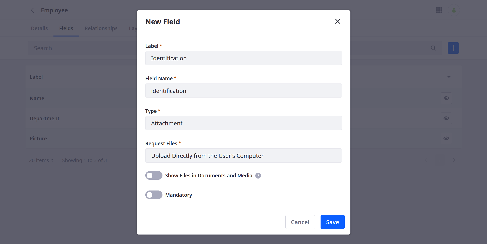

# Understanding Object Field Types

{bdg-secondary}`For Liferay DXP 7.4 U24+`

Object fields represent database columns that store specific types of data for an Object. Fields can be added to both custom and system Objects and can only store one type of data.

Liferay provides a user-friendly name for each field type, which corresponds to a specific data type in the back-end. When making Headless API calls that include fields, you must use the back-end data type names:

| Field Types (UI) | Data Type (HEADLESS) | Description |
| :--- | :--- | :--- |
| [Attachment](#attachment) | Relationship > Long | Stores `jpeg`, `jpg`, `pdf`, and `png` files no larger than 100 MB |
| Boolean | Boolean | Stores true or false values |
| Date | Date | Stores date values |
| Decimal (*previously Double*) | Double | Stores a decimal number value that supports fractional portions |
| Integer | Integer | Stores an integer up to 9 digits in length |
| Long Integer (*previously Long*) | Long | Stores a large integer up to 19 digits in length |
| Long Text (*previously Clob*) | Clob | Stores a text box value that supports up to 65,000 characters; when configuring this field type, you can limit the number of characters allowed |
| Picklist | String | Stores a [Picklist](./picklists.md) string value |
| Precision Decimal (*previously BigDecimal*) | BigDecimal | Stores a high-precision decimal number without rounding |
| Relationship | Long | Stores the numeric ID for all related Object entries |
| Rich Text | Clob | Stores text with advanced formatting tools and media elements (e.g., images, videos, audio) |
| Text (*previously String*) | String | Stores simple text values up to 280 characters; when configuring this field type, you can limit the number of characters allowed |

## Attachment

Attachment fields are for uploading files to your instance's [Document Library](../../system-administration/file-storage.md). When uploaded, the file is linked to the entry's field. You can link each field to one file at a time. You can configure whether files are uploaded with the operating system's file selector or the Documents and Media item selector. A file inherits its scope from the Object definition (i.e., Company or Site). Once attached, you can view an Object entry to download the file or remove it from the field.



```{important}
Assets are not deleted from the Document Library when they're removed from an Object entry.
```

During field creation, the Request Files configuration determines how users add files to the Object entry:

* **Upload Directly from the User's Computer**: Users can upload a file to an entry using their operating system's file selector. By default, this method saves the file to a private folder autogenerated for the Attachment field. This folder is not displayed in the Liferay UI. However, if you enable *Show Files in Documents and Media*, uploaded files are saved to a folder in Documents and Media. By default, this folder uses the Object definition's name, but you can change it when configuring the field.

* **Upload or Select from Documents and Media Item Selector**: Users can select from existing files in Documents and Media or upload a file using the item selector. Uploaded files are saved to the root folder in Documents and Media and can be managed like other files.



```{note}
If desired, you can display hidden Attachment field folders in Documents and Media by adding this [portal property](../../installation-and-upgrades/reference/portal-properties.md) to your server: `dl.show.hidden.mount.folders=true`. 
```

After creating an Attachment field, you can configure it in these ways: 

| Field | Description |
| :--- | :--- |
| Accepted File Extensions | Enter a list of accepted file extensions to determine the type of files users can upload to the field. Each extension must be separated by commas. Currently the Attachment field supports `jpeg`, `jpg`, `pdf`, and `png` files. |
| Maximum File Size | Enter the maximum file size accepted by the field. The default value is 100 MB. If desired, you can set the value to 0 to use the server's Overall Maximum Upload Request Size property. |
| Storage Folder (*for Show Files in Documents and Media*) | Enter a folder name to determine where uploaded files are stored in Documents and Media. By default, the folder uses the Object definition's name (e.g., `/Employee`, `/TimeOffRequest`). |

<!-- 
## Text Fields

### Text

### Long Text

### Rich Text

Use this field type to create rich text compositions that include images, links, and other elements.

## Picklist

## Numeric Fields 

### Integer

### Long Integer

### Decimal

### Precision Decimal

## Relationship Fields
-->

## Additional Information

* [Adding Fields to Objects](./creating-and-managing-objects/adding-fields-to-objects.md)
* [Headless Framework Integration](./understanding-object-integrations/headless-framework-integration.md)
