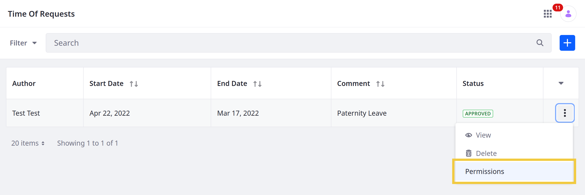
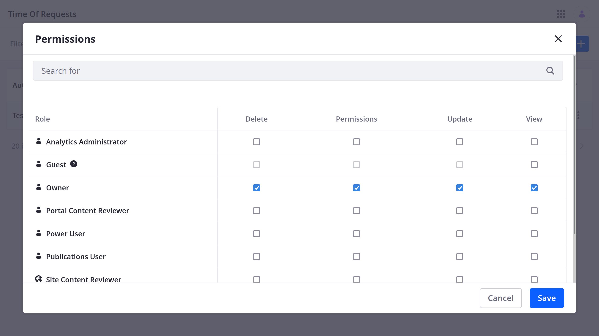

# Permissions Framework Integration

> Available: Liferay DXP/Portal 7.4+

When an Object is created, it is integrated automatically with Liferay's Permissions framework. This means you can assign [application](#application-permissions) and [resource](#resource-permissions) permissions to manage user access to individual Objects and their entries. With role-based access control, you can ensure only appropriate users can view and use your application's data.

When defining role permissions, active Objects appear according to their scope and panel category key.

## Application Permissions

Application permissions grant permission to perform general application-related operations and do not include [resource-related permissions](#resource-permissions).

Custom Objects include the following standard application permissions according to their defined scope.

| Permission | Description |
| :--- | :--- |
| Access in Control Panel (*Company Scope Only*) | Access the Object in the Global Menu |
| Access in Site and Asset Library Administration (*Site Scope Only*) | Access the Object in the Site Menu or Asset Library |
| Configuration | View and set the Object's configuration options |
| Permissions | View and modify the Object's permissions |
| Preferences | View and set the Object's preferences |
| View | View the Object's application page |

```{note}
For Objects scoped to *Site*, you can also determine whether an application or resource permission is granted for all Sites or only specific Sites.
```

## Resource Permissions

Resource permissions grant specific abilities related to application resources. Some of these permissions grant permission to perform [operations on database entities](#actions-on-database-entities) (i.e., model resources). Others grant permission to perform [resource-related operations](#resource-related-actions) in an application context (e.g., create a new resource entity).

Each Object also has the following resource permissions.

### Resource-Related Actions

| Permission | Description |
| :--- | :--- |
| Add Object Entry | Create an Object entry |
| Permissions | View and manage permissions related to Object entries |

### Actions on Database Entities

| Permission | Description |
| :--- | :--- |
| Delete | Delete an Object entry |
| Permissions | View and modify permissions for individual Object entries |
| Update | Update an Object entry |
| View | View an Object entry |

## Managing Permissions for Individual Object Entities

> Available Liferay DXP 7.4 U10+ and Liferay Portal 7.4 GA14+

With custom Objects, you can manage permissions for individual database entities to control access to Object data.

Follow these steps:

1. Navigate to the desired custom Object.

1. Click on the *Actions* button () for the desired entity and select *Permissions*.

   

1. Use the checkboxes to grant [database entity](#actions-on-database-entities) permissions to the desired desired roles.

   ```{note}
   Permissions defined at the Roles admin level override permissions defined at the entity level.
   ```

   

1. Click *Save*.

## Additional Information

* [Understanding Object Integrations](../understanding-object-integrations.md)
* [Objects Overview](../../objects.md)
* [Creating Objects](../creating-and-managing-objects/creating-objects.md)
* [Managing Objects](../creating-and-managing-objects/managing-objects.md)
