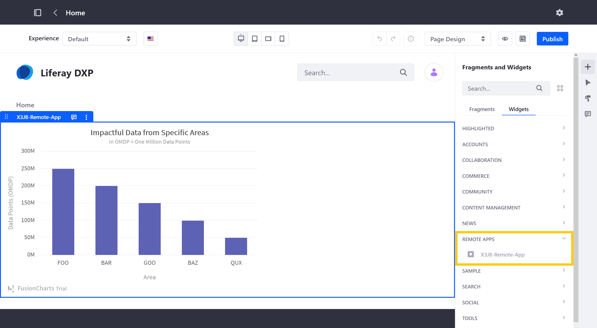

# Remote Apps

```{toctree}
:maxdepth: 3

remote-apps/understanding-remote-app-types.md
remote-apps/remote-apps-tutorials.md
remote-apps/remote-apps-ui-reference.md
```

Remote Apps is an application for extending Liferay DXP without developing and deploying OSGi modules to the Liferay server. It uses Liferay's front-end infrastructure to integrate external applications with the platform and render them as Page widgets. Use Remote Apps to integrate applications from any domain.



Each Remote App entry is created at the company level and includes the necessary URLs and details for registering the application with Liferay. When created, a widget is automatically generated for each entry and renders the application according to its entry type.

Liferay provides two types of Remote App entries: *Iframe* and *Custom Element*. While both types are incorporated into a Page during the render Page lifecycle, they are hosted and rendered differently. They also have different levels of access to Liferay services and runtime data.

* [IFrame](./remote-apps/understanding-remote-app-types.md#using-the-iframe-type): This type renders the application into a separate IFrame element (`<iframe>`) and can allow for limited interaction with the host page using Liferay's optional client SDK API. Each entry of this type stores a URL reference to where the application is running.

* [Custom Element](./remote-apps/understanding-remote-app-types.md#using-the-custom-element-type): This type renders the application as an [HTML custom element](https://web.dev/custom-elements-v1/), which extends the Page's HTML by creating new tags and associating them with custom logic. Each entry of this type stores URL references to the application's code (i.e., the essential `.js` and `.css` files stored in a document or cloud library).

Using Remote Apps, you can decouple your custom application's development cycle from the platform while building Liferay compatible applications that are less dependent on a specific Liferay version.

This approach can benefit all kinds of development environments. For on-premise scenarios, it helps to reduce dependence on the Liferay platform and simplify the upgrade path. While for multi-tenant and SaaS environments, Remote Apps provides powerful customization capabilities without requiring the ability to deploy modules to the Liferay server.

To get started, see [Creating a Basic Remote App](./remote-apps/remote-apps-tutorials/creating-a-basic-remote-app.md).

```{raw} html
:file: ../landingpage_template.html
```

```{raw} html
:file: remote-apps/landing.html
```
