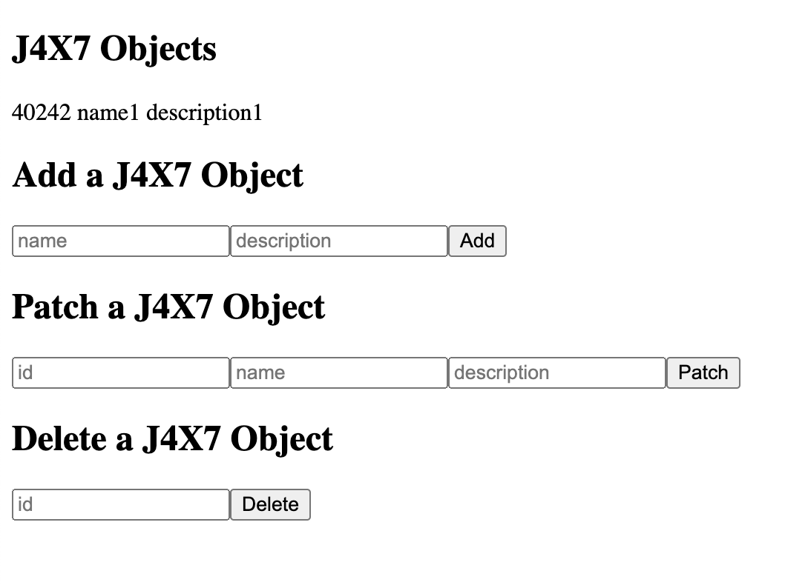

# Remote Apps with Headless APIs

{bdg-secondary}`Available 7.4+`

After [creating and publishing objects](../objects/creating-and-managing-objects/creating-objects.md), headless REST APIs are automatically generated. Here you'll see how to integrate these endpoints to create a simple CRUD (create, read, update, and delete) remote app.

## Set Up Liferay DXP

Before proceeding, start a new Liferay DXP 7.4+ container.

```docker
docker run -it -m 8g -p 8080:8080 [$LIFERAY_LEARN_DXP_DOCKER_IMAGE$]
```

Once started, follow these steps to add the `/o/c/*` URL pattern to the *Default Portal CORS Configuration*:

1. Open the *Global Menu* (), click the *Control Panel* tab, and go to *System Settings* &rarr; *Security Tools*.

1. Go to the *Portal Cross-Origin Resource Sharing (CORS)* tab and click *Default Portal CORS Configuration*.

1. Add a *URL Pattern* with the `/o/c/*` value and click *Save*. This enables CORS for all Object APIs.

   

## Creating an Object for the CRUD app

1. Open the *Global Menu* (), click the *Control Panel* tab, and go to *Objects*.

1. Click the *Add* button () and enter these values:

   | Field | Value |
   | :--- | :--- |
   | Label | J4X7-Object |
   | Plural Label | J4X7-Objects |
   | Name | J4X7Object |

   ```{note}
   The provided React app uses these values.
   ```

1. Select the new *Object* draft, click the *Field* tab, and add these *fields*:

   | Label | Field Name | Type |
   | :--- | :--- | :--- |
   | name | name | Text |
   | description | description | Text |

1. Click the *Details* tab and click *Publish*.

## Set Up the CRUD app

1. Download and unzip the [CRUD app](./liferay-j4x7.zip).

   ```bash
   curl https://learn.liferay.com/dxp/latest/en/building-applications/remote-apps/liferay-j4x7.zip -O
   ```

   ```bash
   unzip liferay-j4x7.zip
   ```

   ```bash
   cd liferay-j4x7
   ```

1. Verify you have `node` and `yarn` installed. If you don't, run the following command and follow the prompts:

   ```bash
   ./setup_tutorial.sh
   ```

1. Navigate to the CRUD app's folder and start the React server.

   ```bash
   cd j4x7-remote-app
   ```

   ```bash
   yarn start
   ```

   Once started, go to `localhost:3000` to view the CRUD app. 

1. Enter a name and description and click *Add* to add a J4X7 Object. A new item has been added.

   

1. Note the J4X7 Object's ID number that you just created. Enter the ID number and a new name and description. Click *Patch*. The item has been updated with the new name and description.

1. Enter the ID number and click *Delete*. The item has now been deleted.

## Examine the Code

The sample CRUD app is separated into two parts: a file that contains the API requests and files that contain the forms to handle the CRUD operations.

### Handle Requests

The `Requests.js` file uses JavaScript's built-in `fetch()` method. 

`getObjects()` makes a GET request for all the objects.

```{literalinclude} ./remote-apps-with-headless-apis/resources/liferay-j4x7-overlay/src/utils/Requests.js
:language: javascript
:lines: 25-33
```

`addObject()` makes a POST request with a name and description for a new object.

```{literalinclude} ./remote-apps-with-headless-apis/resources/liferay-j4x7-overlay/src/utils/Requests.js
:language: javascript
:lines: 1-13
```

`patchObject()` makes a PATCH request with a specific object ID and a new name and description.

```{literalinclude} ./remote-apps-with-headless-apis/resources/liferay-j4x7-overlay/src/utils/Requests.js
:language: javascript
:lines: 35-47
```

`deleteObject()` makes a DELETE request with a specific object ID.

```{literalinclude} ./remote-apps-with-headless-apis/resources/liferay-j4x7-overlay/src/utils/Requests.js
:language: javascript
:lines: 15-23
```

```{note}
Basic authentication is used here for demonstration purposes. For production, you should authorize users via [OAuth 2.0](../../headless-delivery/using-oauth2.md).
```

### Implement Forms

[`GetForm.js`](./remote-apps-with-headless-apis/resources/liferay-j4x7-overlay/src/components/GetForm.js) calls the `getObjects` method and parses the response as JSON. Each J4X7 entry is listed by the form.

[`AddForm.js`](./remote-apps-with-headless-apis/resources/liferay-j4x7-overlay/src/components/AddForm.js) receives input and calls the `addObject` method upon the user clicking *Add*.

[`PatchForm.js`](./remote-apps-with-headless-apis/resources/liferay-j4x7-overlay/src/components/PatchForm.js) receives input and calls the `patchObject` method upon the user clicking *Patch*.

[`DeleteForm.js`](./remote-apps-with-headless-apis/resources/liferay-j4x7-overlay/src/components/DeleteForm.js) receives input and calls the `deleteObject` method upon the user clicking *Delete*.

The forms are gathered together and displayed on one page with the [`App.js`](./remote-apps-with-headless-apis/resources/liferay-j4x7-overlay/src/App.js) file.

## Additional Information

[Creating a Liferay Remote App](../remote-apps/creating-a-liferay-remote-app.md)
[Headless Framework Integration](../objects/understanding-object-integrations/headless-framework-integration.md)
