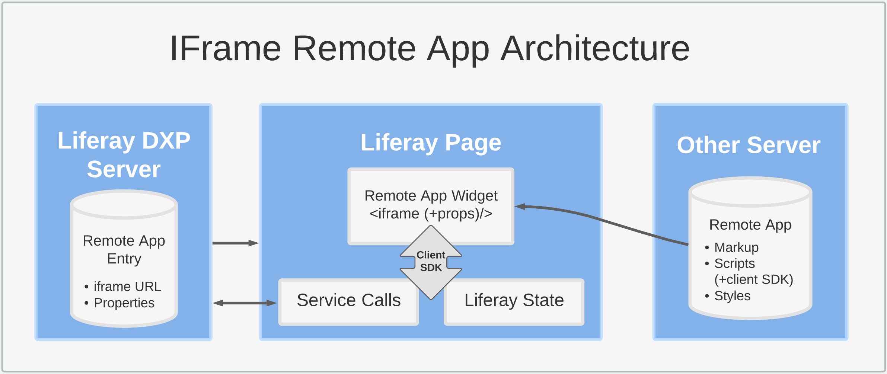
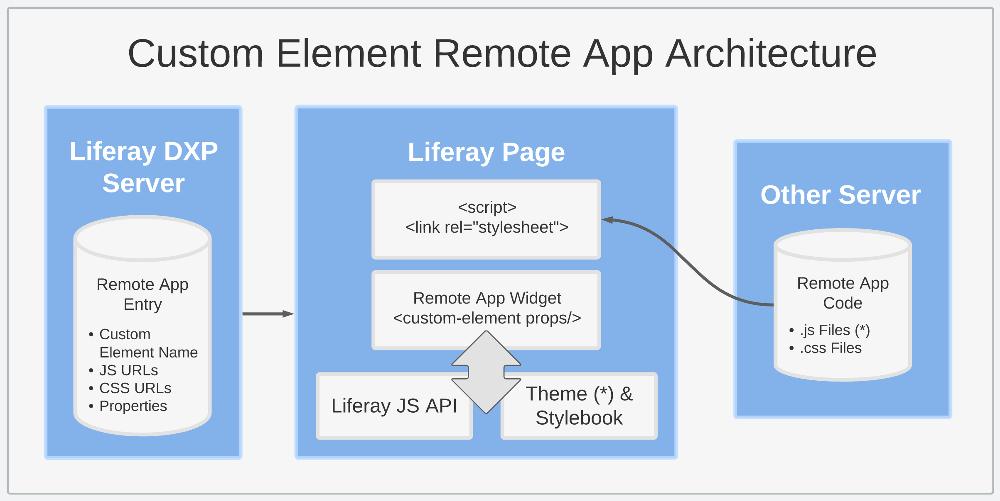

# Understanding Remote App Types

Remote Apps uses Liferay's front-end infrastructure to register external applications with the Liferay platform and render them as Page widgets. When creating a Remote App entry, you can select between the [IFrame](#using-the-iframe-type) and [Custom Element](#using-the-custom-element-type) types. This determines how the external application is registered with Liferay DXP and rendered in Site Pages.

Both types of Remote Apps are integrated into Pages as a widget during the render Page lifecycle. This widget is automatically generated and added to the OSGi service registry by Liferay at entry creation. If desired, you can set additional properties at the entry or widget level to configure how both IFrame and Custom Element applications are rendered.

However, IFrame and Custom Element applications are hosted and rendered differently. They also have different levels of access to Liferay services and runtime data.

```{tip}
The [Custom Element](#using-the-custom-element-type) type offers greater integration with the Liferay platform and supports more complex scenarios.
```

## Using the IFrame Type

The IFrame type renders external applications into a separate `<iframe>` element and allows for limited interaction with the host page using Liferay's client SDK API. The architecture for IFrame applications includes three main parts: the Liferay server, the Liferay host Page, and the external server hosting your application.



Each IFrame entry stores an IFrame URL that links to an application, typically served from an external server. As a result, the application must provide an HTML document including markup, scripts, styles, and (optionally) the client SDK.

When the Remote App's widget is added to a Page, it produces an `<iframe>` tag pointing to the entry's URL. This `<iframe>` is populated with the external application's content. If the entry or widget instance includes properties, they are passed to the application as additional URL attributes (`<iframe (+properties)/>`) so the app can access them programmatically.

```{note}
IFrame apps must be deployed to a server so they can assemble their own markup and send it to the browser to fill the widget's `<iframe>` element. By contrast, [Custom Element apps](#using-the-custom-element-type) don't require a server to produce any markup. They only require the application's code is available via URLs, since the browser is responsible for running the necessary logic via the app's widget and JS code.
```

By default, all browsers impose the 'same-origin' policy for IFrame applications to prevent information flow between a host page and its external applications. Liferay provides a client SDK script to allow limited communication between IFrame elements and a Liferay Page. It works by implementing a communication protocol with the Page via the `postMessage()` API. To use this script, it must be included in the application's markup.

When an IFrame app uses the client SDK, the Liferay Page receives instructions to perform certain actions on behalf of the application as the current logged in user. This includes making service calls to the DXP server and access state details (e.g., opening a toast in the host Page, calling headless APIs, running GraphQL queries, accessing style properties).

## Using the Custom Element Type

The Custom Element type renders external application code into a separate HTML `<custom-element>` and provides full integration with the Liferay host Page. The architecture for Custom Element applications includes three main parts: the Liferay server, the Liferay host Page, and the server storing your application's code. These files are used by Liferay to create the application in a browser.



Each Custom Element entry includes an HTML element name, as well as URLs to any necessary JS and CSS files. They can also include properties rendered with the application during runtime.

Once added to a Page, Liferay inserts the Remote App's JS and CSS files directly into the Page via `<script>` and `<link>` elements. When loaded, the JS declares and instantiates the application, while the CSS files style it.

```{important}
The remote application's code must declare the custom element and provide an HTML element name matching the name in the Remote App entry. For this reason, it must use an [IIFE](https://developer.mozilla.org/en-US/docs/Glossary/IIFE) to ensure that custom element declaration runs in the browser as soon as the app code is loaded.
```

When the Remote App's widget is added to a Page, it renders the application markup by first generating a tag with the provided HTML element name and then executing the logic defined in the element's code. If the entry or widget instance includes properties, they are added to the generated custom element markup (`<custom-element (+props)/>`).

Once rendered, the application is fully integrated in the Liferay Page so it can make use of Liferay's public JS API and reuse style classes already available in the host Page. However, you can change this by how you build the custom element and where you put its style rules. For example, if the application's markup uses [Shadow DOM](https://developer.mozilla.org/en-US/docs/Web/Web_Components/Using_shadow_DOM), the styles of the custom element and the host page can be isolated from one another.

```{note}
When multiple instances of the Custom Element widget are added to a page, Liferay only includes the application's URLs once.
```

## Additional Information

* [Remote Apps Overview](../remote-apps.md)
* [Creating a Basic Remote App](./creating-a-basic-remote-app.md)
* [Remote Apps UI Reference](./remote-apps-ui-reference.md)
