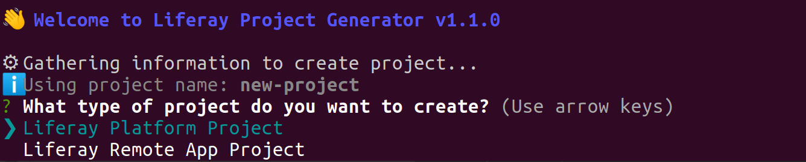
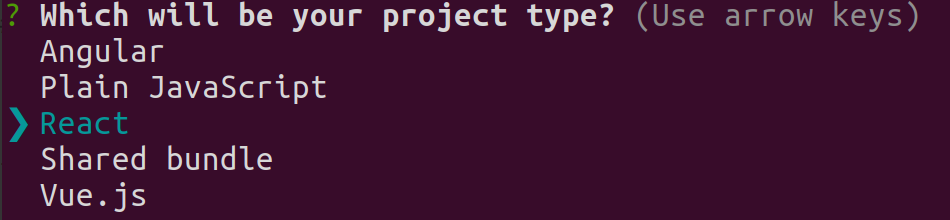

# Liferay CLI Tool

The Liferay CLI tool makes it easy to create [Angular](https://angular.io/), JavaScript, [React](https://reactjs.org/), shared bundle, or [Vue.js](https://vuejs.org/) projects to interface with Liferay's REST and GraphQL services. Using a `liferay` command, you can generate, build, and deploy projects.

```{note}
The Liferay CLI tool replaces the old Yeoman generators used to create JavaScript application projects for Liferay DXP 7.4+. You can use either approach for older versions, but for 7.4+, you must use the CLI tool instead of the Yeoman generators.
```

## Installing the CLI Tool

Run this command to install the CLI tool on your local system:

```bash
npm install -g @liferay/cli
```

```{note}
If you would rather not install the CLI tool globally, you can also run the tool's commands without installing it by using `npx`. For example, you can [generate a new project](#generating-a-project) by running `npx @liferay/cli new [project-name]`.
```

## Generating a Project

Use the `liferay new` command to create a new [Remote App](../../remote-apps/remote-apps-tutorials/creating-a-basic-remote-app.md) or Liferay Platform project:

1. Open a terminal and navigate to where you want to create the project. Run this command:

	```bash
	liferay new [project-name]
	```

1. Enter a name for your new project at the prompt. This name is used as the ID.

1. Choose whether to create a Remote App project or a Liferay Platform project.

   

   ```{note}
   [Remote App projects](../../remote-apps/remote-apps-tutorials/creating-a-basic-remote-app.md) are hosted on a remote server that your Liferay DXP instance can access to use as an application. Liferay Platform projects are deployable to Liferay DXP/Portal.
   ```

1. Enter a human readable description of the new project at the prompt. The default value is "New Project".

1. Choose the target platform for the project. The target platform you choose determines the project's default dependencies and the rules used to build the project (for example, whether your project should have access to all of the target platform's available JavaScript API).

   You can select a Liferay Portal or Liferay DXP target platform for versions 7.1+. You can also select "Liferay Portal CE (not sharing platform's packages)", which defines a `@lifray/portal-agnostic` target in the project's `package.json` file. In this case, your project won't include additional packages bundled with Liferay Portal, and the only required dependencies are build and bundle tools.

   ```{note}
   If you choose a Remote App project, you can only choose a version 7.4+. If you choose a specific version instead of the `not sharing platform's packages` option, your project gets React packages from the Liferay platform. This option reduces the project's size and manual dependencies, but restricts your project to use the packages bundled with that version.
   ```

1. Choose the type of project to create from the given options in the prompt.

    

    ```{note}
    If you chose to create a Remote App project, you can only choose the React type.
    ```

1. **If you chose to create a Liferay Platform project:** choose a category for your widget. The category determines how it is sorted in the list of widgets when you edit a page. The default value is `category.sample` (for the "Sample" widget category), but you can change it to any custom value.

	**If you chose to create a Remote App project instead**: choose the HTML tag name for your custom element. The name must contain at least one hyphen (`-`) and start with a letter. Then answer the prompt (`y` or `n`) for whether to render using shadow DOM.

The CLI tool creates a project in a new folder with the name you chose for your project.

## Building a Project

Use this command to build a project made with the CLI tool:

```bash
liferay build
```

This builds your project and puts the resulting JAR file in your project's `dist/` directory. You can then deploy that JAR to any Liferay instance.

```{note}
You can also run `npm run build` within a project created with the CLI tool as an alias to `liferay build`.
```

## Deploying a Project

Use this command to deploy the JAR file stored in your project's `dist/` directory to your local Liferay installation (after you have run [`liferay build`](#building-a-project)):

```bash
liferay deploy
```

When you run this task for the first time, it asks for your Liferay installation's directory so it can deploy to it, and stores the answer in a `.liferay.json` file in your project's folder. Change the directory configured in this file to change the deployment location.

## Clearing Out a Project's Build Files

Use the `clean` command to delete the `build/` and `dist/` created by the [`build`](#building-a-project) and [`deploy`](#deploying-a-project) commands when out-of-date artifacts would interfere with your builds.

Run this command from your project's directory to remove these folders:

```bash
liferay clean
```

## Upgrading a Project Made with the Yeoman Generators

A project must be structured correctly for you to run CLI tool commands on it. Projects made with the old Yeoman generators (using the `yo liferay-js` command) must first be upgraded to the new architecture.

```{warning}
The `upgrade-project` command only upgrades parts of your project that the Yeoman generator created. Other changes or customizations you made to your project are left as-is. Back up your project before you attempt to upgrade it and be ready to make manual changes in case the upgrade conflicts with your own changes.
```

Run this command to upgrade a React, Angular, or Vue.js project made with the Yeoman generators to work with the Liferay CLI tool:

```bash
liferay upgrade-project
```

## Adapting a Project Made with Other Tools

You can also adapt projects created with other tools to be deployable with the Liferay CLI tool. You can adapt projects created with these tools:

* For [**React**](https://reactjs.org/): the [create-react-app](https://reactjs.org/) project generator

* For [**Angular**](https://angular.io/): the [Angular CLI](https://cli.angular.io/) project generator

* For [**Vue.js**](https://vuejs.org/): the [Vue CLI](https://cli.vuejs.org/) project generator

Run this command from the project's directory to adapt the project created with these other generators:

```bash
liferay adapt
```

The CLI tool adapts your project based on the framework it detects in your project's dependencies. It looks for these specific dependencies (listed as a `dependency` or `devDependency`) in your project's `package.json` file:

* For **React**: `react-scripts`

* For **Angular**: `@angular/cli`

* For **Vue.js**: `@vue/cli-service`
