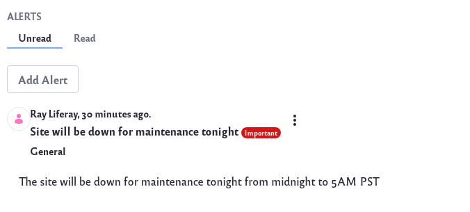
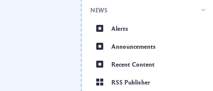
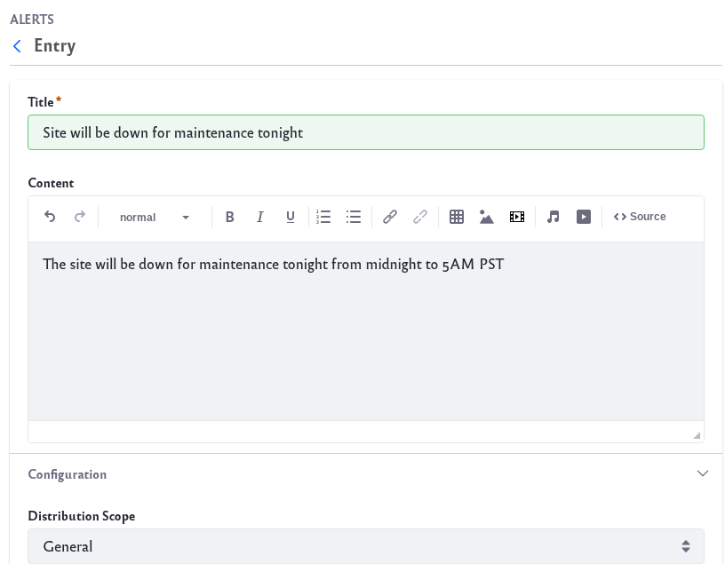
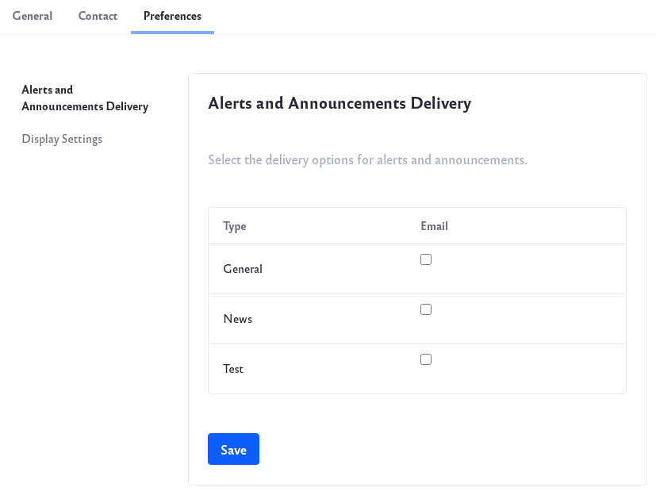
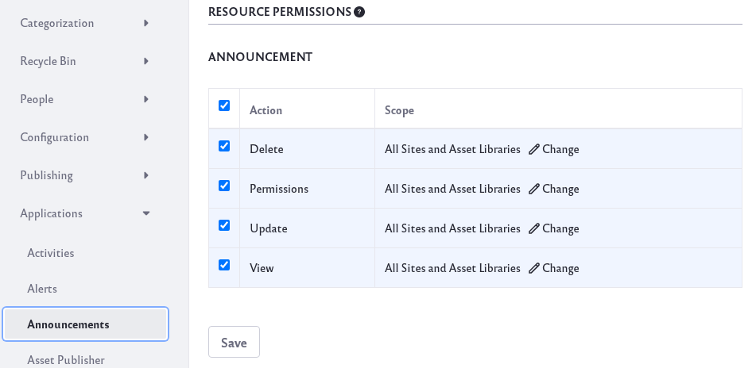

# Sending Alerts and Announcements

You can use the Alerts widget or the Announcements widget to broadcast important information. 

The Alerts widget is designed for displaying high-priority information (e.g. planned downtime alerts, security alerts, etc.). Each alert is labeled with a red *Important* tag. 

The Announcements widget can display all other information you might want to broadcast. Each announcement lacks the red tag. To separate important alerts from more mundane announcements, you can place the Alerts widget and Announcements widget on different pages. You can use either widget, however, to display any information you wish. 

Besides the red *Important* tag, they function the same. You can also scope your alerts and announcements to specific groups of Users.

These widgets have two tabs:

**Unread:** Non-expired alerts/announcements that you haven't read.

**Read:** Alerts/announcements that have expired, or that you've read.

## Creating Alerts and Announcements

1. Add the widget by clicking the _Add_ icon () at the top of a page. Find the Alerts widget or the Announcements widget under the News section and drag it to your page.

    

1. To create an alert or announcement click on *Add Alert* or *Add Announcement*. A new window opens.

    

1. Use the Title field to give the alert or announcement a title. Add additional text in the Content field.

1. Set additional settings under the *Configuration* section below. 

1. Click *Save* when you’re done. Your alert/announcement now appears in the widget.

**Distribution Scope:** The scope where the alert/announcement should appear. The default General scope sends the alert/announcements to everyone. Alternatively, you can select your Site or specific Roles. 

**URL:** A URL (optional) to include with the alert/announcement. For example, an announcement about a news story could include a link to the news article. The URL must be valid and begin with `http://` or `https://`.

**Type:** The alert/announcement type. This can be General, News, or Test. Note that each user can specify a different delivery mechanism for each type of alert/announcement. See [User Configuration ](#user-configuration) for details.

**Priority:** The announcement's priority. This can be Normal or Important. Note that this is disabled for alerts because alerts are always high priority.

**Display Date:** The date the alert/announcement should be displayed. This determines when the alert/announcement is sent and appears in the widget. By default, the *Display Immediately* box is checked. This sets the display date equal to the creation date. Uncheck this box to enter a custom display date. For example, you can create alerts/announcements for display on a later date. This date can be days, weeks, months, or years in the future. Once the Display Immediately box is unchecked, clicking the Display Date field opens the date-picker.

**Expiration Date:** The date and time the alert/announcement expires. Once an alert/announcement expires, the widget displays it in the Read tab. Clicking the Expiration Date field opens the date-picker.

## User Configuration

Users can configure how they'd like to receive announcements.

1. Click on your User profile at the top right and click on *Account Settings*.

1. Click on the *Preferences* tab to find the *Alerts and Announcements Delivery* option.

    

1. Alerts and announcements are always visible from the page on which the widget is configured. Users can choose to
receive alerts and announcements by email as well. Select between General, News, or Test type.

1. Click *Save* when you're finished.

## Alert and Announcement Roles

You can also create Roles for Users to be able manage alerts and announcements: 

1. Click on the *Applications Menu* icon () &rarr; *Control Panel* &rarr; *Roles*.

1. With the *Regular Roles* tab selected, click the *Add* icon (). This opens the New Role form.

1. Name your Role *Announcements*, give it a title and description, and click *Save*.

1. Click on the _Options_ icon () of the Role and click *Edit*.

1. Click on the *Define Permissions* tab. 

    Under Control Panel, click on *General Permissions*, select *Add General Announcements*. Click *Save*.

    

    Go back to the Define Permissions tab. Navigate to *Site and Asset Library Administration* &rarr; *Applications* &rarr; *Announcements*. Select all the resource permissions and click *Save*.

1. Now any User assigned to this Role can manage alerts and announcements.
