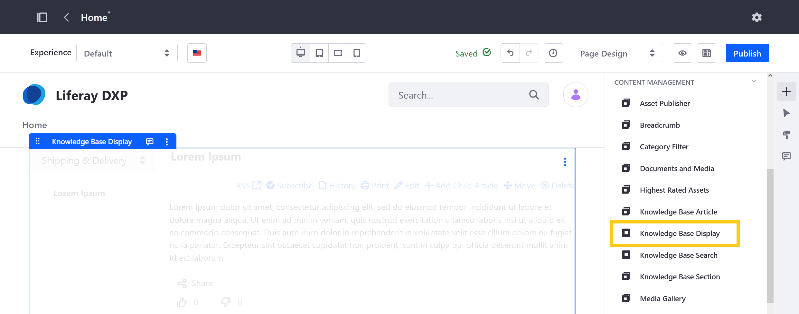
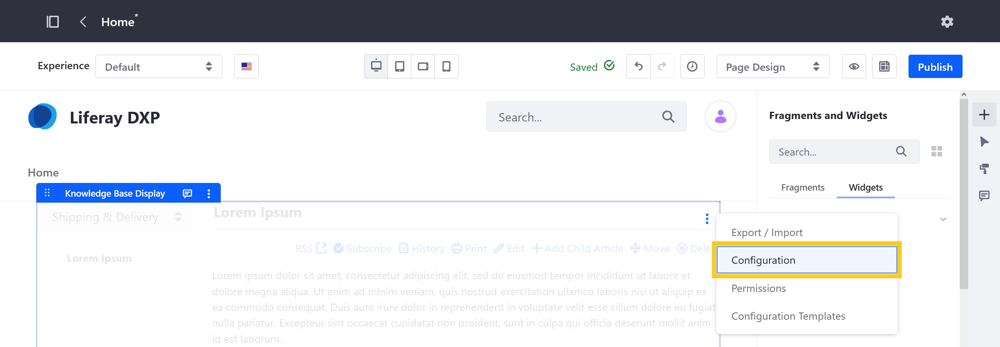
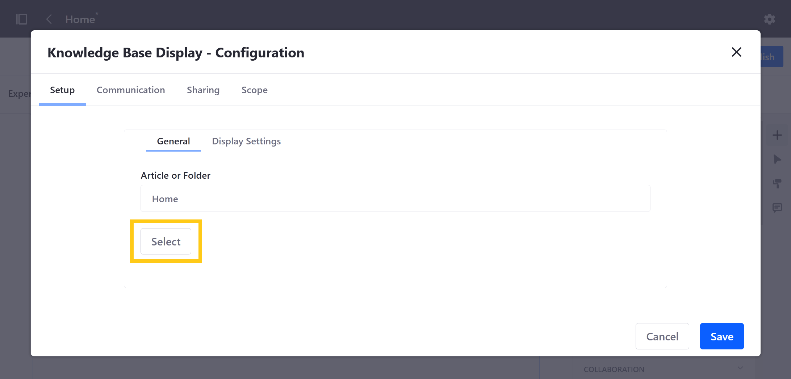
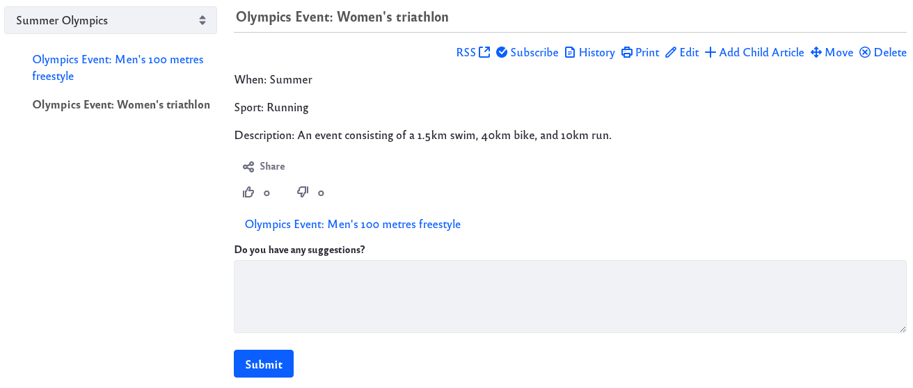

# Knowledge Base Display Widget

With the Knowledge Base Display widget, you can display published Knowledge Base articles on a Widget or Content Page. By default, this widget displays articles from the Knowledge Base’s Home folder. However, you can customize which articles are included and how they're displayed.

You can find the widget under *Content Management* in the widget menu.

## Configuring the Widget

Follow these steps to determine which article or folder is displayed by the widget:

1. Navigate to a Page where the Knowledge Base Display widget it deployed.

1. Click the *Options* button () for the widget and select *Configuration*.

   

1. In the *Setup* tab of the configuration window, go to the *General* tab and click *Select*.

    

1. In the Select Entry window, click *Select* for the article or folder of articles that you want to display.

   Alternatively, click on the desired folder and then click *Choose This Folder* to select its content for display.

   

1. Click *Save* and close the configuration window.

The Knowledge Base Display widget also has additional configuration options:

* Display Settings
* Communication Settings
* Sharing Settings
* Scope Settings

## Exploring the Widget's Features

The Knowledge Base Display’s navigation menu and display options make it a great candidate for a full page widget. If you display a folder of articles, the navigation on the left side of the widget displays links to all the folder’s articles. 

The viewing area on the right side of the widget displays the folder’s leading article (the *priority one* article). Click an article in the navigation to display it in the viewing area. The currently displayed article’s link appears in bold in the navigation. You can also move between articles by clicking the links at the bottom of the article before the suggestions section.

Knowledge Base Display can also show article hierarchies. Viewing an article that has child articles expands the navigation tree to show links to the child articles. Expanded nodes collapse when you view a different top level article.

The links at the top of the widget expose these actions on an article:

* Subscribe to an RSS feed of the Knowledge Base
* Subscribe to the current article
* View the current article’s history
* Print the current article

Administrators have access to an additional set of links at the top of the widget:

* Edit the article
* Add a child article
* Move the article
* Delete the article

Below the article’s content is the rating interface, showing thumbs up/down icons. Users can also submit suggestions or comments below the article in the text box labeled *Do you have any suggestions*?. Administrators can view the [suggestions and mark progress on them](responding-to-knowledge-base-feedback.md).

If the administrator enables the Knowledge Base app’s source URL feature (more on this in a moment) and an article has an assigned source URL, an *Edit on GitHub* button () appears to the right of the article’s title. This button links to the article’s source in GitHub. You can use this feature to encourage people to contribute fixes or improvements to articles. If you’re interested in this feature, you can direct your administrator to follow the instructions in [Knowledge Base System Settings](knowledge-base-system-settings.md).

## Displaying Different Article Sets

You can use folders to aggregate similar articles and provide an easy way for users to switch between these sets of articles. The Knowledge Base Display’s content folder feature adds a selector to the top of the navigation for switching between article sets.

Follow these steps to set up content folders:

1. Add a folder in the Knowledge Base app in Site Administration. Then create sub-folders in this folder. These sub-folders are the *content folders*.

1. Add articles to each content folder.

1. Select *Configuration* from Knowledge Base Display’s *Options* menu (). In the *Setup* &rarr; *General* tab, select the content folders’ parent folder and click *Save*.

The content selector’s values reflect the names of your content folders. Select one to view its articles.

You can also add a common prefix to the names shown in the selector:

1. Select *Configuration* from Knowledge Base Display’s *Options* menu (). In the Configuration dialog, select the *Setup* &rarr; *Display Settings* tab.

1. Enter the prefix into the *Content Root Prefix* field and click *Save*.

## Additional Information

* [Using the Knowledge Base](./using-the-knowledge-base.md)
* [Creating Knowledge Base Articles](./creating-knowledge-base-articles.md)
* [Managing the Knowledge Base](./managing-the-knowledge-base.md)
