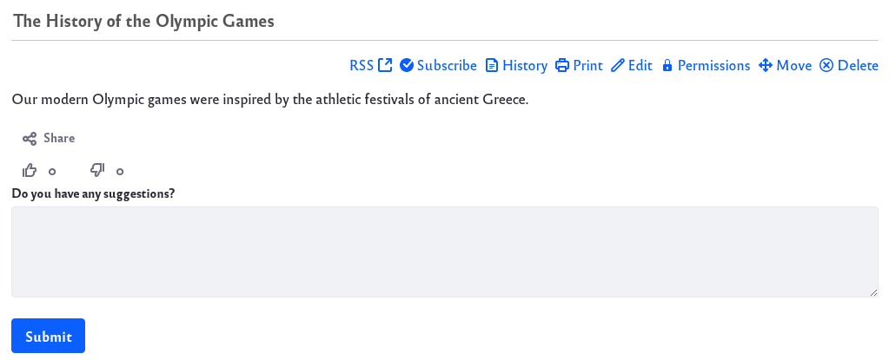
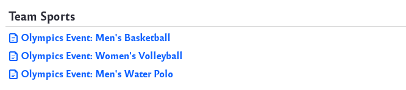
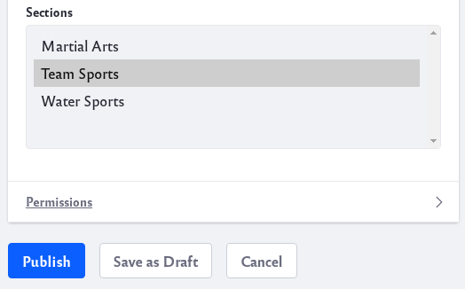
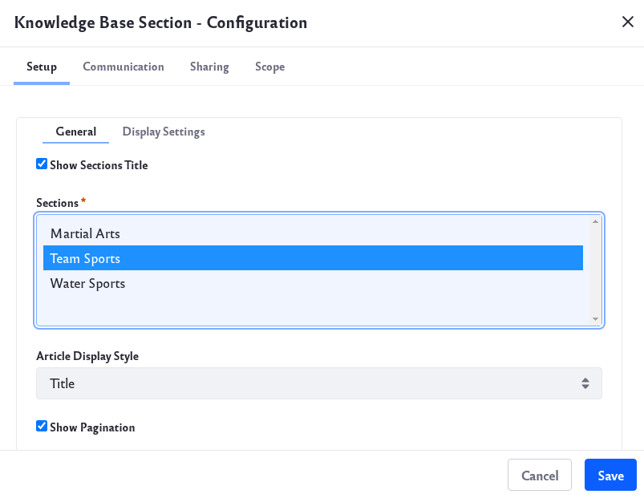
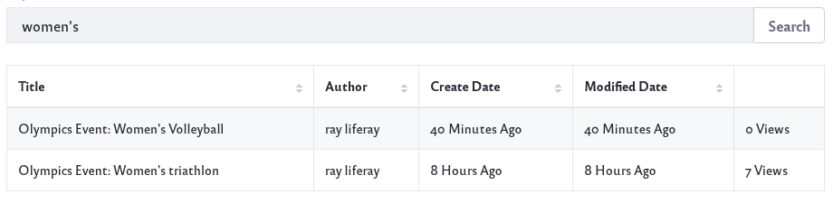
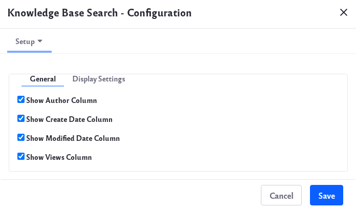

# Other Knowledge Base Widgets

There are other Knowledge Base widgets you can add to pages besides the [Knowledge Base Display widget](knowledge-base-display-widget.md):

**Knowledge Base Article widget:** Display a single article’s content.

**Knowledge Base Section widget:** Publish articles associated with a specific topic (section).

**Knowledge Base Search widget:** Search for articles.

You can add these widgets from *Add* () &rarr; *Widgets* &rarr; *Content Management*.

## Knowledge Base Article Widget

The Knowledge Base Article widget displays a single article’s content. It even shows abstracts of child articles. You can add multiple Knowledge Base article instances to a page, and each one can show a different article.

After adding the Knowledge Base Article widget to a Site page,

1. Click _Options_ () &rarr; click *Configuration*.

1. In the *Setup* &rarr; *General* tab, click *Select*. Choose an article, click *Save*, and close the Configuration window.

    

The Knowledge Base Article widget shares the same UI as the Knowledge Base Display widget to display and manage its articles. Refer to the [Knowledge Base Display widget](knowledge-base-display-widget.md) documentation for a detailed description of the widget’s UI.

## Knowledge Base Section Widget

```note::
   As of Knowledge Base 3.0.0, the Knowledge Base Sections widget is deprecated and replaced by `categories <../../../content-authoring-and-management/tags-and-categories/organizing-content-with-categories-and-tags.md>`_.
```

The Knowledge Base Section widget can publish articles associated with a specific topic (section). For example, a Site about the Summer Olympics might have the sections Team Sports, Water Sports and Martial Arts.



To use sections, you must first configure the feature in System Settings, creating the section names for use in the Knowledge Base Section widget. This process is covered in detail in [Knowledge Base System Settings](knowledge-base-system-settings.md). 

When creating or editing a Knowledge Base article, authors can then select the article’s section in the Configuration &rarr; Section field.



You can add multiple instances of the Knowledge Base Section widget to a page. Each widget can display articles from any number of sections. You can configure the widget to display article titles or abstracts. You can also define whether to show pagination or section titles.

To configure the Knowledge Base Section widget,

1. Select *Configuration* from the Knowledge Base Section widget’s *Options* menu (). This opens the widget’s Configuration window.

    

1. In *Setup* &rarr; *General* tab, select the section or sections that you want to use and click *Save*.

1. Close the Configuration window to see the updates.

The matching articles are displayed in the app beneath their section heading.

## Knowledge Base Search Widget

```note::
   As of Knowledge Base 3.0.0, the Knowledge Base Search widget is deprecated and replaced by Liferay Search.
```

Even though the Knowledge Base can show the structure of its articles, it may be difficult to find exactly what you’re looking for by browsing. For this, you can use the Knowledge Base Search widget.

Enter your search term and press the *Search* button. The results are displayed in a table with the following criteria for each matching article:

* Title
* Author
* Create date
* Modified date
* Number of views



After adding the widget to a page,

1. Click _Options_ () &rarr; *Configuration*.

   

1. In the *Setup* &rarr; *General* tab, select the criteria to display in the search results.

1. Click *Save*, and close the Configuration window.
