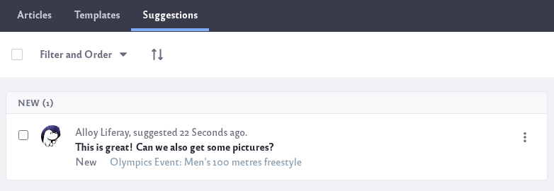
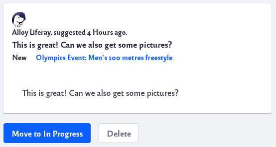
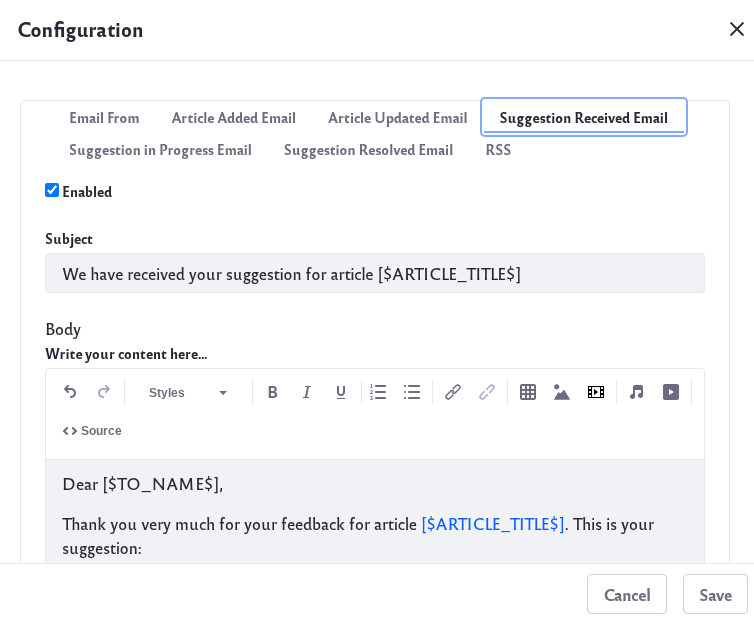

# Responding to Knowledge Base Feedback

The Suggestions tab shows feedback on articles. You can mark progress on addressing the feedback. 

To navigate to the Knowledge Base app, click the _Menu_ icon () and navigate to *Content and Data* &rarr; *Knowledge Base*. 

Each suggestion provides the link to the associated article, the feedback, the User’s name, the feedback’s time stamp, and the status on addressing the suggestion. You can use each entry’s Actions menu () to move the entry between the *New*, *In Progress*, and *Resolved* states.

You can also click on an individual suggestion and mark it to advance the progress.

Feedback first shows a Move to In Progress button, and then a Resolve button. A suggestion can be changed back to new state by clicking the *New* button. Suggestions can also be deleted by clicking on the *Delete* button.

Note: To view article suggestions, your Role must have the permission Knowledge Base &rarr; Knowledge Base: View Suggestions.

To move suggestions between the New, In Progress, and Resolved states, your Role must have the permission Knowledge Base &rarr; Knowledge Base Article: Update. Roles assigned this permission can also view and update the state of article suggestions from any of the other Knowledge Base widgets. 

When you move the suggestion to a different state, an email is sent notifying the user of the change. You can view and configure the automated emails from the Knowledge Base app’s *Options* () &rarr; *Configuration* menu.

Enable and customize the email that is sent as feedback is accepted and resolved.
