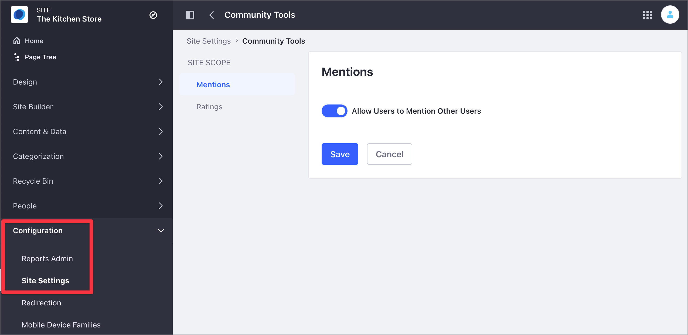
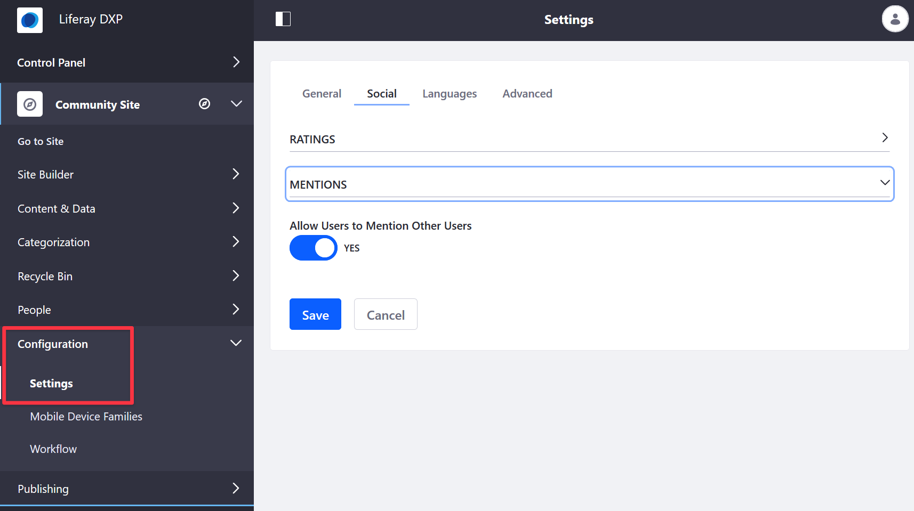

# Configuring Mentions

Mentions are enabled by the _Mentions_ app. By default, the _Mentions_ app is enabled globally. However, this can be enabled or disabled either globally or per Site.

## Configuring Mentions on a Global Scope

To access the global Mentions settings for your Virtual Instance:

1. Click the *Global Menu* () and click *Control Panel*.
1. Under Configuration, click *Instance Settings*.
1. Under Content and Data, click *Community Tools*.

   

1. In the Virtual Instance Scope section, click *Mentions*.
1. By default, all users can mention fellow Site members and friends. To configure this option, select *Define Mentions Capability for Users* and specify the settings you want.

    

1. Click *Save*.

## Configuring Mentions on a Site Scope

Site administrators can enable or disable *Mentions* for a Site.

1. Access the Mentions option:

    - In Liferay DXP 7.4+

      1. From the Site Menu, go to *Configuration* &rarr; *Site Settings*.
      1. In the Content and Data section, click *Community Tools* and then click *Mentions*.

            

   - In previous Liferay DXP versions

      1. From the Site Menu, go to *Configuration* &rarr; *Settings*.
      1. Under the Social area, expand the *Mentions* option.

            

1. In the *Allow Users to Mention Other Users* option, toggle the switch to set your preferred setting.

1. Click *Save*.

## Related Information

- [Site Settings UI Reference](../../../site-building/site-settings/site-settings-ui-reference.md)
- [Managing Notifications and Requests](./managing-notifications-and-requests.md)
- [Mentioning Users](./mentioning-users.md)
