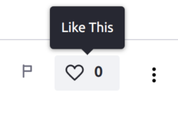
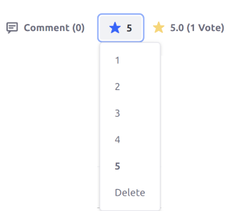
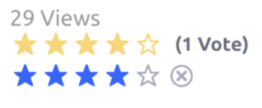
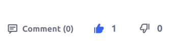
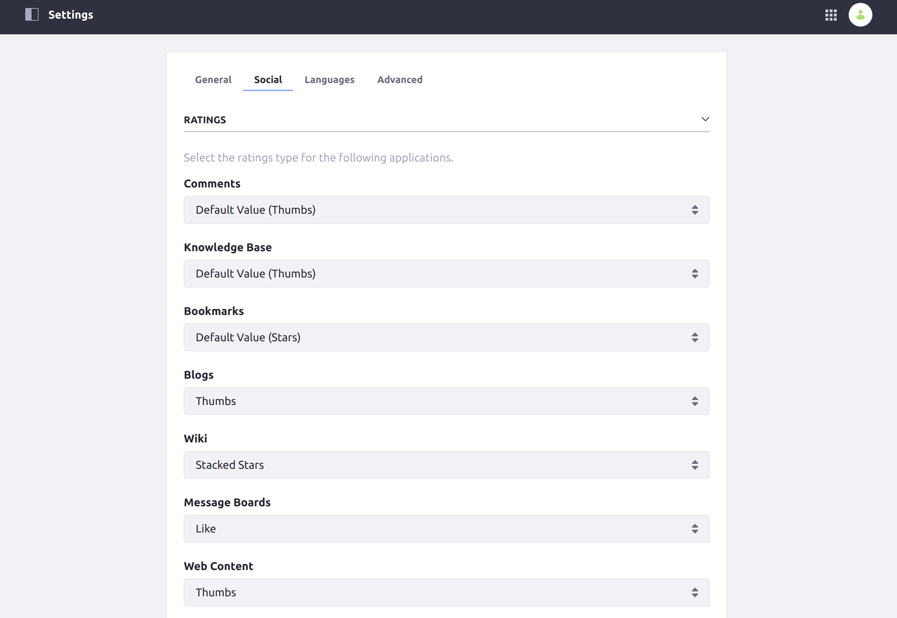
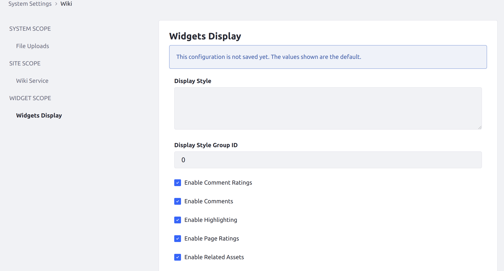

# Using the Ratings System

Liferay DXP's asset framework <!-- TODO: Add link to asset framework article when available --> supports a content rating system that allows Users to rate or value content. Many of DXP's built-in content types have ratings enabled by default.

## Ratings Types

The following types of ratings are available out-of-the-box for compatible assets:

* **Likes**: Content only has one button (with a heart icon) for users to "like" the content. The total number of likes is shown beside the heart button.

    

* **Stars**: Content is rated from 1 to 5 stars in a drop-down menu. The content's total star rating is shown to the side.

    

* **Stacked Stars**: Content is rated from 1 to 5 stars in a horizontal selection. The content's total star rating is shown above the user's selection. The only difference between this rating type and the standard Stars type is how it appears on the screen.

    

* **Thumbs**: Content is given either a "thumbs up" or "thumbs down" rating. The total number of thumbs up or down is shown beside each thumb button.

    

## Ratings Value Conversion

Because the different types of configurable ratings (likes, stars, etc.) are presented differently, the database stores a normalized ratings value for assets that have them enabled. If the ratings type of an asset is changed, then the ratings are converted and carry over to the new type.

The following table shows how ratings from each type can be converted to the other types:

|  | **Converted to Likes** | **Converted to Stars** | **Converted to Thumbs Up/Down** |
| --- | --- | --- | --- |
| **Likes** | No change | 1 Like = 5 Star rating | 1 Like = 1 Thumbs Up |
| **Stars** | 3-5 Stars = 1 Like; 1-2 Stars are omitted | No change | 3-5 Stars = 1 Thumbs Up; 1-2 Stars = 1 Thumbs Down |
| **Thumbs** | 1 Thumbs Up = 1 Like; Thumbs Down are omitted | 1 Thumbs Up = 5 Star rating; 1 Thumbs Down = 1 Star rating | No change |

## Enabling Ratings for Your Content

Ratings can be configured for your content from the Site Settings menu (individually per Site).

From the Site menu, navigate to _Configuration_ &rarr; _Settings_, and then click the _Social_ tab. Under the _Ratings_ section, the rating type for each available asset type can be individually configured:



Administrators can also enable or disable ratings for specific widgets across multiple Sites via the Control Panel, in either _Instance Settings_ (for a single virtual DXP instance) or _System Settings_ (globally).

From either of these settings menus, find the icon for the chosen asset type under _Content and Data_ (for example, _Blogs_ or _Wiki_). Then, choose the menu option for the specific widget under the _WIDGET SCOPE_ header (e.g., _Widgets Display_):



```note::
   Not every widget that supports content ratings can have ratings enabled or disabled from the Control Panel.
```

<!-- TODO: (When developer-oriented article available) You can also enable ratings for your own applications by adding just a few lines of code. See the article on [adding support for ratings](link) to your content widgets for more information. -->

## Additional Information

* [Using the Activities Widget](./using-the-activities-widget.md)
