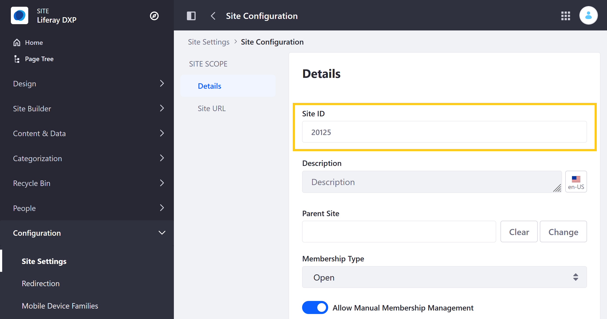

# Wiki API Basics

Liferay's Headless Delivery application provides REST services for the [Wiki](../getting-started-with-wikis.md) application. With these services, you can add Wiki nodes and pages, list their information, modify their content, or remove them altogether. Here you'll call those services using cURL commands and Java classes.

## Preparing Tutorial Resources

Before proceeding with the tutorial, first set up a clean Liferay Docker container and prepare the provided tutorial code for use.

### Liferay Docker Container

The following tutorial requires a DXP/Portal 7.3+ instance for testing the tutorial code. Since the Wiki application is Site scoped, you'll also need a Site ID throughout the tutorial.

To start up a new Liferay DXP container, run the following command:

```docker
docker run -it -m 8g -p 8080:8080 [$LIFERAY_LEARN_PORTAL_DOCKER_IMAGE$]
```

Once started, retrieve the Site ID. To find your Site ID, open the *Site Menu* (), and go to *Configuration* &rarr; *Site Settings* &rarr; *Site Configuration*.



### Tutorial Code

This tutorial provides sample code to demonstrate the Headless API. This code includes both sample cURL and Java files for use throughout the tutorial.

Run the following command to download and unzip the [sample code](https://learn.liferay.com/dxp/latest/en/collaboration-and-social/wiki/developer-guide/liferay-q8u2.zip):

```bash
curl https://learn.liferay.com/dxp/latest/en/collaboration-and-social/wiki/developer-guide/liferay-q8u2.zip -O
```

```bash
unzip liferay-q8u2.zip
```

While the cURL scripts come ready for use, you must manually compile the Java source files before you can run them. To do this, go to the project's `java` folder, and run the `javac` command.

```bash
cd liferay-q8u2/java
```

```bash
javac -classpath .:* *.java
```

## Using WikiNode and WikiPage Headless APIs

The sample code includes cURL scripts and Java classes that call the following APIs.

| Service | HTTP Method | HTTP Endpoint | Java Method | Description |
| --- | --- | --- | --- | --- |
| WikiNode | `POST` | `/v1.0/sites/{siteId}/wiki-nodes` | `postSiteWikiNode` | Creates a new Wiki node in the specified Site using the details provided in the API call |
| WikiNode | `GET` | `/v1.0/sites/{siteId}/wiki-nodes` | `getSiteWikiNodesPage` | Returns a complete list of all Wiki nodes in the specified Site; results can be paginated, filtered, searched, and sorted |
| WikiNode | `GET` | `/v1.0/wiki-nodes/{wikiNodeId}` | `getWikiNode` | Returns details for the specified node entity |
| WikiNode | `PUT` | `/v1.0/wiki-nodes/{wikiNodeId}` | `putWikiNode` | Replaces the specified node's details with those provided in the API call |
| WikiNode | `DELETE` | `​/v1.0​/wiki-nodes​/{wikiNodeId}` | `deleteWikiNode` | Deletes the specified node and returns a 204 if the operation succeeds |
| WikiPage | `POST` | `/v1.0/wiki-nodes/{wikiNodeId}/wiki-pages` | `postWikiNodeWikiPage` | Creates a new Wiki page in the specified node using the details provided in the API call |
| WikiPage | `POST` | `/v1.0/wiki-pages/{parentWikiPageId}/wiki-pages` | `postWikiPageWikiPage` | Creates a new Wiki child page for the specified Wiki page using the details provided in the API call. |
| WikiPage | `GET` | `/v1.0/wiki-nodes/{wikiNodeId}/wiki-pages` | `getWikiNodeWikiPagesPage` | Returns a complete list of all Wiki pages added to the specified Wiki node; results can be paginated, filtered, searched, and sorted |
| WikiPage | `GET` | `/v1.0/wiki-pages/{parentWikiPageId}/wiki-pages` | `getWikiPageWikiPagesPage` | Returns a complete list of all Wiki child pages added to the specified Wiki page; results can be paginated, filtered, searched, and sorted |
| WikiPage | `GET` | `/v1.0/wiki-pages/{wikiPageId}` | `getWikiPage` | Returns details for the specified Wiki page entity |
| WikiPage | `PUT` | `/v1.0/wiki-pages/{wikiPageId}` | `putWikiPage` | Replaces the specified page's details with those provided in the API call |
| WikiPage | `DELETE` | `/v1.0/wiki-pages/{wikiPageId}` | `deleteWikiPage` | Deletes the specified page and returns a 204 if the operation succeeds |

```{important}
When using POST and PUT methods for Wiki pages, you must define both the `headline` and `encodingFormat` fields. The `headline` field sets the page's main title, while the `encodingFormat` field determines the page's media format (e.g., HTML, BBCode, etc.).
```

### Calling the WikiNode APIs

In this exercise, you can use either the cURL commands or Java classes to call the WikiNode APIs. The following output examples correspond to the cURL command, which slightly differs from the output for the provided Java classes.

1. Navigate to the `curl` or `java` folder in the `liferay-q8u2` project.

   **For cURL:**

   ```bash
   cd liferay-q8u2/curl
   ```

   **For Java:**

   ```bash
   cd liferay-q8u2/java
   ```

1. Execute the `WikiNode_POST_ToSite` shell script or Java class using your Site ID as a parameter. This creates a new Wiki node in the specified Site.

   **For cURL:**

   ```bash
   ./WikiNode_POST_ToSite.sh {site-id}
   ```

   **For Java:**

   ```bash
   java -classpath .:* -DsiteId={site-id} WikiNode_POST_ToSite
   ```

   The terminal displays the complete schema for the newly created Wiki node. The provided API calls only define the `description` and `name` fields for the new node, though you should copy the node's ID for use with the following GET, PUT, and DELETE methods.

   ```bash
   {
     ...
     "description" : "Foo",
     ...
     "id" : 38405,
     "name" : "Able Node",
     ...
   }
   ```

1. Execute the `WikiNodes_GET_FromSite` shell script or Java class using the Site ID for its parameter. This returns a list of all Wiki nodes in the specified Site.

   **For cURL:**

   ```bash
   ./WikiNodes_GET_FromSite.sh {site-id}
   ```

   **For Java:**

   ```bash
   java -classpath .:* -DsiteId={site-id} WikiNodes_GET_FromSite
   ```

   ```{note}
   All DXP/Portal instances come with a default Wiki node called `Main`. This node is shown in the above output, along with any nodes you've created.
   ```

1. Execute the `WikiNode_PUT_ById` shell script or Java class using the Wiki node ID for its parameter. This replaces the details of the specified Wiki node with the details provided in the API call.

   **For cURL:**

   ```bash
   ./WikiNode_PUT_ById.sh {wiki-node-id}
   ```

   **For Java:**

   ```bash
   java -classpath .:* -DwikiNodeId={wiki-node-id} WikiNode_PUT_ById
   ```

   ```bash
   {
     ...
     "description" : "Bar",
     ...
     "id" : 38405,
     "name" : "Baker Node",
     ...
   }
   ```

1. Execute the `WikiNode_DELETE_ById` shell script or Java class using the Wiki node ID for its parameter. This deletes the specified node.

   **For cURL:**

   ```bash
   ./WikiNode_DELETE_ById.sh {wiki-node-id}
   ```

   **For Java:**

   ```bash
   java -classpath .:* -DwikiNodeId={wiki-node-id} WikiNode_DELETE_ById
   ```

1. Execute the `WikiNode_GET_ById` shell script or Java class using the previous Wiki node ID for its parameter. This returns the details for the specified node if it exists.

   **For cURL:**

   ```bash
   ./WikiNode_GET_ById.sh {wiki-node-id}
   ```

   **For Java:**

   ```bash
   java -classpath .:* -DwikiNodeId={wiki-node-id} WikiNode_GET_ById
   ```

   Since you deleted the node in the preceding step, it returns the following message.

   ```bash
   {
     "status" : "NOT_FOUND",
     "title" : "No WikiNode exists with the primary key 38405"
   }
   ```

### Calling the WikiPage APIs

You can use either the cURL commands or Java classes to call the WikiPage APIs. The following output examples correspond to the cURL command, which differs from the Java classes output.

1. Navigate to the `curl` or `java` folder in the `liferay-q8u2` project.

   **For cURL:**

   ```bash
   cd liferay-q8u2/curl
   ```

   **For Java:**

   ```bash
   cd liferay-q8u2/java
   ```

1. Execute the `WikiNode_POST_ToSite` shell script or Java class to create a node for your Wiki page.

   **For cURL:**

   ```bash
   ./WikiNode_POST_ToSite.sh {site-id}
   ```

   **For Java:**

   ```bash
   java -classpath .:* -DsiteId={site-id} WikiNode_POST_ToSite
   ```

   ```{note}
   Since Wiki pages are stored in Wiki nodes, at least one node must exist before you can create any Wiki pages.
   ```

1. Copy the node's ID from the output for use with the `WikiPage_POST_ToNode` call.

   ```bash
   {
     ...
     "description" : "Foo",
     ...
     "id" : 38504,
     "name" : "Able Node",
     ...
   }
   ```

1. Execute the `WikiPage_POST_ToNode` shell script or Java class using the above node ID for its parameter. This creates a new Wiki page for the specified node.

   **For cURL:**

   ```bash
   ./WikiPage_POST_ToNode.sh {wiki-node-id}
   ```

   **For Java:**

   ```bash
   java -classpath .:* -DwikiNodeId={wiki-node-id} WikiPage_POST_ToNode
   ```

1. Copy the page's ID for use with the `WikiPage_POST_ToParent` call.

   ```bash
   {
     ...
     "content" : "Foo",
     ...
     "description" : "Able Page",
     "encodingFormat" : "text/x-wiki",
     ...
     "headline" : "Able Page",
     "id" : 38506,
     ...
   }
   ```

1. Execute the `WikiPage_POST_ToParent` shell script or Java class using the above Wiki page ID for its parameter. This creates a child page for the specified Wiki page.

   **For cURL:**

   ```bash
   ./WikiPage_POST_ToNode.sh {wiki-page-id}
   ```

   **For Java:**

   ```bash
   java -classpath .:* -DparentWikiPageId={wiki-page-id} WikiPage_POST_ToParent
   ```

   ```bash
   {
      ...
      "content" : "Foo",
      ...
      "description" : "Charlie Page",
      "encodingFormat" : "text/x-wiki",
      ...
      "headline" : "Charlie Page",
      "id" : 38510,
      ...
   }
   ```

1. Execute the `WikiPages_GET_FromNode` shell script or Java class using the Wiki node ID for its parameter. This returns a list of all Wiki pages added to the specified node, which includes both of the newly created Wiki pages.

   **For cURL:**

   ```bash
   ./WikiPages_GET_FromNode.sh {wiki-node-id}
   ```

   **For Java:**

   ```bash
   java -classpath .:* -DwikiNodeId={wiki-node-id} WikiPages_GET_FromNode
   ```

1. Execute the `WikiPages_GET_FromParent` shell script or Java class using the Wiki parent page ID for its parameter. This returns any existing child pages for the specified Wiki page.

   **For cURL:**

   ```bash
   ./WikiPages_GET_FromParent.sh {wiki-page-id}
   ```

   **For Java:**

   ```bash
   java -classpath .:* -DparentWikiPageId={wiki-page-id} WikiPages_GET_FromParent
   ```

1. Execute the `WikiPage_PUT_ById` shell script or Java class using either of the above Wiki page IDs for its parameter. This replaces the original page's content with the content defined in the API call.

   **For cURL:**

   ```bash
   ./WikiPage_PUT_ById.sh {wiki-page-id}
   ```

   **For Java:**

   ```bash
   java -classpath .:* -DwikiPageId={wiki-page-id} WikiPage_PUT_ById
   ```

   ```bash
   {
     "content" : "Bar",
     ...
     "encodingFormat" : "text/x-wiki",
     ...
     "headline": "Baker Page",
     "id" : 38515,
     ...
   }
   ```

1. Execute the `WikiPage_DELETE_ById` shell script or Java class using the desired Wiki page ID for its parameter. This deletes the specified Wiki page.

   **For cURL:**

   ```bash
   ./WikiPage_DELETE_ById.sh {wiki-page-id}
   ```

   **For Java:**

   ```bash
   java -classpath .:* -DwikiPageId={wiki-page-id} WikiPage_DELETE_ById
   ```

1. Execute the `WikiPage_GET_ById` shell script or Java class using the deleted Wiki page's ID for its parameter. This returns the details for the specified page if it exists.

   **For cURL:**

   ```bash
   ./WikiPage_GET_ById.sh {wiki-page-id}
   ```

   **For Java:**

   ```bash
   java -classpath .:* -DwikiPageId={wiki-page-id} WikiPage_GET_ById
   ```

   Since the page was deleted in the preceding step, you see the following message.

   ```bash
   {
     "status" : "NOT_FOUND",
     "title" : "No WikiNode exists with the primary key 38515"
   }
   ```

## Examining the Sample cURL Scripts

The following are representative examples of the tutorial's cURL commands.

### `WikiNode_POST_ToSite.sh`

```{literalinclude} ./wiki-api-basics/resources/liferay-q8u2.zip/curl/WikiNode_POST_ToSite.sh
   :language: bash
```

### `WikiPage_POST_ToNode.sh`

```{literalinclude} ./wiki-api-basics/resources/liferay-q8u2.zip/curl/WikiPage_POST_ToNode.sh
   :language: bash
```

### `WikiPages_GET_FromNode.sh`

```{literalinclude} ./wiki-api-basics/resources/liferay-q8u2.zip/curl/WikiPages_GET_FromNode.sh
   :language: bash
```

## Examining the Sample Java Classes

The following are representative examples of the tutorial's Java commands.

### `WikiNode_POST_ToSite.java`

```{literalinclude} ./wiki-api-basics/resources/liferay-q8u2.zip/java/WikiNode_POST_ToSite.java
   :dedent: 1
   :language: java
   :lines: 4-28
```

### `WikiPage_POST_ToNode.java`

```{literalinclude} ./wiki-api-basics/resources/liferay-q8u2.zip/java/WikiPage_POST_ToNode.java
   :dedent: 1
   :language: java
   :lines: 4-29
```

### `WikiPages_GET_FromNode.java`

```{literalinclude} ./wiki-api-basics/resources/liferay-q8u2.zip/java/WikiPages_GET_FromNode.java
   :dedent: 1
   :language: java
   :lines: 6-25
```

## Additional Information

* [Using Liferay as a Headless Platform](../../../headless-delivery/using-liferay-as-a-headless-platform.md)
* [Consuming Rest Services](../../../headless-delivery/consuming-apis/consuming-rest-services.md)
