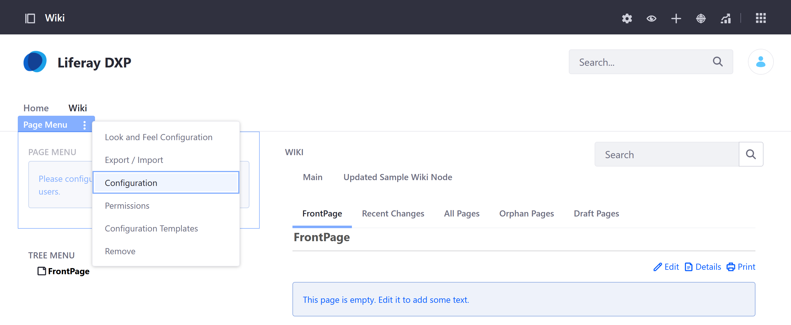

<<<<<<< Updated upstream
# Using the Page Menu Widget

Coming soon!
=======
# Using the Page Menu Widget  

The *Page Menu* Widget is used to display the outgoing links in a [Wiki Page](./getting-started-with-wikis.md). It shows you the links you can access from that main page <!-- CONVINCE READER THE PAGE MENU IS TOPSTER add a sentence listing examples of the type of links you can include (e.g. These can include links to other Wiki Pages, Documents and Media assets, external websites, DXP Site Pages, and more). Also, I'd maybe add a sentence that remarks on the value of the widget.-->. Once you've added the widget to a Page, you'll need to configure which Wiki Page it uses as its source for links. Follow these steps to do so:

1. Click on the *widget’s Options icon*  and select *Configuration*, this opens a *Modal Window*.

   

1. In the *Setup* tab, choose the *Wiki Node*, select the Wiki Page &rarr; *Save* and close the Modal Window. 
      
   
<!--1. When you click a Page Menu link, the site page’s Wiki or Wiki Display widget displays the wiki page associated with that link. 
     [rever essa parte do texto!]-->

## Additional Information 

- [Adding a Page to a Site](https://learn.liferay.com/dxp/latest/en/site-building/creating-pages/adding-pages/adding-a-page-to-a-site.html) 
- [Creating a Page Template](https://learn.liferay.com/dxp/latest/en/site-building/creating-pages/adding-pages/creating-a-page-template.html)
- [Creating Wiki Pages](https://learn.liferay.com/dxp/latest/en/collaboration-and-social/wiki/user-guide/creating-wiki-pages.html?highlight=wiki%20widgets) 
>>>>>>> Stashed changes
