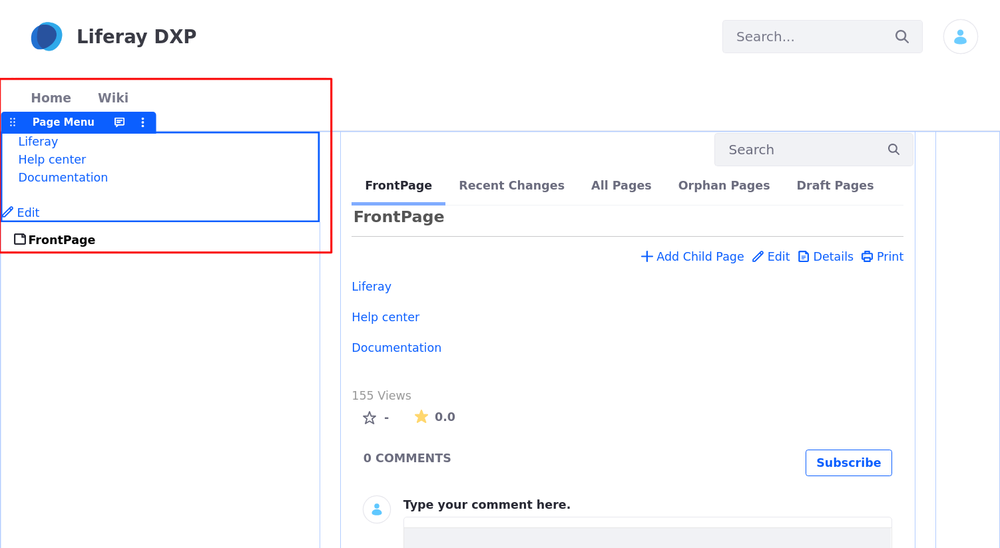
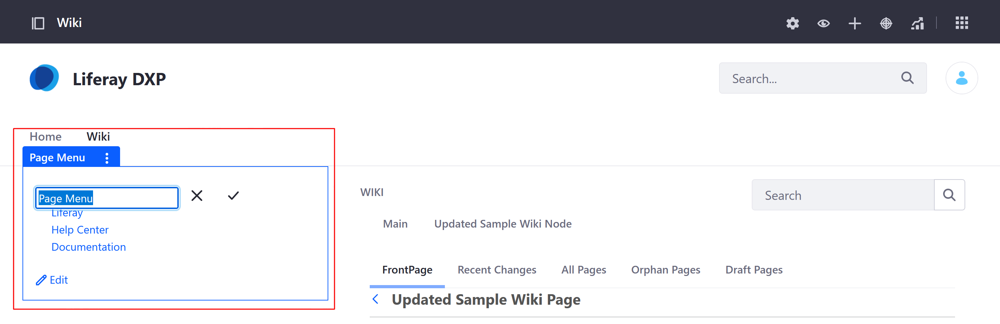

# Using the Page Menu Widget 

The *Page Menu* widget is used to display the outgoing links included in a [Wiki Page](./getting-started-with-wikis.md). It shows you the links you can access from that main page. These can include other Wiki Pages, DXP Site Pages, Documents and Media assets, external websites, and more. Once you've added the widget to a Page, you need to configure which Wiki Page it uses and its sources for links. Follow these steps: 

1. Click on the widget’s *Options* icon () and select *Configuration*. 

   

1. In the modal window's Setup tab, select a *Wiki Node* and *Wiki Page*. This determines which page is used as the source of the links. 
    
      

1. Click *Save* to update the widget and close the modal window.

    Once your configuration is saved, the widget displays any links added to the specified Wiki page. 

    

   Optionally, you can change the display name of the widget when it's deployed to a Widget Page. 

    

## Additional Information 

- [Getting Started with Wikis](./getting-started-with-wikis.md)

- [Creating Wiki Pages](./creating-wiki-pages.md) 

- [Creating a Wiki Node](./creating-a-node.md)

- [Scoping Your Wikis](./scoping-your-wikis.md)

- [Exporting and Importing a Wiki](./exporting-and-importing-a-wiki.md)