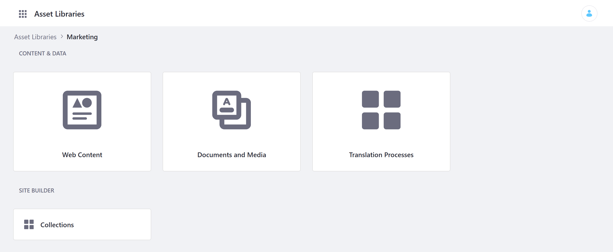
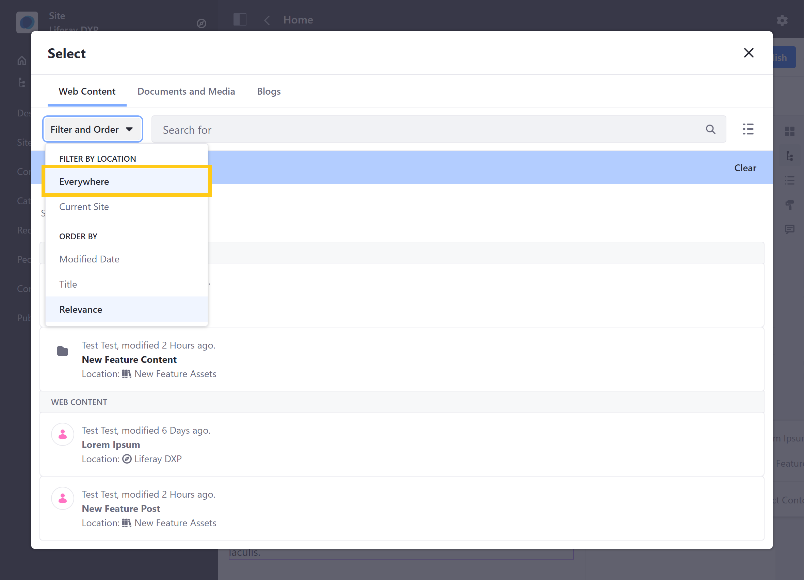
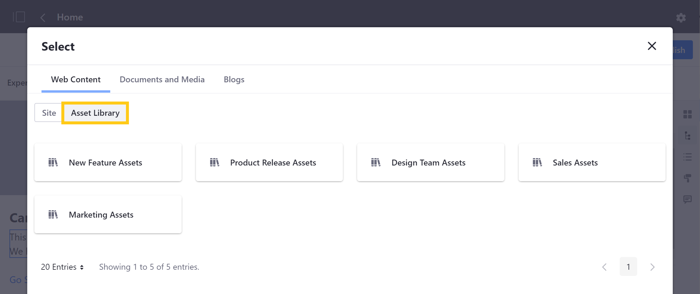
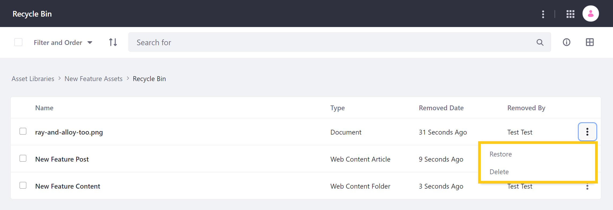

# Asset Library Content

Asset Libraries provide a convenient way to share content across your Sites. This can help to reduce data duplication and streamline content collaboration across your instance. Users can add and manage a Library's content from its *dashboard* page, which can be accessed by clicking on its *name* in the Asset Libraries application Page.



Each Library's dashboard displays its active applications and categorization tools. From here, you can view, create, and organize a Library's content, as well as initiate import/export processes. You can also enable a workflow to direct the publishing process for your Library's web content.

If enabled, all removed content will be temporarily stored in the Library's [Recycle Bin](../recycle-bin/configuring-the-recycle-bin.md), where you can manually restore it to its Library or delete it from your instance.

* [Creating Content](#creating-content)
* [Using Content in Your Sites](#using-content-in-your-sites)
* [Tagging and Categorizing Content](#tagging-and-categorizing-content)
* [Importing and Exporting Content](#importing-and-exporting-content)
* [Removing Content](#removing-content)

## Creating Content

Since all supported applications behave in the same way, creating content in an Asset library is essentially the same as creating it in a Site. The only differences are its location and default theme settings.

To create content, first go to the dashboard for the desired Asset Library, and then click on the application to create content for. From here, the content creation process is the same as with Site content. See [Content Authoring and Management](../../content_authoring_and_management.html) articles for more information about creating each type of content.

```note::
   Only active applications appear on a Library's dashboard. To activate or deactivate an application, see `Configuring Asset Libraries <./creating-and-managing-asset-libraries.md#configuring-asset-libraries>`_ for more information.
```

## Using Content in Your Sites

To use Asset Library content in a Site, they must be connected, and the library must have the desired application activated. Once configured, using Asset Library content in your Site works the same way as using Site content. The only difference is that Users must filter available content to display content from connected Asset Libraries.

For example, when mapping content to a page fragment, you can use content from an Asset Library by filtering displayed content to include content from *Everywhere*. Then, select the desired content in the Item Selector.



Alternatively, use the breadcrumb in the Item Selector modal window to navigate to *Sites and Libraries*. Then, click on the *Asset Library* tab. From here, select the Library with the content you want to use. This directs you back to the Item Selector window, where you can view and map content from your selected Library.



Similarly, when publishing content using the Asset Publisher widget, you must set its scope to include content from a specific Asset Library. Then select the content you want to use.


See [Displaying Content](../../site-building/displaying_content.html) documentation for more information about using content in your Sites.

## Tagging and Categorizing Content

You can use tags and categories to organize your content. To access these tools, go to a Library's dashboard and click on *Tags* or *Categories*. Here you can create new tags and decide whether to use Global categories or to create your own.

The creation process is the same as in other contexts, though tags and categories created in this way are scoped to the Library in which they're made. See [Tags and Categories](../tags_and_categories.html) documentation for more information.

## Exporting and Importing Content

You can export and import Asset Library content as LAR files. To initiate a new export/import process for a Library, go to its dashboard, and click on *Export* or *Import* at the bottom of the page. Then click the *Add* button () to initiate a new process.

Exporting and importing Library content follows the same process as Site assets. You can also create and use custom export templates by clicking on the *Actions* button (  ) in the Applications bar and selecting *Export Templates*. See [Importing/Exporting Sites and Content](../../site-building/building-sites/importing-exporting-pages-and-content.md) for more information.

## Removing Content

You can move content to your Library's Recycle Bin when this feature is enabled. By default, recycled content is retained for 43200 minutes (i.e., 30 days), but you can adjust this period in each Asset Library's settings. Recycled content that has been in the Recycle Bin for more than the allotted time are automatically deleted from your instance.

You can also choose to manually delete recycled content or restore it to your Asset Library by clicking on its *Actions* button (  ). See [Recycle Bin Overview](../recycle-bin/recycle-bin-overview.md) for more information.



## Additional Information

* [Asset Libraries Overview](./asset-libraries-overview.md)
* [Creating and Managing Asset Libraries](./creating-and-managing-asset-libraries.md)
