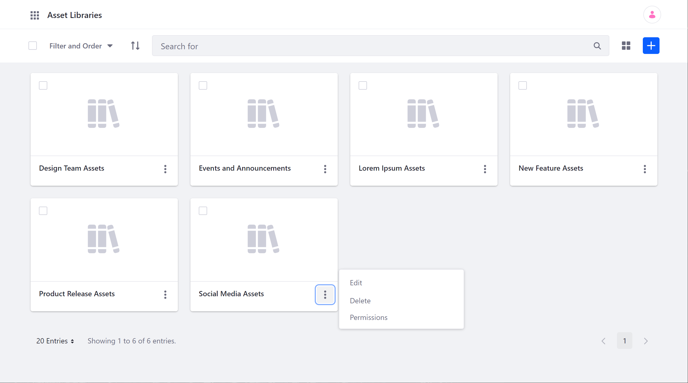
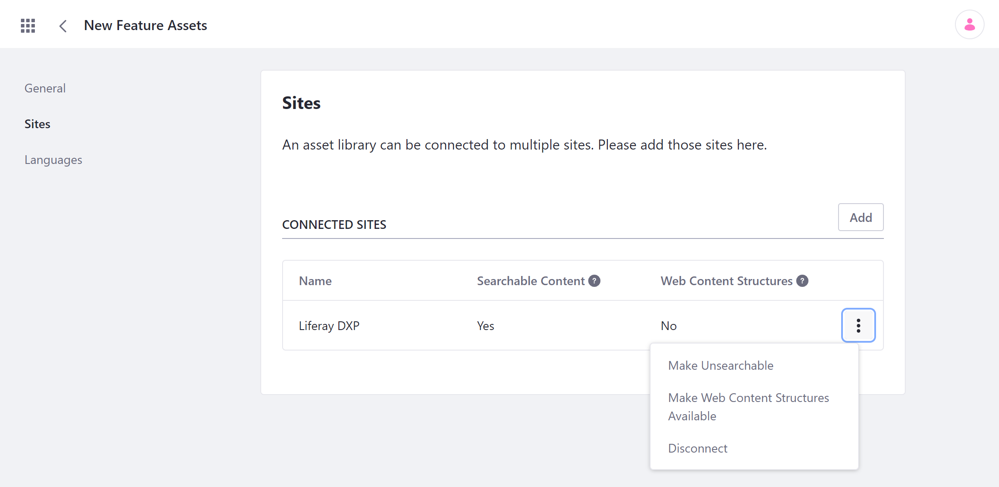
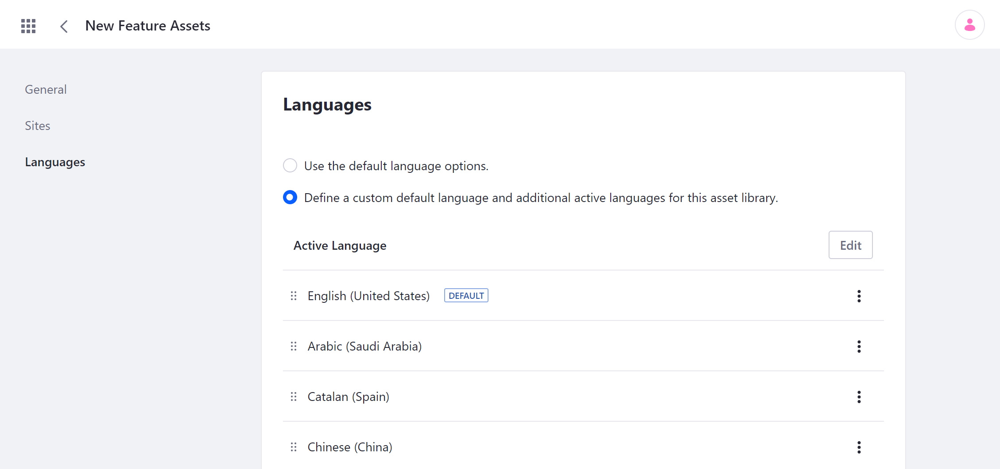
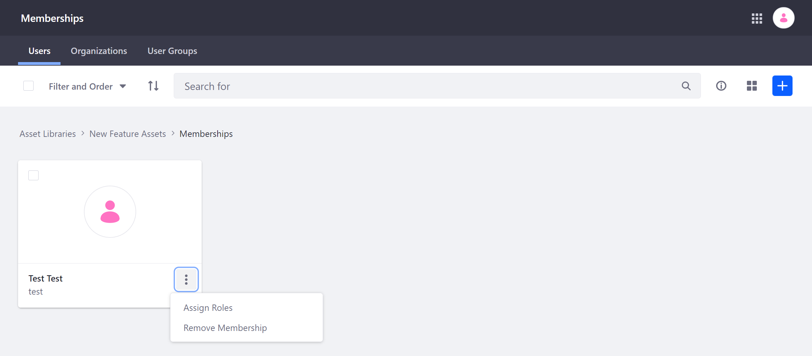

# Creating and Managing Asset Libraries

> Available: Liferay DXP/Portal 7.3+

You can manage Asset Libraries via the Asset Libraries link in the *Applications* tab of the Global Menu. Here, you can create and configure as many Libraries as needed and determine how each Library is connected to your Sites.



## Creating an Asset Library

1. Open the *Global Menu* (), and go to *Content* &rarr; *Asset Libraries* in the Applications tab.

1. Click the *Add* button (  ) and enter a *Name* for your new Asset Library.

1. Click *Save*.

This creates a new Asset Library with a unique ID and redirects you to its configuration page.

You can configure your Library now or accept the default settings and start adding content to the Library.

## Configuring Asset Libraries

Once you've created an Asset Library, you can configure it at any time by clicking on its *Actions* button (  ) and selecting *Edit*. Configuration options are organized into three sections: *General*, *Sites*, and *Languages*.

You can also access a Library's settings via its dashboard page. Simply click on the *name* of the desired Asset Library, and then click on *Asset Library Settings*.

### General Settings

Here you can configure an Asset Library's basic information.

**Details**: View a Library's unique ID, and configure its name or description.

**Applications**: Activate or deactivate a Library's supported applications (i.e., Documents and Media, Collections, Translation Processes, Web Content). Activated applications can be accessed and used to create and manage digital assets, while inactive applications are not exposed to users. Deactivating an application does not delete the application's content or remove it from connected Sites.

**Sharing**: Enable or disable sharing for assets. When enabled, Asset Library members can share its assets with other users.

**Asset Auto Tagging**: Enable or disable [auto tagging](../tags-and-categories/auto-tagging/auto-tagging-assets.md). When enabled, assets are automatically tagged using the providers configured at the instance level.

**Documents and Media**: Enable or disable HTTP directory browsing for this library. By default, this setting is disabled. When enabled, users with view permission for an Asset Library can view files and folders in its document library in their browser (e.g., `http://localhost:8080/documents/asset-library-{assetLibraryId}`).

**Recycle Bin**: Enable or disable Recycle Bin for a Library, and set the maximum age for recycled assets. By default, the maximum age is set to 43200 minutes (i.e., 30 days).

### Sites

Here you can connect or disconnect individual Sites to an Asset Library, as well as configure how they're related via the connected Site's *Actions* button (  ).



**Add**: Connect a new Site to the selected Library.

**Make Searchable/Unsearchable**: Determine whether the Library's assets appear in search queries for the selected Site. By default, all connections are searchable.

**Make Web Content Structures Available**: By default, this feature is disabled. When enabled, you can use the Library's Web Content structures and templates in connected Sites.

   ```{important}
   If you later disable this feature, Web Content using the Library's structures and templates in a Site is no longer available.
   ```

**Disconnect**: Disconnect the selected Site from the Library. When disconnected, the Library's assets are no longer accessible from the Site.

   ```{important}
   You cannot disconnect a Library from a Site while *Make Web Content Structures Available* is enabled. This is to avoid breaking Site content that uses the Library's structures and templates.
   ```

### Languages

Here you can choose the active language for an Asset Library, whether it's the default or not. You can determine your Library's default language, along with each language's relative priority. If you define a custom language, you can edit the list to determine which languages are available in the Library.



Use the *Drag* icon (  ) to adjust a language's relative priority, or click on a language's *Actions* button (  ) and select *Move Up* or *Move Down*.

## Managing Asset Library Memberships

You can view and manage User memberships for an Asset Library by going to its dashboard Page and clicking on *Memberships*. From here, you can click the *Add* button () to add new Users, Organizations, and User Groups to the selected Library. You can also Assign Roles or Remove Memberships for each existing member by clicking on its *Actions* button (  ).



By default, Asset Libraries include the five following Roles:

* **Asset Library Member**: Grants basic permissions and is automatically assigned to Users who belong to an Asset Library.

* **Asset Library Connected Site Member**: Automatically assigned to members of a connected Site.

* **Asset Library Content Reviewer**: Grants permissions necessary for reviewing content in a workflow.

* **Asset Library Administrator**: Grants permission to manage most aspects of an Asset Library, including content, memberships, and settings. However, it does not grant permission to modify or assign the Owner or Administrator Roles to other members.

* **Asset Library Owner**: Grants control over all aspects of an Asset Library and is automatically assigned to the Library's creator.

```{note}
By default, the Asset Library Member's permissions are more restricted than those of its Site counterpart. This means you'll need to manually grant access to applications, update/delete permissions for content, and more if you want Members to be responsible for managing content.
```

Creating or customizing an Asset Library Role is the same process as for other kinds of Roles. See [Roles and Permissions](../../users-and-permissions/roles-and-permissions.md) for how to create, customize, manage, and assign Roles.

## Deleting an Asset Library

To remove an Asset Library and its contents from your instance, click its *Actions* button (  ) and select *Delete*. You are then prompted to confirm the deletion. Once deleted, all contained assets are removed from your database and are no longer available to previously connected Sites.

```{warning}
Asset Library deletion cannot be undone. Ensure you're removing the correct Asset Library and that you've backed up any assets you want to keep.
```

## Additional Information

* [Asset Libraries Overview](./asset-libraries-overview.md)
* [Asset Library Content](./asset-library-content.md)
