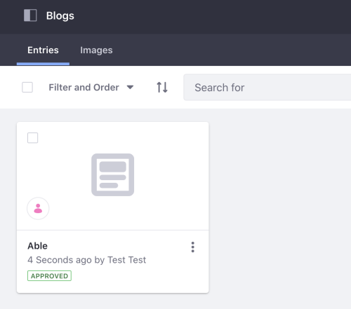

# Blog API Basics

Liferay's REST API's provide services for adding, modifying, and deleting blog posts and images. 

Start by seeing an example of adding a new blog post.

## Adding a Blog Post

1. Start Liferay DXP. If you don't already have a docker container, use

   ```bash
   docker run -it -p 8080:8080 [$LIFERAY_LEARN_PORTAL_DOCKER_IMAGE$]
   ```

1. Download and unzip [Blog API Basics](./liferay-r3g4.zip).

   ```bash
   curl https://learn.liferay.com/dxp/latest/en/content-authoring-and-management/blogs/developer-guide/liferay-r3g4.zip -O
   ```

   ```bash
   unzip liferay-r3g4.zip
   ```

2. [Find your Site's ID](../../../headless-delivery/consuming-apis/consuming-rest-services.md#identify-the-site-containing-the-data). You'll use this in different service calls below.

3. Use the cURL script to add a new blog post to your Site. On the command line, navigate to the `curl` folder. Execute the `BlogPosting_POST_ToSite.sh` script with your Site ID as a parameter.

    ```bash
    ./BlogPosting_POST_ToSite.sh 1234
    ```

    The JSON response shows a new blog post has been added:

    ```bash
    "alternativeHeadline" : "",
    "articleBody" : "Foo",
    "creator" : {
    "additionalName" : "",
    "contentType" : "UserAccount",
    "familyName" : "Test",
    "givenName" : "Test",
    "id" : 20125,
    "name" : "Test Test"
    },
    "customFields" : [ ],
    "dateCreated" : "2021-07-21T21:26:55Z",
    "dateModified" : "2021-07-21T21:26:55Z",
    "datePublished" : "2021-07-21T21:26:00Z",
    "description" : "",
    "encodingFormat" : "text/html",
    "friendlyUrlPath" : "able",
    "headline" : "Able",
    "id" : 38511,
    "keywords" : [ ],
    "numberOfComments" : 0,
    "relatedContents" : [ ],
    "siteId" : 20121,
    "taxonomyCategoryBriefs" : [ ]
    ```

1. Go to the Blogs application by navigating to *Administration Menu* &rarr; *Content & Data* &rarr; *Blogs*. See that a new blog post has been added.

    

1. The REST service can also be called with a Java class. Navigate out of the `curl` folder and into the `java` folder. Compile the source files: 

    ```bash
    javac -classpath .:* *.java
    ```

1. Run the `BlogPosting_POST_ToSite` class. Replace the `siteId` value with your site's ID:

    ```bash
    java -classpath .:* -DsiteId=1234 BlogPosting_POST_ToSite
    ```

## Examine the cURL Command

The `BlogPosting_POST_ToSite.sh` script calls the REST service with a cURL command. 

```{literalinclude} ./blog-api-basics/resources/liferay-r3g4.zip/curl/BlogPosting_POST_ToSite.sh
    :language: bash
```

Here are the command's arguments:

| Arguments | Description |
| --------- | ----------- |
| `-H "Content-Type: application/json"` | Indicates that the request body format is JSON. |
| `-X POST` | The HTTP method to invoke at the specified endpoint |
| `"http://localhost:8080/o/headless-delivery/v1.0/sites/${1}/blog-postings"` | The REST service endpoint |
| `-d "{\"articleBody\": \"Foo\", \"headline\": \"Able\"}"` | The data you are requesting to post |
| `-u "test@liferay.com:test"` | Basic authentication credentials |

```note::
   Basic authentication is used here for demonstration purposes. For production, you should authorize users via `OAuth2 <../../../installation-and-upgrades/securing-liferay/configuring-sso/using-oauth2/introduction-to-using-oauth2.md>`_.
```

The other cURL commands use similar JSON arguments.

## Examine the Java Class

The `BlogPosting_POST_ToSite.java` class adds a blog post by calling the blog posting related service.

```{literalinclude} ./blog-api-basics/resources/liferay-r3g4.zip/java/BlogPosting_POST_ToSite.java
   :dedent: 1
   :language: java
   :lines: 9-26
```

This class invokes the REST service using only three lines of code: 

| Line (abbreviated) | Description |
| :----------------- | :---------- |
| `BlogPostingResource.Builder builder = ...` | Gets a `Builder` for generating a `BlogPostingResource` service instance. |
| `BlogPostingResource blogPostingResource = builder.authentication(...).build();` | Specifies basic authentication and generates a `BlogPostingResource` service instance. |
| `BlogPosting blogPosting = blogPostingResource.postSiteBlogPosting(...);` | Calls the `BlogPostingResource.postSiteBlogPosting` method and passes the data to post. |

```note::
   The ``main`` method's comment demonstrates running the class.
```

The other example Java classes are similar to this one, but call different `BlogPostingResource` methods.

```{important}
See [BlogPostingResource](https://github.com/liferay/liferay-portal/blob/[$LIFERAY_LEARN_PORTAL_GIT_TAG$]/modules/apps/headless/headless-delivery/headless-delivery-client/src/main/java/com/liferay/headless/delivery/client/resource/v1_0/BlogPostingResource.java) for service details.
```

Below are examples of calling other `BlogPosting` REST services using cURL and Java.

## Get Blog Posts from Site

You can list a site's blog posts by executing the following cURL or Java command. As above, replace `1234` with your site's ID.

### BlogPostings_GET_FromSite.sh

Command:

```bash
./BlogPostings_GET_FromSite.sh 1234
```

Code:

```{literalinclude} ./blog-api-basics/resources/liferay-r3g4.zip/curl/BlogPostings_GET_FromSite.sh
   :language: bash
```

### BlogPostings_GET_FromSite.java

Command:

```bash 
java -classpath .:* -DsiteId=1234 BlogPostings_GET_FromSite
```

Code:

```{literalinclude} ./blog-api-basics/resources/liferay-r3g4.zip/java/BlogPostings_GET_FromSite.java
   :dedent: 1
   :language: java
   :lines: 11-23
```

The site's `BlogPosting` objects are listed in JSON.

## Get a Blog Post

Get a specific blog post with the following cURL or Java command. Replace `1234` with the blog post's ID.

```tip:: 
   Use ``BlogPostings_GET_FromSite.[java|sh]`` to get ``BlogPosting`` IDs.
```

### BlogPosting_GET_ById.sh

Command:

```bash
./BlogPosting_GET_ById.sh 1234
```

Code:

```{literalinclude} ./blog-api-basics/resources/liferay-r3g4.zip/curl/BlogPosting_GET_ById.sh
   :language: bash
```

### BlogPosting_GET_ById.java

Command: 

```bash
java -classpath .:* -DblogPostingId=1234 BlogPosting_GET_ById
```

Code:

```{literalinclude} ./blog-api-basics/resources/liferay-r3g4.zip/java/BlogPosting_GET_ById.java
   :dedent: 1
   :language: java
   :lines: 9-20
```

The `BlogPosting` fields are listed in JSON.

## Patch a Blog Post

Do a partial edit of an existing blog post with the following cURL and Java commands. Note: replace `1234` with your blog post's ID.

### BlogPosting_PATCH_ById.sh

Command:

```bash
./BlogPosting_PATCH_ById.sh 1234
```

Code:

```{literalinclude} ./blog-api-basics/resources/liferay-r3g4.zip/curl/BlogPosting_PATCH_ById.sh
   :language: bash
```

### BlogPosting_PATCH_ById.java

Command: 

```bash 
java -classpath .:* -DblogPostingId=1234 BlogPosting_PATCH_ById
``` 

Code:

```{literalinclude} ./blog-api-basics/resources/liferay-r3g4.zip/java/BlogPosting_PATCH_ById.java
   :dedent: 1
   :language: java
   :lines: 9-25
```

In this example the article body content is changed from Foo to Bar.

## Put a Blog Post

Do a complete overwrite of an existing blog post with the following cURL and Java commands. Note, replace `1234` with your blog post's ID.

### BlogPosting_PUT_ById.sh

Command:

```bash
./BlogPosting_PUT_ById.sh 1234
```

Code:

```{literalinclude} ./blog-api-basics/resources/liferay-r3g4.zip/curl/BlogPosting_PUT_ById.sh
   :language: bash
```

### BlogPosting_PUT_ById.java

Command:

```bash
java -classpath .:* -DblogPostingId=1234 BlogPosting_PUT_ById
```

Code:

```{literalinclude} ./blog-api-basics/resources/liferay-r3g4.zip/java/BlogPosting_PUT_ById.java
   :dedent: 1
   :language: java
   :lines: 9-26
```

## Delete a Blog Post

Delete an existing blog post with the following cURL and Java commands. Note, replace `1234` with your blog post's ID.

### BlogPosting_DELETE_ById.sh

Command:

```bash
./BlogPosting_DELETE_ById.sh 1234
```

Code:

```{literalinclude} ./blog-api-basics/resources/liferay-r3g4.zip/curl/BlogPosting_DELETE_ById.sh
   :language: bash
```

### BlogPosting_DELETE_ById.java 

Command

```bash 
java -classpath .:* -DblogPostingId=1234 BlogPosting_DELETE_ById
```

Code:

```{literalinclude} ./blog-api-basics/resources/liferay-r3g4.zip/java/BlogPosting_DELETE_ById.java
   :dedent: 1
   :language: java
   :lines: 8-17
```

## Blog Post Image Services

The cURL commands and Java classes for blog images works in the same way as blog posts.

| Files | Description |
| :---- | :---------- |
| `BlogPostingImage_DELETE_ById.[java|sh]` | Deletes a blog post image by ID. |
| `BlogPostingImage_GET_ById.[java|sh]` | Get a specific blog post image by ID. |
| `BlogPostingImage_POST_ToSite.[java|sh]` | Post a blog post image to a site. |
| `BlogPostingImages_GET_FromSite.[java|sh]` | Get a list of blog post images from a site. |

The [API Explorer](../../../headless-delivery/consuming-apis/consuming-rest-services.md) lists all of the `BlogPosting` and `BlogPostingImage` services and schemas, and has an interface to try out each service.
