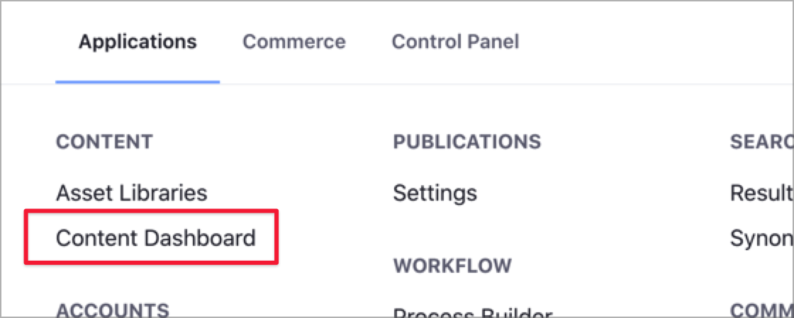
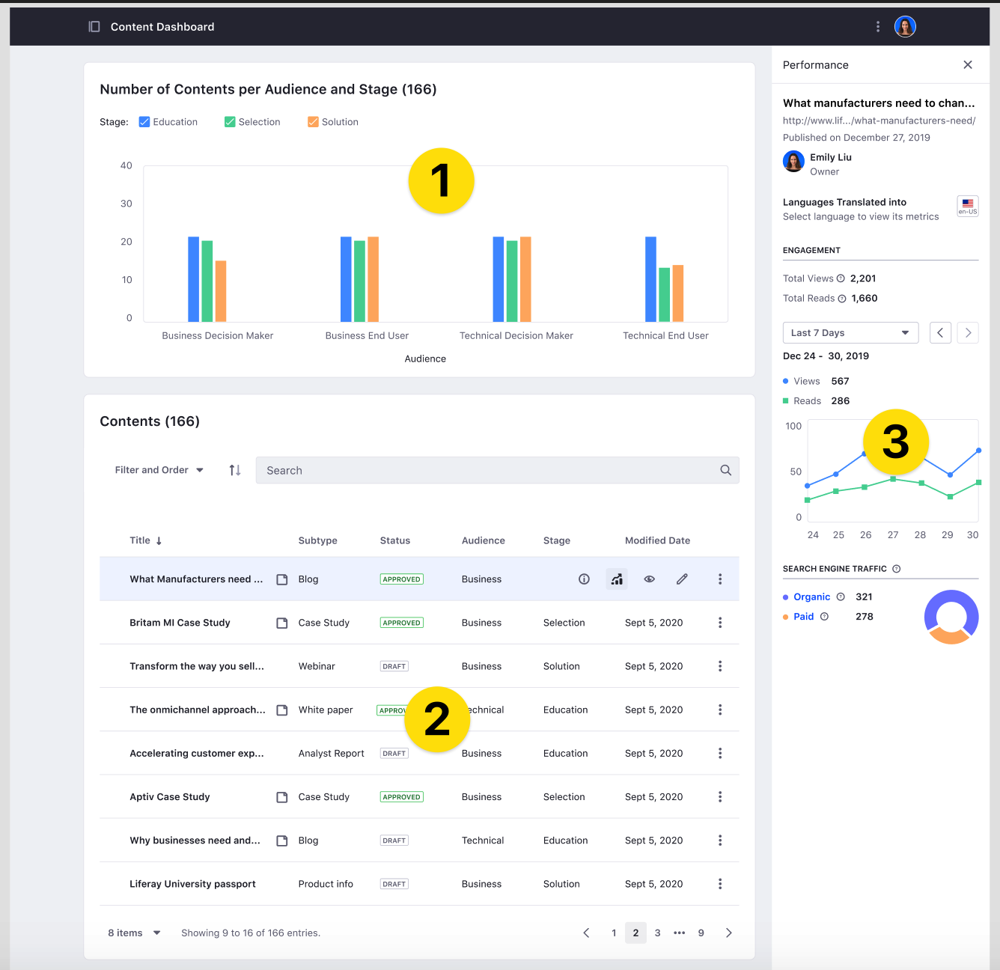

# About the Content Dashboard

{bdg-secondary}`Available 7.3+`

The *Content Dashboard* is a global application for managing your content. From the Content Dashboard page, content authors and marketers can access and audit all content generated across Sites and Asset Libraries.

```{note}
For analyzing performance metrics of your content, use the [Content Performance tool](../page-performance-and-accessibility/about-the-content-performance-tool.md).
```

Using the Content Dashboard, content authors and marketers can analyze their content in different ways:

- Find and filter content across Sites and Asset Libraries using built-in or custom filters.
- Analyze existing content by audience or phase in a customer journey.
- Audit content areas with enough content or content gaps to improve your content strategy.

The Content Dashboard shows information based on the Categories you assign to content assets. Liferay provides the *Audience* and *Stage* global Vocabularies to work along with the Content Dashboard. To learn about Vocabularies and Categories, see [Organizing Content with Categories and Tags](../tags-and-categories/organizing-content-with-categories-and-tags.md). To categorize to your content, see [Defining Categories and Vocabularies for Content](../tags-and-categories/defining-categories-and-vocabularies-for-content.md).

## Content Dashboard Components

To access the Content Dashboard, click the Global Menu and, under the *Content* area, click *Content Dashboard*.



```{note}
If the Global Menu is disabled, open the Product Menu and, under the *Site* Menu, go to *Content* → *Content Dashboard*.
```

You can see different areas on the Content Dashboard page.



The [Content Audit Tool](./content-dashboard-interface.md#content-audit-tool) (1) is the graphical area at the top of the page. It shows metrics for the Vocabularies and Categories you define in Liferay. You can include and combine your global Vocabularies here, and filter the Categories to analyze your data in different ways.

The [Contents List](./content-dashboard-interface.md#contents-list) (2) shows content across all Sites and Asset Libraries. From here, you can sort and filter your information using built-in or custom filters. The Content Audit Tool chart changes dynamically based on the filters that you set.

From the Contents List, you can access the [Content info](./content-dashboard-interface.md#content-info-sidebar) sidebar (3) and the [Content Performance tool](../page-performance-and-accessibility/about-the-content-performance-tool.md). The Information sidebar shows different metadata for each asset, while the Content Performance tool gathers statistics for your content, like the number of views or the traffic acquisition channels.

To learn more about the Content Dashboard interface and how to customize the information for your needs, see the [Content Dashboard Interface](./content-dashboard-interface.md) topic.

## Related Information

- [Content Dashboard Interface](./content-dashboard-interface.md)
- [About the Content Performance Tool](../page-performance-and-accessibility/about-the-content-performance-tool.md)
- [Defining Categories and Vocabularies for Content](../tags-and-categories/defining-categories-and-vocabularies-for-content.md)
