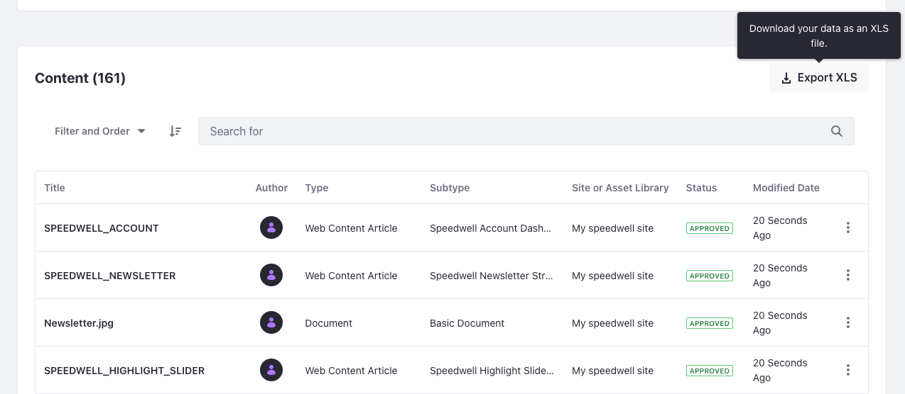
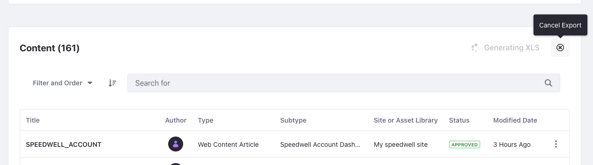
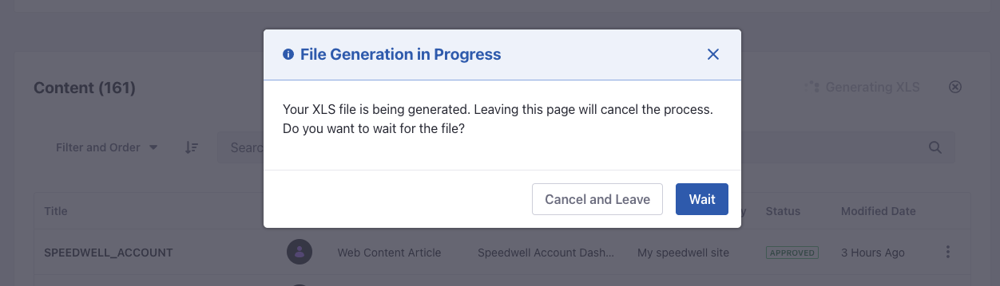
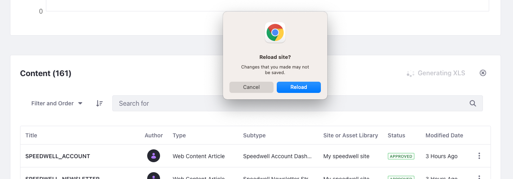

# Exporting Assets List To a Spreadsheet

The Content Dashboard is a global application for managing your content. From the Content Dashboard page, content authors and marketers can access and audit all content generated across Sites and Asset Libraries. Content dashboard gathers information about several types of assets. Now Liferay offers a way to export that list of assets and metadata to a spreadsheet (.XLS file), so it can be used for further purposes.

To export the asset list to a spreadsheet follow this steps: 

1. Click on the Global Menu and, under the *Content* area, click *Content Dashboard*.
   
   If the Global Menu is disabled, open the Site Menu and go to *Content* &rarr; *Content Dashboard*.

1. Click on *Export XLS* to download the asset list.



While generating the file, the *Export XLS* button will show a *loading state* along with a *cancellation button*. If you click on the cancellation button the exporting process stops automatically and shows a message *XLS generation was cancelled*. 

When the exporting process is done, the *Export XLS* button shows the massage *XLS Generated*.



## Navigation During File Generation

Navigation during file generation means that you want to keep browsing the Liferay DXP platform or want to access another page using a browser.

### Portal Single Page Application (SPA) navigation

Single Page Application is the situation when you use any portal link to navigate away from the content Dashboard  and don't reload the page. If you do this, while the file is being generated, a modal will appear prompting to cancel the generation or wait until it finishes.



### Browser Reload

If you reload the browser page or paste any external URL and try to navigate away from the Liferay DXP platform, a browser native prompt will show up informing that the navigation may provoke uncertainty in the current process.



## XLS File Content 

Currently, all metadata is exported from contents and documents, so the XLS will contain the following columns:

* Title

* Author

* Type

* Subtype

* Site or Asset Library

* Status

* Categories

* Tags

* Modified Date

* Description

* Extension

* File Name

* Size

* Display Date

* Creation Date

* Languages Translated Into

```{note}
Note that the available information will differ between item types. For example, a basic document (an image) will not display anything in the Languages Translated Into cell, as a file cannot be translated.
```