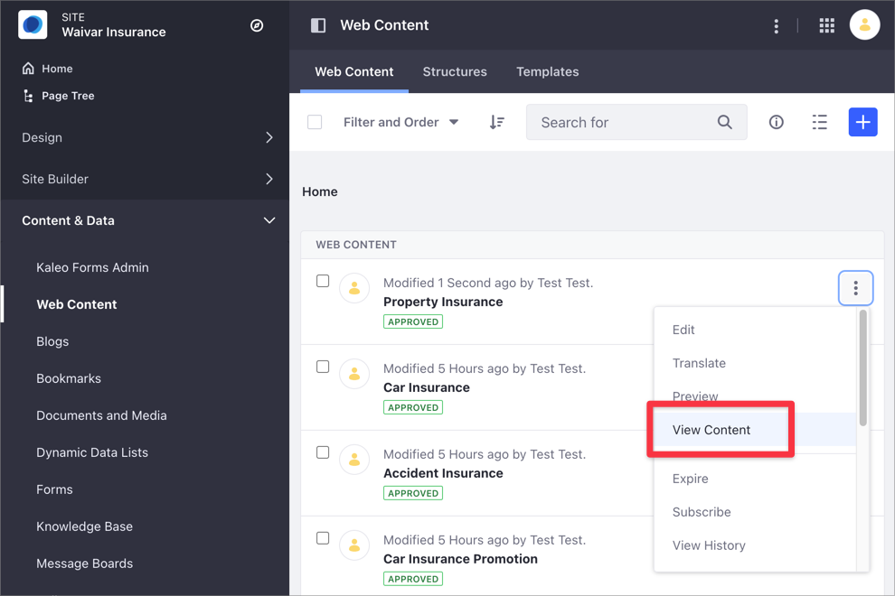

# About the Content Performance Panel

> Available: Liferay 7.3+. Some Content Performance options are only available starting with Liferay DXP 7.4.

The Content Performance panel is a global application for analyzing performance metrics of your content, like traffic acquisition channels or the number of views over time. Content teams can use the Content Performance panel to periodically assess and adapt their content strategy. The Content Performance panel is available for assets based on a [Display Page Template](../../site-building/displaying-content/using-display-page-templates/displaying-content-with-display-page-templates.md) and starting with Liferay DXP 7.4, for [Content](../../site-building/creating-pages/building-and-managing-content-pages/content-pages-overview.md) and [Widget](../../site-building/creating-pages/using-widget-pages/adding-widgets-to-a-page.md) Pages.

To learn how to analyze your content performance quantitatively using the Content Performance panel, see [Analyze Content Metrics Using the Content Performance panel](./analyze-content-metrics-using-content-performance-panel.md).

```{note}
To manage and audit your content across Sites and Asset Libraries, use the [Content Dashboard](../content-dashboard/about-the-content-dashboard.md).
```

You can access the Content Performance panel when the following conditions are met:

- The Liferay DXP instance has an active [connection to Liferay Analytics Cloud](https://learn.liferay.com/analytics-cloud/latest/en/connecting-data-sources/connecting-liferay-dxp-to-analytics-cloud.html) and your site is synchronized.
- You have Edit permissions for the Page or content.
- The content is in a Content Page, Widget Page, or is based on a [Display Page Template](../../site-building/displaying-content/using-display-page-templates/displaying-content-with-display-page-templates.md).

## Accessing the Content Performance Panel

You can open the Content Performance panel using the *Content Performance* () button from

- [Content based on a Display Page Template](#accessing-the-content-performance-panel-from-content-based-on-a-display-page-template), like Web Content, Documents, or Blog entries.
- [Content or Widget Pages](#accessing-the-content-performance-panel-from-content-or-widget-pages) (Liferay DXP 7.4+).
- [The Content Dashboard](#accessing-the-content-performance-panel-from-the-content-dashboard).

### Accessing the Content Performance Panel from Content Based on a Display Page Template

Using a Display Page Template, you can display Web Content, Documents, or Blog entries in a Display Page using a unique URL. For more information, read [Displaying Content with Display Page Templates](../../site-building/displaying-content/using-display-page-templates/displaying-content-with-display-page-templates.md).

1. Go to *Site Administration* &rarr; *Content & Data* &rarr; *Web Content*.
1. Click the *Web Content* tab.
1. For the Web Content you want to review, click the *Actions* () menu and choose *View Content*.

   ```{note}
   If the *View Content* option is not available, the Web Content is not using a Display Page Template.
   ```

   

1. In view mode, click the *Content Performance* () icon in the [Applications toolbar](../../getting-started/navigating-dxp.md#applications-bar).

### Accessing the Content Performance Panel from Content or Widget Pages

1. Go to *Site Administration* &rarr; *Site Builder* &rarr; *Pages*.
1. For the Page you want to review, click the *Actions* () menu and choose *View*.
1. Click the *Content Performance* () icon in the Application toolbar.

   

### Accessing the Content Performance Panel from the Content Dashboard

1. Open the [Content Dashboard](../content-dashboard/content-dashboard-interface.md#accessing-the-content-dashboard).
1. On the [Contents list](../content-dashboard/content-dashboard-interface.md#contents-list), click the *Actions* menu () next to the content you want to review, and select *View Metrics*.
1. Alternatively, hover over the content and click the *Content Performance* () icon.


```{note}
If the Content Performance option is not available, your content does not meet one or more conditions. See [About the Content Performance Panel](#about-the-content-performance-panel) for more information.
```

## Related Information

- [Analyze Content Metrics Using the Content Performance Panel](./analyze-content-metrics-using-content-performance-panel.md)
- [About the Content Dashboard](../content-dashboard/about-the-content-dashboard.md)
- [Defining Categories and Vocabularies for Content](../tags-and-categories/defining-categories-and-vocabularies-for-content.md)
