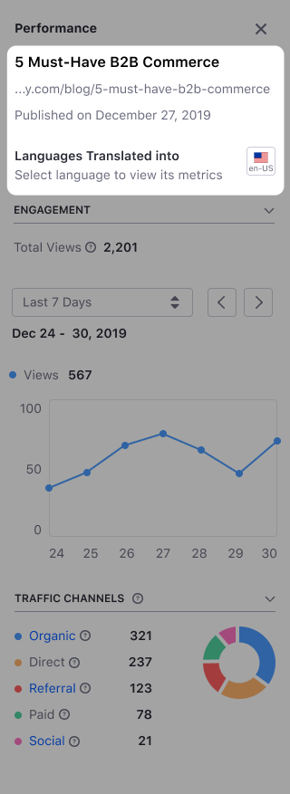
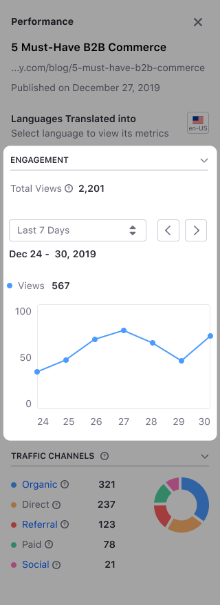
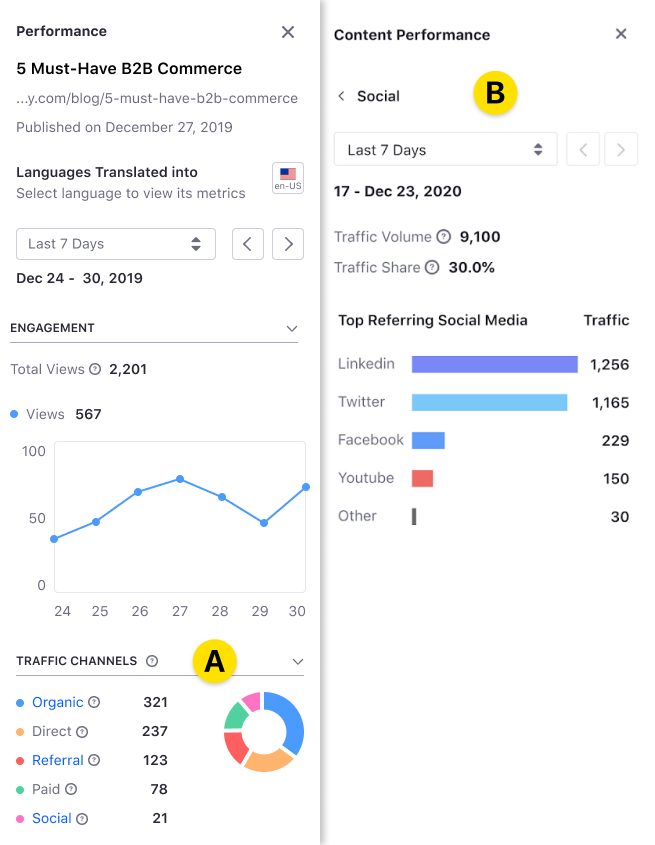

# Analyze Content Metrics Using the Content Performance Panel

> Available: Liferay 7.3+. Some Content Performance options are only available starting with Liferay DXP 7.4.

You can use the Content Performance panel to analyze content metrics, like the number of views, traffic acquisition channels, or keywords driving people to your page. In the Content Performance panel, you can view metrics for the URL of the Content Page, Widget Page, or Web Content associated with a [Display Page Template](../../site-building/displaying-content/using-display-page-templates/displaying-content-with-display-page-templates.md).

```important::
   Content Performance metrics are only available for the `Default Experience <../../site-building/personalizing-site-experience/experience-personalization/creating-and-managing-experiences.md>`_.
```

Access the Content Performance panel using the *View Metrics* () option for your content. You can find this option in the [Applications toolbar](../../getting-started/navigating-dxp.md#applications-bar) and the [Content Dashboard](../content-dashboard/about-the-content-dashboard.md). For more information, see [About the Content Performance Panel](./about-the-content-performance-panel.md).

The Content Performance panel contains three different areas:

- [Content Information](#reviewing-content-information)
- [Engagement](#analyzing-content-engagement)
- [Traffic Channels](#analyzing-traffic-channels)

## Reviewing Content Information

The top area in the Content Performance panel provides general information about your content.

| Label | Description |
| --- | --- |
| Content Name | Content or Widget Page's name or name of the asset based on a Display Page Template. |
| URL | Represent the URL of the Content Page, Widget Page, or Web Content associated with a Display Page Template. |
| Author | Author's name. This information is only available for Web Content using a Display Page Template. |
| Publication date | Shows the publication date. Note that when you link the asset to a Display Page Template newer than the asset publication date, the publication date corresponds to the Display Page Template creation date. |

The [Engagement](#analyzing-content-engagement) and [Traffic Channels](#analyzing-traffic-channels) areas in the Content Performance panel show statistics for the language selected in the language icon selector. When your content is localized in different languages, you can view metrics for each language.

```note::
   Even when your content is not translated into a specific language, you may find statistics for that language if users access the content using that language's URL.
```



## Analyzing Content Engagement

This area shows the number of views for the content or Page URL and how this number changes over time. The number of views is key to understanding content performance and discovering content insights. For Web Content based on a Display Page Template, the Engagement area also shows the number of reads. A visitor accessing the Web Content may or may not read it. To distinguish the audience that only visits the content (number of Views) from the audience engaging with the content (number of Reads), Liferay uses a specialized algorithm that considers parameters like article length, language, and scroll behavior, among others.

By default, the Engagement area shows the total number of views for the content, along with the number of views in the last seven days. You can change this period in the drop-down time selector and analyze trends over time using the backward and forward buttons ( ). Hover over any part of the line chart to show views for a specific time.

```note::
   If the Engagement chart shows a zero value for a certain period, it means that the information could not be collected or analyzed for that period.
```



## Analyzing Traffic Channels

This part of the Content Performance sidebar provides information about the sources driving web traffic to your content. The sources can be:

| Traffic Channel | Source Description |
| --- | --- |
| Social | Social networks |
| Organic | Search engines |
| Paid | Paid keywords from Google Ads |
| Referral | Sources other than the search engines and same Page's domain |
| Direct | Other or unknown sources |


When you click one of the traffic channels (A), you can see extended information for the channel (B).



The following table describes the metrics you can find in the Traffic Channels area:

| Label | Description |
| --- | --- |
| Traffic Volume | The estimated number of visitors to your Page. |
| Traffic Share | Percentage of traffic your content receives from the traffic source. |
| Best Keyword | Top five keywords driving traffic through organic search. |
| Best Paid Keyword | Top five keywords driving traffic through paid search. |
| Top Referring Social Media | Top ten social media networks driving traffic to your Page. |
| Top Referring Pages | Top ten referrer Pages driving traffic to your Page. |
| Top Referring Domains | Top ten referrer domains driving traffic to your Page. |

```note::
   Keywords are one or more words that people use to find content.
```

## Related Information

- [About the Content Performance Panel](./about-the-content-performance-panel.md)
- [About the Content Dashboard](../content-dashboard/about-the-content-dashboard.md)
- [Defining Categories and Vocabularies for Content](../tags-and-categories/defining-categories-and-vocabularies-for-content.md)
