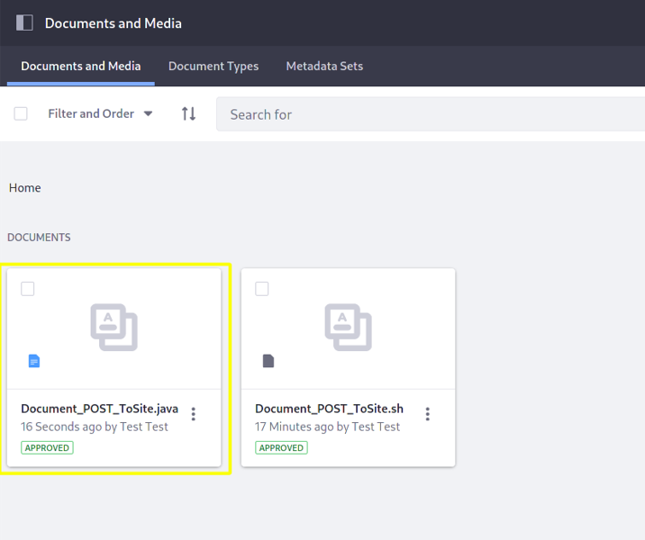
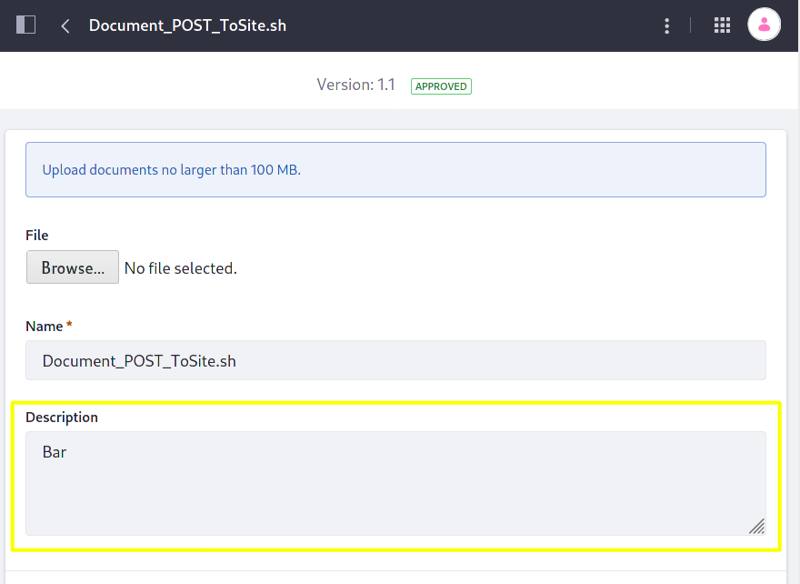
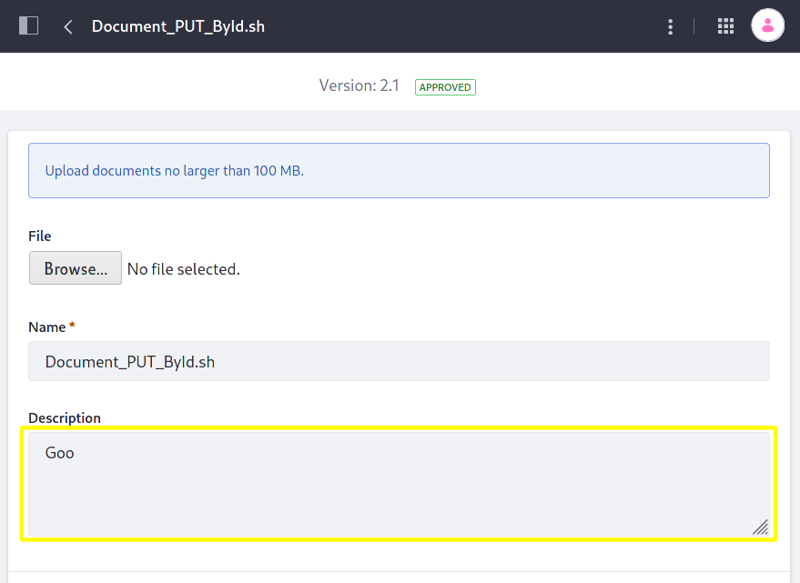

# Document API Basics

Liferay's headless delivery application provides REST services for [Documents and Media](../../sharing-documents-and-media.md). There are services to add documents and folders, list their information, modify them, delete them and more. Here you'll call those services using curl commands and Java classes. 

Start with uploading documents using an example curl command and Java class.

## Uploading Documents With REST Services

1.  Start the Liferay Docker image:

    ```bash
    docker run -it -p 8080:8080 [$LIFERAY_LEARN_DXP_DOCKER_IMAGE$]
    ```

1. Sign in to Liferay.

    ```tip::
    Using basic authentication while signed in to Liferay is an easy way to test services.
    ```

1. [Find your site's ID](../../../../headless-delivery/consuming-apis/consuming-rest-services.md#identify-the-site-containing-the-data). You'll use this ID in several service calls.

1. Download and unzip the [example command code](https://learn.liferay.com/dxp/7.x/en/content-authoring-and-management/documents-and-media/developer-guide/api/liferay-g9i6.zip):

    ```bash
    curl https://learn.liferay.com/dxp/7.x/en/content-authoring-and-management/documents-and-media/developer-guide/api/liferay-g9i6.zip -O
    ```

    ```bash
    unzip liferay-g9i6.zip
    ```

    The example curl commands are in the `curl` folder and the Java classes are in the `java` folder.

1. On the command line, navigate to the `curl` folder. Copy the curl command from the `Document_POST_ToSite.sh` file to your command line. Replace `${1)` with your site ID and replace the user credentials with your own. For example,

    ```bash 
    curl -F "file=@Document_POST_ToSite.sh" -H "Content-Type: multipart/form-data" -X POST "http://localhost:8080/o/headless-delivery/v1.0/sites/20121/documents" -u "test@liferay.com:test"
    ```

1. Execute the curl command.

    The `Document_POST_ToSite.sh` file uploaded to your site's Documents and Media.

    

    The command response looks like this:

    ```bash 
    {
      "actions" : {
        "get" : {
          "method" : "GET",
          "href" : "http://localhost:8080/o/headless-delivery/v1.0/documents/{documentId}"
        },
        "replace" : {
          "method" : "PUT",
          "href" : "http://localhost:8080/o/headless-delivery/v1.0/documents/{documentId}"
        },
        "update" : {
          "method" : "PATCH",
          "href" : "http://localhost:8080/o/headless-delivery/v1.0/documents/{documentId}"
        },
        "delete" : {
          "method" : "DELETE",
          "href" : "http://localhost:8080/o/headless-delivery/v1.0/documents/{documentId}"
        }
      },
      "adaptedImages" : [ ],
      "contentUrl" : "/documents/20121/0/Document_POST_ToSite.sh/f56e88a6-0cae-c67f-dd14-6e891837b5b9?version=1.0&t=1617977639864",
      "creator" : {
        "additionalName" : "",
        "contentType" : "UserAccount",
        "familyName" : "Test",
        "givenName" : "Test",
        "id" : 20125,
        "name" : "Test Test"
      },
      "customFields" : [ ],
      "dateCreated" : "2021-04-09T14:13:59Z",
      "dateModified" : "2021-04-09T14:13:59Z",
      "description" : "",
      "documentFolderId" : 0,
      "documentType" : {
        "availableLanguages" : [ ],
        "contentFields" : [ ],
        "description" : "",
        "name" : "Basic Document"
      },
      "encodingFormat" : "application/x-sh",
      "fileExtension" : "sh",
      "id" : 38301,
      "keywords" : [ ],
      "numberOfComments" : 0,
      "relatedContents" : [ ],
      "siteId" : 20121,
      "sizeInBytes" : 183,
      "taxonomyCategoryBriefs" : [ ],
      "title" : "Document_POST_ToSite.sh"
    }
    ```

    ```note:: 
     The response includes ``Document_POST_ToSite.sh`` document's newly assigned `id`. Note the ID for later commands.
     ```

    Next you'll upload a file using Java.

1. Compile the Java source files.

    ```bash
    cd ../java
    ```

    ```bash
    javac -classpath .:* *.java
    ```

1. Upload the `Document_POST_ToSite.java` file to Documents and Media by running the `Document_POST_ToSite` class, replacing the `siteId` value below with your site's ID.

    ```bash
    java -classpath .:* -DsiteId=1234 Document_POST_ToSite
    ```

    ```note::note 
    If your user and password aren't ``test@liferay.com`` and ``test``, respectively, replace those values in the ``Document_POST_ToSite.java`` file and recompile the class.
    ```

    ```tip::tip 
    A comment at the top of each example Java class includes a command to run the class.
    ```

The `Document_POST_ToSite.java` document was added to your site's Documents and Media.



Take a closer look at the REST service call code, starting with the curl command. 

## Examine the CURL Command

The curl command in the `Document_POST_ToSite.sh` file posts itself to a site via a REST call to the `headless-delivery` application.

```bash 
curl -F "file=@Document_PUT_ToSite.sh" -H "Content-Type: multipart/form-data" -X POST "http://localhost:8080/o/headless-delivery/v1.0/sites/${1}/documents" -u "test@liferay.com:test"
```

Here are the command's arguments:

| Arguments | Description |
| :--- | :---------- |
| `-F "file=@Document_POST_ToSite.sh"` | The file to post. |
| `-H "Content-Type: multipart/form-data"` | The file's [MIME type](https://en.wikipedia.org/wiki/Media_type). |
| `-X POST "http://localhost:8080/o/headless-delivery/v1.0/sites/${1}/documents"` | The POST action to invoke at the specified endpoint.  |
| `-u "test@liferay.com:test"` | User credentials. |

Other curl commands for Documents and Media document and document folder REST services use similar arguments.

Next, examine the Java code in `Document_POST_ToSite.java`.

## Examine the Java Service Call

Here's the code from `Document_POST_ToSite.java`:

```java
import com.liferay.headless.delivery.client.dto.v1_0.Document;
import com.liferay.headless.delivery.client.resource.v1_0.DocumentResource;

import java.io.File;

import java.util.HashMap;

public class Document_POST_ToSite {

	/**
	 * java -classpath .:* -DsiteId=1234 Document_POST_ToSite
	 */
	public static void main(String[] args) throws Exception {
		DocumentResource.Builder builder = DocumentResource.builder();

		DocumentResource documentResource = builder.authentication(
			"test@liferay.com", "test"
		).build();

		Document document = documentResource.postSiteDocument(
			Long.valueOf(System.getProperty("siteId")), new Document(),
			new HashMap<String, File>() {
				{
					put("file", new File("Document_POST_ToSite.java"));
				}
			});

		System.out.println(document);
	}

}
```

This class invokes a service using only three lines of code that do these things:

1. Get a `DocumentResource.Builder`.
1. Use the `DocumentResource.Builder` to authenticate a user with a `DocumentResource` instance.
1. Call the `DocumentResource.postSiteDocument` method, passing in a site ID, a `Document` object for the uploaded, and a hash map that specifies the file to upload. The file is arbitrary--this example uses local file `Document_POST_ToSite.java` for convenience.

```note::
The ``main`` method's comment demonstrates running the class.
```

The other example Java classes are similar to this one, but call different `DocumentResource` methods.

```important::
See `DocumentResource <https://docs.liferay.com/dxp/apps/headless/latest/javadocs/com/liferay/headless/delivery/resource/v1_0/DocumentResource.html>`_ for service details.
```

The following sections demonstrate calling other common document and document folder REST services using curl and Java.

## Listing Your Site's Documents

You can list a site's documents by executing the following curl or Java command. Make sure to enter your site ID in place of `${1}` in the curl command or in place of the `siteId` value in the Java command.

### Documents_GET_FromSite.sh

```bash
curl "http://localhost:8080/o/headless-delivery/v1.0/sites/${1}/documents" -u "test@liferay.com:test"
```

### Documents_GET_FromSite.java

Command:

```bash 
java -classpath .:* -DsiteId=1234 Documents_GET_FromSite
```

Code:

```java
import com.liferay.headless.delivery.client.dto.v1_0.Document;
import com.liferay.headless.delivery.client.pagination.Page;
import com.liferay.headless.delivery.client.pagination.Pagination;
import com.liferay.headless.delivery.client.resource.v1_0.DocumentResource;

public class Documents_GET_FromSite {

	/**
	 * java -classpath .:* -DsiteId=1234 Documents_GET_FromSite
	 */
	public static void main(String[] args) throws Exception {
		DocumentResource.Builder builder = DocumentResource.builder();

		DocumentResource documentResource = builder.authentication(
			"test@liferay.com", "test"
		).build();

		Page<Document> page = documentResource.getSiteDocumentsPage(
			Long.valueOf(System.getProperty("siteId")), null, null, null, null,
			Pagination.of(1, 2), null);

		System.out.println(page);
	}

}
```

The site's documents are listed as objects in JSON.

## Getting a Document's Fields

You can get a document's fields by executing the following curl or Java command. Replace the command's `${1}` or `documentId` with the document's ID.

```tip::tip 
Use ``Documents_GET_FromSite.[sh|java]`` to get site document IDs.
```

### Document_GET_ByID.sh

```bash
curl "http://localhost:8080/o/headless-delivery/v1.0/documents/${1}" -u "test@liferay.com:test"
```

### Document_GET_ByID.java

Command: 

```bash 
java -classpath .:* -DdocumentId=1234 Document_GET_ById
```

Code:

```java
import com.liferay.headless.delivery.client.dto.v1_0.Document;
import com.liferay.headless.delivery.client.resource.v1_0.DocumentResource;

public class Document_GET_ById {

	/**
	 * java -classpath .:* -DdocumentId=1234 Document_GET_ById
	 */
	public static void main(String[] args) throws Exception {
		DocumentResource.Builder builder = DocumentResource.builder();

		DocumentResource documentResource = builder.authentication(
			"test@liferay.com", "test"
		).build();

		Document document = documentResource.getDocument(
			Long.valueOf(System.getProperty("documentId")));

		System.out.println(document);
	}

}
```

The documents fields are listed in JSON.

## Updating a Document

Document's PATCH services update a document and its fields. You can update a document by executing the following curl or Java command. Replace the command's `${1}` or `documentId` with the document's ID.

### Document_PATCH_ById.sh

```bash 
curl -F "document={\"description\": \"Bar\"}" -F "file=@Document_POST_ToSite.sh" -H  "Content-Type: multipart/form-data; boundary=ARBITRARY" -X PATCH "http://localhost:8080/o/headless-delivery/v1.0/documents/${1}" -u "test@liferay.com:test"
```

The first form data part specifies a new value for the document's `description` field. The second form data part sets the updated file to upload.

### Document_PATCH_ById.java

Command: 

```bash 
java -classpath .:* -DdocumentId=1234 Document_PATCH_ById
``` 

Code:

```java 
import com.liferay.headless.delivery.client.dto.v1_0.Document;
import com.liferay.headless.delivery.client.resource.v1_0.DocumentResource;

import java.io.File;

import java.util.HashMap;

public class Document_PATCH_ById {

	/**
	 * java -classpath .:* -DdocumentId=1234 Document_PATCH_ById
	 */
	public static void main(String[] args) throws Exception {
		DocumentResource.Builder builder = DocumentResource.builder();

		DocumentResource documentResource = builder.authentication(
			"test@liferay.com", "test"
		).build();

		Document document = documentResource.patchDocument(
			Long.valueOf(System.getProperty("documentId")),
			new Document() {
				{
					description = "Bar";
				}
			},
			new HashMap<String, File>() {
				{
					put("file", new File("Document_POST_ToSite.java"));
				}
			});

		System.out.println(document);
	}

}
```

The Java code above calls `DocumentResource`'s `patchDocument` method, passing in the document's ID, a document object that includes a field to update, and the updated file to upload.

The above commands update the document's description to "Bar".



## Replacing a Document

Document's PUT services replace the document and its fields entirely. You can replace a document by executing the following curl or Java command. Set the command's `${1}` or `documentId` to your document's ID.

### Document_PUT_ById.sh 

```bash 
curl -F "document={\"description\": \"Goo\", \"title\": \"Document_PUT_ById.sh\"}" -F "file=@Document_PUT_ById.sh" -H "Content-Type: multipart/form-data; boundary=ARBITRARY" -X PUT "http://localhost:8080/o/headless-delivery/v1.0/documents/${1}" -u "test@liferay.com:test"
``` 

The first form data part specifies new values for the document's `description` and `title` fields. The second form data part sets replacement file to upload.

### Document_PUT_ById.java

Command:

```bash
java -classpath .:* -DdocumentId=1234 Document_PUT_ById
```

Code:

```java
import com.liferay.headless.delivery.client.dto.v1_0.Document;
import com.liferay.headless.delivery.client.resource.v1_0.DocumentResource;

import java.io.File;

import java.util.HashMap;

public class Document_PUT_ById {

	/**
	 * java -classpath .:* -DdocumentId=1234 Document_PUT_ById
	 */
	public static void main(String[] args) throws Exception {
		DocumentResource.Builder builder = DocumentResource.builder();

		DocumentResource documentResource = builder.authentication(
			"test@liferay.com", "test"
		).build();

		Document document = documentResource.putDocument(
			Long.valueOf(System.getProperty("documentId")),
			new Document() {
				{
					description = "Goo";
    				title = "Document_PUT_ById.java";
				}
			},
			new HashMap<String, File>() {
				{
					put("file", new File("Document_PUT_ById.java"));
				}
			});

		System.out.println(document);
	}

}
```

The Java code above calls `DocumentResource`'s `putDocument` method, passing in the document's ID, a document object that includes values for the document's `description` and `title` fields, and a replacement file to upload.

The above commands replace the document with a completely new document that has a new title and the description "Goo".

```warning::
   Unless you want to use the current document's title, make sure to specify the ``title`` value you want for the replacement document.
```



## Deleting a Document

You can delete a document by executing the following curl or Java command. Replace the command's `${1}` or `documentId` with the document's ID.

### Document_DELETE_ById.sh

```bash
curl -X DELETE "http://localhost:8080/o/headless-delivery/v1.0/documents/${1}" -u "test@liferay.com:test"
```

### Document_DELETE_ById.java 

Command

```bash 
java -classpath .:* -DdocumentId=1234 Document_DELETE_ById
```

Code:

```java
import com.liferay.headless.delivery.client.resource.v1_0.DocumentResource;

public class Document_DELETE_ById {

	/**
	 * java -classpath .:* -DdocumentId=1234 Document_DELETE_ById
	 */
	public static void main(String[] args) throws Exception {
		DocumentResource.Builder builder = DocumentResource.builder();

		DocumentResource documentResource = builder.authentication(
			"test@liferay.com", "test"
		).build();

		documentResource.deleteDocument(
			Long.valueOf(System.getProperty("documentId")));
	}

}
```

The document is removed from Documents and Media.

## More Document and Document Folder Services

The following curl commands and Java classes demonstrate more document services and document folder services.

| File | Description |
| :--- | :---------- |
| `DocumentFolder_POST_ToSite.[sh\|java]` | Posts a document folder to a site. |
| `DocumentFolder_GET_FromSite.[sh\|java]` | Lists the site's folders. |
| `DocumentFolder_GET_ById.[sh\|java]` | Lists a folder's fields. |
| `Document_POST_ToDocumentFolder.[sh\|java]` | Posts a document to the folder. |
| `DocumentFolder_PATCH_ById.[sh\|java]` | Updates a folder and its fields. |
| `DocumentFolder_PUT_ById.[sh\|java]` | Replaces a folder and its fields entirely. |

Liferay's API Explorer lists all of the headless services and schemas, and provides an interface to try out each one.

1. Open your browser to `http://localhost:8080/o/api`.
1. From *REST Applications*, select *headless-delivery/v1.0*.

The Headless Delivery REST services appear.

To see the API for Document or DocumentFolder, click the row with its name. To try an action (e.g., GET, PATCH, POST, PUT, DELETE) on an endpoint, click its row and click *Try it out*.

To view the schema for Document or DocumentFolder, click *Schemas* at the bottom of the page (near the WikiPage API) and click Document or DocumentFolder to view its schema.

For Javadoc, see [DocumentResource](https://docs.liferay.com/dxp/apps/headless/latest/javadocs/com/liferay/headless/delivery/resource/v1_0/DocumentResource.html)  and [DocumentFolderResource](https://docs.liferay.com/dxp/apps/headless/latest/javadocs/com/liferay/headless/delivery/resource/v1_0/DocumentFolderResource.html).

## Additional Information

* [Sharing Documents and Media](../../sharing-documents-and-media.md)
* [Consuming REST Services](../../../../headless-delivery/consuming-apis/consuming-rest-services.md)
* [API Headers Reference](../../../../headless-delivery/consuming-apis/api-headers-reference.md)
* [Consuming GraphQL APIs](../../../../headless-delivery/consuming-apis/consuming-graphql-apis.md)