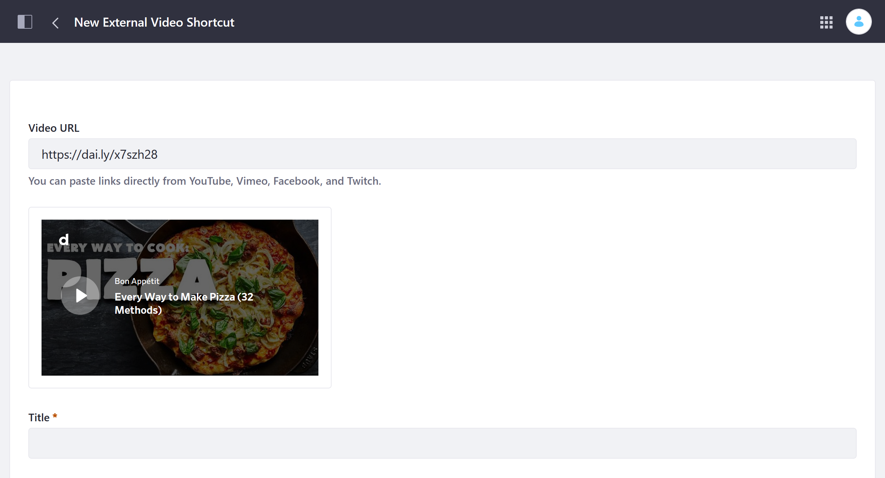

# Creating Video Shortcut Providers

> Available for Liferay DXP 7.4+

By default, Liferay's external video shortcuts support [YouTube](https://github.com/liferay/liferay-portal/blob/master/modules/apps/document-library/document-library-video/src/main/java/com/liferay/document/library/video/internal/video/external/shortcut/provider/YouTubeDLVideoExternalShortcutProvider.java), [Vimeo](https://github.com/liferay/liferay-portal/blob/master/modules/apps/document-library/document-library-video/src/main/java/com/liferay/document/library/video/internal/video/external/shortcut/provider/VimeoDLVideoExternalShortcutProvider.java), [Facebook](https://github.com/liferay/liferay-portal/blob/master/modules/apps/document-library/document-library-video/src/main/java/com/liferay/document/library/video/internal/video/external/shortcut/provider/FacebookDLVideoExternalShortcutProvider.java), and [Twitch](https://github.com/liferay/liferay-portal/blob/master/modules/apps/document-library/document-library-video/src/main/java/com/liferay/document/library/video/internal/video/external/shortcut/provider/TwitchDLVideoExternalShortcutProvider.java). However, you can extend this feature to support other video sources.

Follow these steps to create your own video shortcut provider:

1. **OSGI Component Annotation**: Use the `@Component` annotation to declare the provider a `DLVideoExternalShortcutProvider.class` service within the OSGi framework.

1. [**`DLVideoExternalShortcutProvider`**](https://github.com/liferay/liferay-portal/blob/master/modules/apps/document-library/document-library-api/src/main/java/com/liferay/document/library/video/external/shortcut/provider/DLVideoExternalShortcutProvider.java): Implement the `DLVideoExternalShortcutProvider` interface.

1. **Override the Interface's Method**: Override the interface's `getDLVideoExternalShortcut()` method. This method creates an instance of the [`DLVideoExternalShortcut`](https://github.com/liferay/liferay-portal/blob/master/modules/apps/document-library/document-library-api/src/main/java/com/liferay/document/library/video/external/shortcut/DLVideoExternalShortcut.java) interface and receives a URL String. Ensure your implementation does these things: 

   * Checks if the received URL matches any defined URL patterns.
   * If the URL doesn't match a pattern, the program should return `null`. Liferay checks other available providers in search of a match.
   * If the URL matches a pattern, parse the URL, fetch any extra information from the external source, and return a `DLVideoExternalShortcut` instance with the gathered information.

1. **Override `DLVideoExternalShortcut` Methods**: Override the required methods for the `DLVideoExternalShortcut` instance returned by the `getDLVideoExternalShortcut()` method.

   * `getURL()`: retrieves the original video URL.
   * `renderHTML()`: embeds the video in the user interface. This typically renders an `iframe` but could also be an HTML video tag anything that renders the video for users.

1. Override these optional methods: 

   * `getDescription()`: Use this method to retrieve the original video's description; its default value is `null`.
   * `getThumbnailURL()`: Use the this method to retrieve the video's thumbnail; its default value is `null`.
   * `getTitle()`: Use this method to retrieve the original video's title; its default value is `null`.

Below is a [sample external video shortcut provider](liferay-g9b6.zip) that demonstrates the minimum requirements for implementing your own. See [existing providers](https://github.com/liferay/liferay-portal/tree/master/modules/apps/document-library/document-library-video/src/main/java/com/liferay/document/library/video/internal/video/external/shortcut/provider) for more complex examples.

## Deploying the Sample Video Provider

1. Start a new [Liferay Docker container](../../../installation-and-upgrades/installing-liferay/using-liferay-docker-images/docker-container-basics.md).

   ```bash
   docker run -it -m 8g -p 8080:8080 [$LIFERAY_LEARN_PORTAL_DOCKER_IMAGE$]
   ```

1. Download and unzip the example module.

   ```bash
   curl https://learn.liferay.com/docs/dxp/latest/en/content-authoring-and-management/documents-and-media/developer-guide/liferay-g9b6.zip -O
   ```

   ```bash
   unzip liferay-g9b6.zip -d liferay-g9b6
   ```

1. Run the `gradlew deploy` command to build the JAR file and deploy it to your new Docker container:

   ```bash
   ./gradlew deploy -Ddeploy.docker.container.id=$(docker ps -lq)
   ```

   The JAR is generated in the `build/libs` folder (i.e., `g9b6-impl/build/libs/com.acme.G9B6.impl-1.0.0`).

1. Confirm the provider was successfully deployed and started via the container console.

   ```log
   Processing com.acme.G9B6.impl-1.0.0.jar
   STARTED com.acme.G9B6.impl-1.0.0 [1356]
   ```

1. Verify the module is working by creating a new external video shortcut<!--TASK: add link once article is merged--> with a short Dailymotion URL (e.g., https://dai.ly/x7szh28).

   If successful, Liferay should recognize Dailymotion as a supported platform.

   

## Code for the Sample Video Provider

```{literalinclude} ./creating-custom-video-shortcut-providers/resources/liferay-g9b6.zip/g9b6-impl/src/main/java/com/acme/g9b6/internal/document/library/video/external/shortcut/provider/G9B6DLVideoExternalShortcutProvider.java
   :dedent: 1
   :language: java
   :lines: 14-51
```

### OSGi Component Annotation

The provider is declared a component within the OSGi framework and identified as a `DLVideoExternalShortcutProvider.class` service.

### `DLVideoExternalShortcutProvider` Implementation

The provider implements the `DLVideoExternalShortcutProvider` interface. This interface includes a single method, `getDLVideoExternalShortcut`, which returns a `DLVideoExternalShortcut` if a valid URL is received.

### Override `getDLVideoExternalShortcut`

The provider overrides the interface's `getDLVideoExternalShortcut` method, which contains all of the provider's essential logic. It checks whether the URL matches the defined regex pattern. If no match is found, then it returns `null`, and Liferay proceeds to call other available providers in search of a match. If it does match, it returns a new `DLVideoExternalShortcut` object for embedding the video into a Liferay Page or asset.

### Override `DLVideoExternalShortcut`'s Methods

When the provider returns a `DLVideoExternalShortcut` object, it overrides the object's `getURL()` and `renderHTML()` methods. `getURL()` returns the URL entered by the user. `renderHTML()` receives a `HttpServletRequest` parameter and returns an `iframe` string to be embedded into a Liferay Page or asset. Consider the following example.

Since `getDescription()`, `getThumbnailURL()`, and `getTitle()` are not overridden, `null` is returned. 

## Additional Information

* [Creating External Video Shortcuts](../videos/creating-external-video-shortcuts.md)
