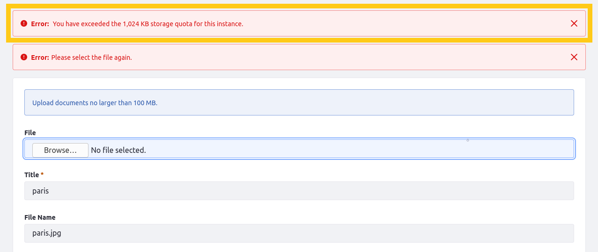

# Setting a Documents and Media Storage Quota

You can define storage quotas in Documents and Media by enabling the `data.limit.dl.storage.max.size` portal property. Once you define a value for this property, upload attempts exceeding the defined quota fail and display an error message. This quota applies specifically to Documents and Media and users of its APIs (e.g. message boards attachments, blogs images).



```important::
   Although the setting is global, each instance keeps track of its current consumed quota. If you define a quota of 100MB and you have 10 instances, the maximum global storage that can be consumed by Documents and Media is roughly 1TB.
```

By default, the `data.limit.dl.storage.max.size` portal property is disabled. You can override this value using a `portal-ext.properties` file.

Follow these steps to set a global storage quota for Documents and Media in a Liferay instance:

1. Create a `portal-ext.properties` file. 

1. Add the `data.limit.dl.storage.max.size` property to your new properties file and set its value to the storage quota you want.

   The property's value must be set in bytes. For example, the following value sets the storage quota to 100MB.

   ```properties
   data.limit.dl.storage.max.size=104857600
   ```

   Assigning a negative number or `0` disables the property.

1. Deploy the `portal-ext.properties` file to your [Liferay Home](../../../installation-and-upgrades/reference/liferay-home.md) folder or `[USER_HOME]` folder. See [Portal Properties](../../../installation-and-upgrades/reference/portal-properties.md) for more details.

1. Restart the Liferay server to apply your new properties file.

Under normal circumstances, the system dynamically updates the storage quota. However, in some cases, a manual update may be required due to database corruption, runtime errors, or some other cause. To do this, run the `documentLibrary:update` OSGi command from the Gogo Shell.

```warning::
   Updating a quota can be time and resource intensive, depending on the amount of documents stored in Documents and Media. Please exercise care when running this command in your production environment.
```

## Additional Information

* [Sharing Documents and Media](../sharing-documents-and-media.md)
* [Portal Properties](../../../installation-and-upgrades/reference/portal-properties.md)
